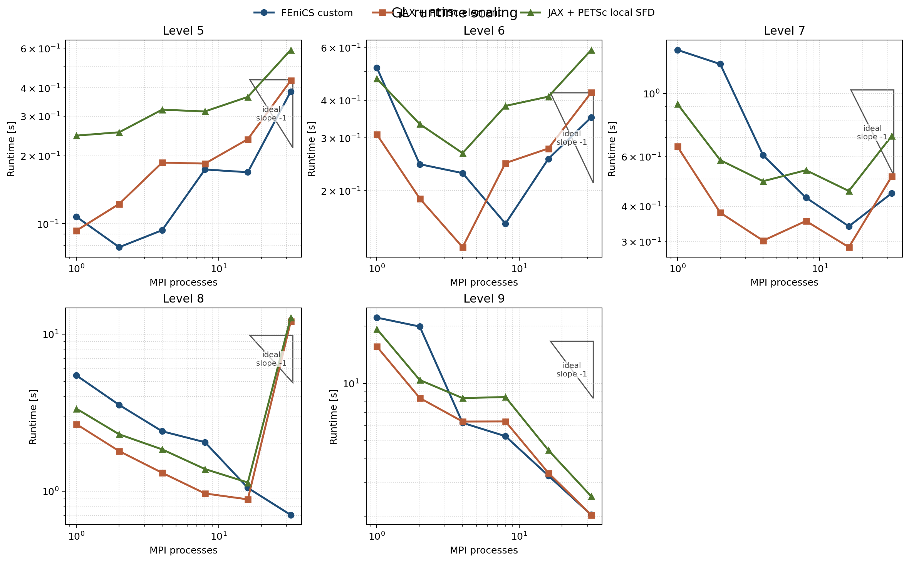
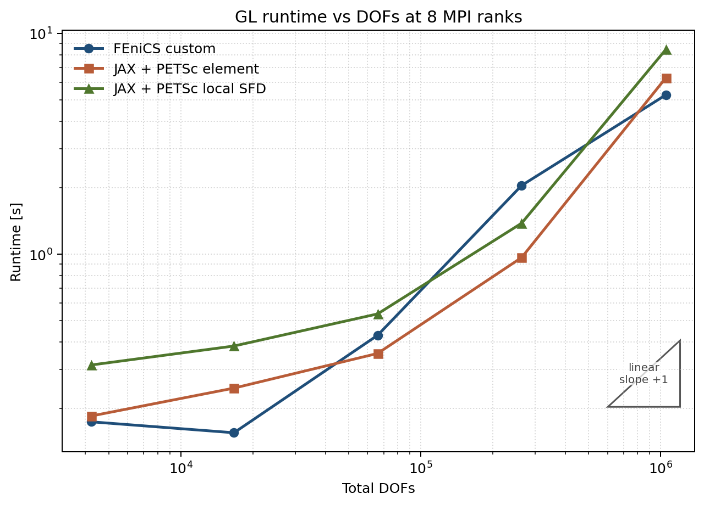
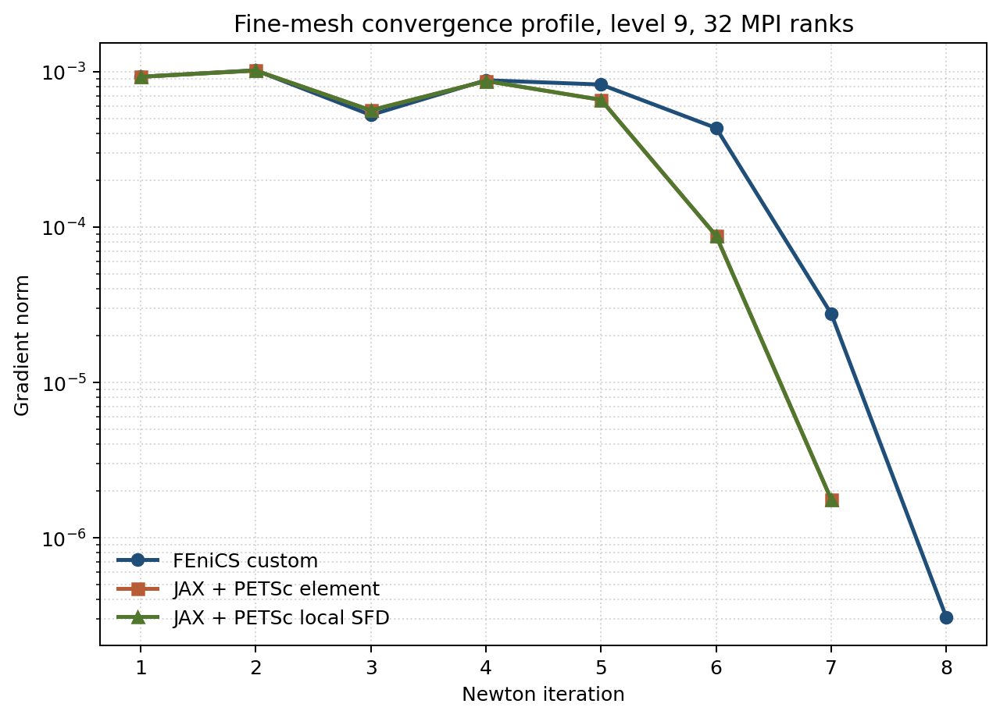

# Final GL Benchmark Report

Date: 2026-03-16

This report is the refreshed canonical summary for the maintained
Ginzburg-Landau benchmark campaign. The validated rerun lives under
`artifacts/reproduction/2026-03-15_refactor_stage2b_final/full/gl_final_suite/`
and supersedes older cached headline timings.

## Campaign Summary

- mesh levels: `5..9`
- MPI counts: `1, 2, 4, 8, 16, 32`
- solver families:
  - `fenics_custom`
  - `jax_petsc_element`
  - `jax_petsc_local_sfd`
- validated suite rows: `90`
- completed rows: `88`
- expected benchmark-documented failures retained:
  - `jax_petsc_element`, `level 8`, `np=32`
  - `jax_petsc_local_sfd`, `level 8`, `np=32`

## Current Best Settings

On the maintained final campaign, the winning GL policy remains the looser
line-search Newton configuration rather than the trust-region variants explored
in the diagnostic sweeps.

| Knob | Value |
| --- | --- |
| nonlinear method | line-search Newton |
| line-search interval | `[-0.5, 2.0]` |
| line-search tolerance | `1e-3` for the maintained GL campaign |
| trust region | off in the frozen final suite |
| KSP type | `gmres` |
| PC type | `hypre` |
| KSP rtol | `1e-3` |
| KSP max it | `200` |

## Fine-Mesh Benchmark

Reference case: `level 9`, `32` MPI ranks.

| Solver | Total time [s] | Newton | Linear | Final energy | Result |
| --- | ---: | ---: | ---: | ---: | --- |
| `fenics_custom` | `2.031441` | `8` | `37` | `0.345626` | completed |
| `jax_petsc_element` | `2.029041` | `7` | `39` | `0.345626` | completed |
| `jax_petsc_local_sfd` | `2.542170` | `7` | `39` | `0.345626` | completed |

Readout:

- `fenics_custom` and `jax_petsc_element` are effectively tied on the refreshed
  hardest-case rerun.
- `jax_petsc_local_sfd` remains competitive while paying a moderate premium for
  the local-SFD Hessian construction path.
- The only retained suite failures are the expected `level 8`, `np=32`
  breakdowns for the two JAX + PETSc variants; all `level 9` cases complete in
  the canonical rerun.

## Figures







The plotted figures are regenerated from the validated final campaign summary
under `artifacts/reproduction/.../full/gl_final_suite/summary.json`, written to
`artifacts/figures/benchmark_reports/gl_final/`, and then curated into
`docs/assets/gl_final/`.

## Reproduction

Final suite:

```bash
python experiments/runners/run_gl_final_suite.py \
  --out-dir artifacts/reproduction/2026-03-15_refactor_stage2b_final/full/gl_final_suite
```

Figures:

```bash
python experiments/analysis/generate_gl_final_report_figures.py \
  --summary-json artifacts/reproduction/2026-03-15_refactor_stage2b_final/full/gl_final_suite/summary.json \
  --asset-dir artifacts/figures/benchmark_reports/gl_final
```
