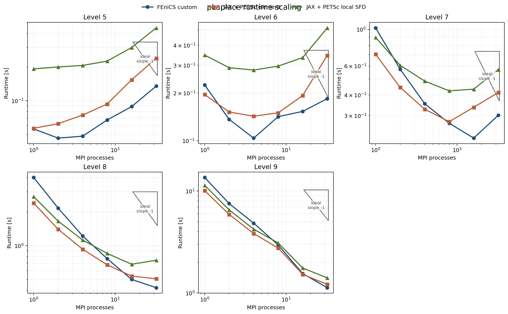
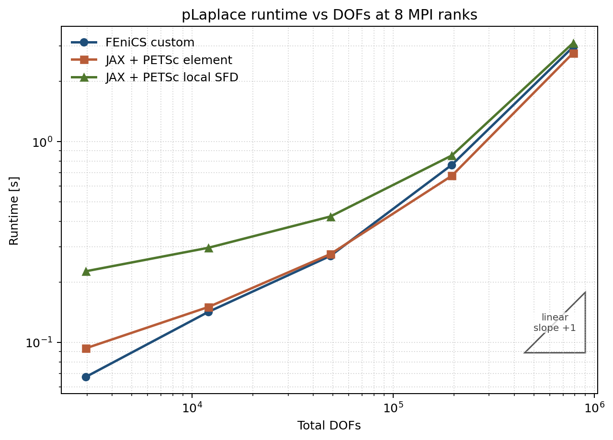

# Final pLaplace Benchmark Report

Date: 2026-03-16

This report is the refreshed canonical summary for the maintained pLaplace
benchmark campaign. The validated rerun lives under
`artifacts/reproduction/2026-03-15_refactor_stage2b_final/full/plaplace_final_suite/`
and replaces older cached headline numbers where they drifted.

## Campaign Summary

- mesh levels: `5..9`
- MPI counts: `1, 2, 4, 8, 16, 32`
- solver families:
  - `fenics_custom`
  - `jax_petsc_element`
  - `jax_petsc_local_sfd`
- validated suite rows: `90`
- completed rows: `90`

## Current Best Settings

The current maintained campaign still prefers the looser line-search Newton
policy rather than the HE trust-region setup:

| Knob | Value |
| --- | --- |
| nonlinear method | line-search Newton |
| line-search interval | `[-0.5, 2.0]` |
| line-search tolerance | `1e-1` |
| trust region | off |
| KSP type | `cg` |
| PC type | `hypre` |
| KSP rtol | `1e-1` |
| KSP max it | `30` |
| PC rebuild policy | rebuild every Newton iteration |

## Fine-Mesh Benchmark

Reference case: `level 9`, `32` MPI ranks.

| Solver | Total time [s] | Newton | Linear | Final energy | Result |
| --- | ---: | ---: | ---: | ---: | --- |
| `fenics_custom` | `1.127909` | `6` | `12` | `-7.960006` | completed |
| `jax_petsc_element` | `1.215456` | `6` | `11` | `-7.960003` | completed |
| `jax_petsc_local_sfd` | `1.408397` | `6` | `11` | `-7.960003` | completed |

Readout:

- `fenics_custom` is the fastest maintained fine-grid path in the refreshed
  canonical rerun.
- `jax_petsc_element` stays very close while preserving the shared reordered
  distributed assembly path.
- `jax_petsc_local_sfd` remains a valid like-for-like alternative with a small
  runtime premium on the hardest benchmark case.

## Figures






The plotted figures are regenerated from the validated final campaign summary
under `artifacts/reproduction/.../full/plaplace_final_suite/summary.json`,
written to `artifacts/figures/benchmark_reports/plaplace_final/`, and then
curated into `docs/assets/plaplace_final/`.

## Reproduction

Final suite:

```bash
python experiments/runners/run_plaplace_final_suite.py \
  --out-dir artifacts/reproduction/2026-03-15_refactor_stage2b_final/full/plaplace_final_suite
```

Figures:

```bash
python experiments/analysis/generate_plaplace_final_report_figures.py \
  --summary-json artifacts/reproduction/2026-03-15_refactor_stage2b_final/full/plaplace_final_suite/summary.json \
  --asset-dir artifacts/figures/benchmark_reports/plaplace_final
```
