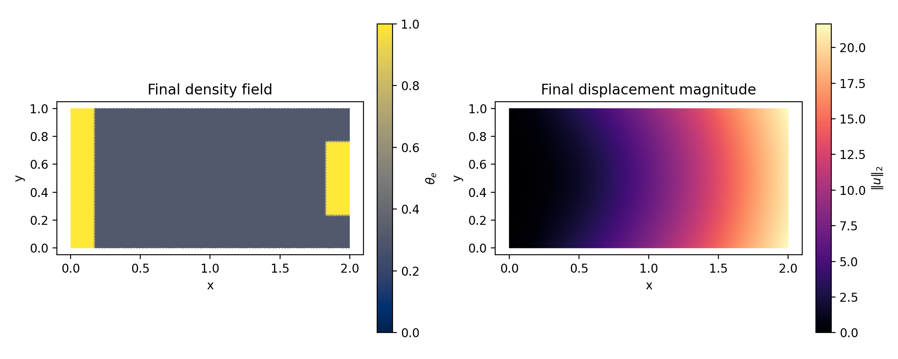
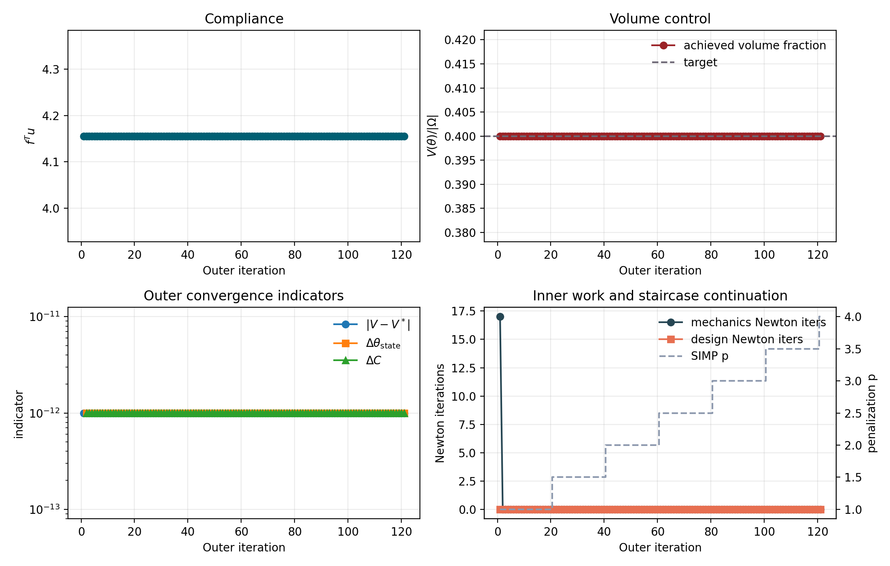
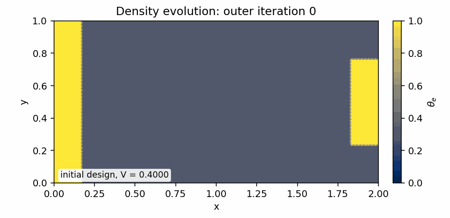

# JAX Topology Optimisation Benchmark

Date: 2026-03-16

This document is the refreshed canonical serial benchmark for the pure-JAX
topology path. It replaces the older report values with the validated rerun
stored under
`artifacts/reproduction/2026-03-15_refactor_stage2b_final/full/topology_serial_reference/`.

The benchmark fixes the problem to one clean reference configuration: a
`192 x 96` cantilever mesh, a staggered displacement/design solve, and a fixed
staircase SIMP continuation. The goal is to document one maintained
implementation that defines energies in JAX, autodifferentiates them on fixed
sparse graphs, and solves a nontrivial compliance-constrained topology problem.

## Reference Configuration

| Knob | Value |
| --- | --- |
| Mesh | 192 x 96 |
| Elements | 36864 |
| Free displacement DOFs | 37248 |
| Free design DOFs | 16205 |
| Target volume fraction | 0.4000 |
| Staircase schedule | p = p + 0.5 every 20 outer iterations |
| Final p target | 4.00 |
| Volume control | beta_lambda = 12.0, volume_penalty = 10.0 |
| Regularisation | alpha = 0.005, ell = 0.08, mu_move = 0.01 |

## Minimal JAX Problem Definition

The problem-specific input to JAX is just the energy definition. The mechanics
and design subproblems are still autodifferentiated directly from the energy
expressions:

```python
def mechanics_energy(
    u_free, u_0, freedofs, elems, elem_B, elem_area, material_scale, constitutive, force
):
    u_full = expand_free_dofs(u_free, u_0, freedofs)
    u_elem = u_full[elems]
    strain = jnp.einsum("eij,ej->ei", elem_B, u_elem)
    elastic_density = 0.5 * jnp.einsum("ei,ij,ej->e", strain, constitutive, strain)
    return jnp.sum(elem_area * material_scale * elastic_density) - jnp.dot(force, u_full)


def design_energy(
    z_free, z_0, freedofs, elems, elem_grad_phi, elem_area, e_frozen,
    z_old_full, lambda_volume, alpha_reg, ell_pf, mu_move, theta_min, p_penal
):
    z_full = expand_free_dofs(z_free, z_0, freedofs)
    theta_full = theta_from_latent(z_full, theta_min)
    theta_elem = theta_full[elems]
    theta_centroid = jnp.mean(theta_elem, axis=1)
    grad_theta = jnp.einsum("eia,ei->ea", elem_grad_phi, theta_elem)
    z_delta_centroid = jnp.mean(z_full[elems] - z_old_full[elems], axis=1)

    double_well = theta_centroid**2 * (1.0 - theta_centroid) ** 2
    reg_density = 0.5 * ell_pf * jnp.sum(grad_theta * grad_theta, axis=1) + double_well / ell_pf
    proximal_density = 0.5 * mu_move * z_delta_centroid**2
    design_density = e_frozen * theta_centroid ** (-p_penal) + lambda_volume * theta_centroid
    return jnp.sum(elem_area * (design_density + alpha_reg * reg_density + proximal_density))
```

The continuation policy remains the fixed staircase rule used in the maintained
report generator:

```python
def staircase_p_step(p_penal, *, p_max, p_increment, continuation_interval, outer_it):
    if p_penal >= p_max or outer_it % continuation_interval != 0:
        return 0.0
    return min(p_increment, p_max - p_penal)
```

## Geometry And Final State




The density plot is elementwise constant: each triangle is coloured by its
average density `theta_e`.

## Convergence History



## Density Evolution



## Run Summary

| Metric | Value |
| --- | --- |
| Result | completed |
| Outer iterations | 121 |
| Final p | 4.0000 |
| Wall time [s] | 16.014 |
| JAX setup [s] | 1.652 |
| Solve time [s] | 14.362 |
| Final compliance | 4.155670 |
| Final volume fraction | 0.400000 |
| Final volume error | 0.000000 |
| Final state change | 0.000000 |
| Final design change | 0.000000 |
| Final compliance change | 0.000000 |
| Total mechanics Newton iterations | 17 |
| Total design Newton iterations | 0 |

## Density Quality Indicators

| Indicator | Value |
| --- | --- |
| Gray fraction on 0.1 < theta < 0.9 | 0.8656 |
| Gray fraction on 0.05 < theta < 0.95 | 0.8656 |
| theta_min | 0.309095 |
| theta_max | 0.999955 |

## JAX Setup Timings

| Stage | Time [s] |
| --- | --- |
| mechanics: coloring | 0.248116 |
| mechanics: compilation | 0.228308 |
| design: coloring | 0.046067 |
| design: compilation | 0.275771 |

## Curated Artifacts

- JSON result:
  [`../assets/jax_topology_serial/report_run.json`](../assets/jax_topology_serial/report_run.json)
- Final state:
  [`../assets/jax_topology_serial/report_state.npz`](../assets/jax_topology_serial/report_state.npz)
- Outer-history CSV:
  [`../assets/jax_topology_serial/report_outer_history.csv`](../assets/jax_topology_serial/report_outer_history.csv)

## Reproduction

Regenerate the benchmark report and assets with:

```bash
./.venv/bin/python experiments/analysis/generate_report_assets.py \
  --asset-dir artifacts/reproduction/2026-03-15_refactor_stage2b_final/full/topology_serial_reference \
  --report-path artifacts/reproduction/2026-03-15_refactor_stage2b_final/full/topology_serial_reference/report.md
```

Run the solver directly with the same fine-grid staircase setup:

```bash
./.venv/bin/python src/problems/topology/jax/solve_topopt_jax.py \
  --nx 192 --ny 96 --length 2.0 --height 1.0 \
  --traction 1.0 --load_fraction 0.2 \
  --fixed_pad_cells 16 --load_pad_cells 16 \
  --volume_fraction_target 0.4 --theta_min 0.001 \
  --solid_latent 10.0 --young 1.0 --poisson 0.3 \
  --alpha_reg 0.005 --ell_pf 0.08 --mu_move 0.01 \
  --beta_lambda 12.0 --volume_penalty 10.0 \
  --p_start 1.0 --p_max 4.0 --p_increment 0.5 \
  --continuation_interval 20 --outer_maxit 180 \
  --outer_tol 0.02 --volume_tol 0.001 \
  --mechanics_maxit 200 --design_maxit 400 \
  --tolf 1e-06 --tolg 0.001 \
  --ksp_rtol 0.01 --ksp_max_it 80 --save_outer_state_history --quiet \
  --json_out artifacts/reproduction/2026-03-15_refactor_stage2b_final/full/topology_serial_reference/report_run.json \
  --state_out artifacts/reproduction/2026-03-15_refactor_stage2b_final/full/topology_serial_reference/report_state.npz
```
