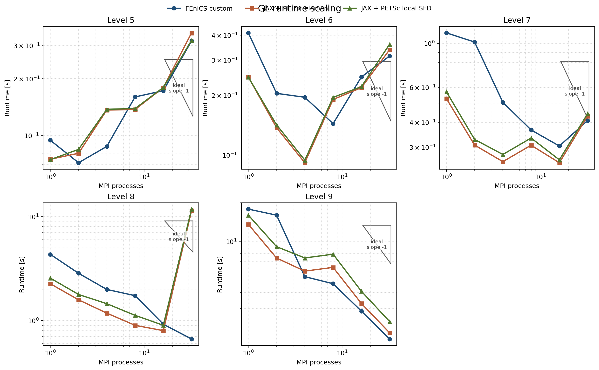
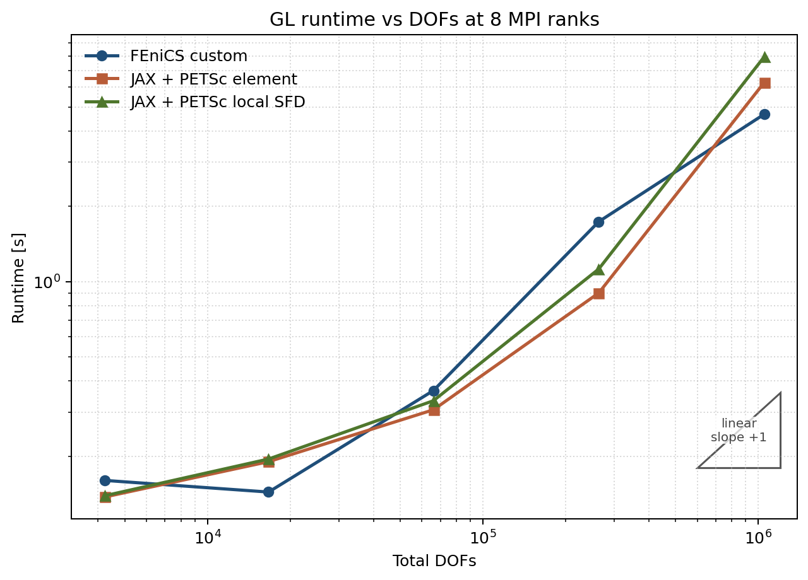

# Final GL Benchmark Report

Date: 2026-03-09

## Purpose

This document applies the refreshed HE-style workflow to the `GinzburgLandau2D`
example:

- a finest-mesh minimizer sweep was rerun before freezing the reporting policy,
- the JAX + PETSc path now has a reordered overlap element implementation,
- the same distributed layout now supports both exact element Hessians and a
  local-SFD Hessian variant,
- and the final qualitative suite was rerun across mesh levels `5..9` and MPI
  counts `1, 2, 4, 8, 16, 32`.

Raw sweep data are in
`../experiment_results_cache/gl_minimizer_sweep_l9_np32/`.

Raw final-suite data are in
`../experiment_results_cache/gl_final_suite/`.

## Current Best Settings

### 1. Fine-mesh benchmark winner

Benchmark: `level 9`, `32` MPI ranks.

| Solver | Config | Total time [s] | Newton | Linear | Final energy | Result |
|---|---|---:|---:|---:|---:|---|
| `fenics_custom` | `ls_loose` | `0.995` | `6` | `8` | `0.345626` | completed |
| `fenics_custom` | `ls_ref` | `2.299` | `8` | `37` | `0.345626` | completed |
| `fenics_custom` | `tr_stcg_r0_5` | `15.187` | `100` | `100` | `0.664550` | failed |
| `fenics_custom` | `tr_stcg_r1_0` | `20.812` | `100` | `100` | `0.664112` | failed |
| `fenics_custom` | `tr_stcg_r2_0` | `13.878` | `100` | `100` | `0.664195` | failed |
| `jax_petsc_element` | `ls_loose` | `1.257` | `6` | `9` | `0.345626` | completed |
| `jax_petsc_element` | `ls_ref` | `2.126` | `7` | `39` | `0.345626` | completed |
| `jax_petsc_element` | `tr_stcg_r0_5` | `16.525` | `100` | `100` | `0.664494` | failed |
| `jax_petsc_element` | `tr_stcg_r1_0` | `16.444` | `100` | `100` | `0.664392` | failed |
| `jax_petsc_element` | `tr_stcg_r2_0` | `16.602` | `100` | `100` | `0.664678` | failed |

Conclusion:

- the finest-mesh benchmark clearly prefers the looser line-search Newton path,
- all tested STCG trust-region variants failed on both backends for this
  non-convex scalar problem,
- and `level 9`, `32` MPI ranks is the right GL regression benchmark when the
  goal is to separate implementations cheaply.

### 2. Robust suite-default policy

The fine-mesh winner cannot be used as the whole-suite default unchanged.
`ls_loose` wins at `level 9`, `32` ranks, but it already fails on `level 5`,
`np=1` for both solver families.

The final qualitative suite therefore freezes on the robust line-search
reference settings:

| Knob | Value |
|---|---|
| nonlinear method | line-search Newton |
| line-search interval | `[-0.5, 2.0]` |
| line-search tolerance | `1e-3` |
| trust region | off |
| KSP type | `gmres` |
| PC type | `hypre` |
| KSP rtol | `1e-3` |
| KSP max it | `200` |
| PC rebuild policy | rebuild every Newton iteration |
| thread count per rank | `1` |

## Implementation Summary

### 1. FEniCS custom + PETSc

The GL custom solver now matches the structured HE / p-Laplace workflow:

- one `steps` list per case,
- per-Newton `history`,
- per-linear-solve `linear_timing`,
- optional trust-region PETSc KSP support,
- and JSON output compatible with
  `experiment_scripts/run_trust_region_case.py`.

### 2. JAX + PETSc reordered element path

The production JAX + PETSc GL path mirrors the scalar reordered overlap design
used for the refreshed p-Laplace implementation:

- reordered free-DOF ownership before PETSc split,
- overlap domains plus `Allgatherv` of the free state,
- fixed PETSc COO sparsity pattern with value-only updates,
- exact element Hessians via `jax.hessian`,
- and corrected energy accounting for Dirichlet-only elements so reported
  energies match the original JAX discretisation.

Implementation files:

- `GinzburgLandau2D_jax_petsc/reordered_element_assembler.py`
- `GinzburgLandau2D_jax_petsc/solver.py`

### 3. Local-SFD variant in the same layout

The second JAX + PETSc variant keeps the same reordered overlap layout and
changes only the local Hessian evaluation:

- `local_hessian_mode=element` uses exact per-element Hessians,
- `local_hessian_mode=sfd_local` uses overlap-local distance-2 coloring plus
  local SFD HVPs.

This keeps the comparison like-for-like: same distribution, same matrix
pattern, same nonlinear policy, different local Hessian mechanism.

## Benchmark Matrix

Final suite:

- solvers:
  - `fenics_custom`
  - `jax_petsc_element`
  - `jax_petsc_local_sfd`
- mesh levels: `5, 6, 7, 8, 9`
- MPI ranks: `1, 2, 4, 8, 16, 32`

DOF sizes:

| Level | Total DOFs |
|---|---:|
| `5` | `4225` |
| `6` | `16641` |
| `7` | `66049` |
| `8` | `263169` |
| `9` | `1050625` |

## Results

### 1. Fine-mesh like-for-like comparison

`level 9`, selected MPI counts:

| Solver | MPI | Total time [s] | Newton | Linear | Assembly [s] | PC init [s] | KSP solve [s] | Final energy | Result |
|---|---:|---:|---:|---:|---:|---:|---:|---:|---|
| `fenics_custom` | `1` | `17.819` | `7` | `22` | `2.386` | `2.658` | `2.438` | `0.345626` | completed |
| `jax_petsc_element` | `1` | `13.574` | `9` | `33` | `2.070` | `3.623` | `3.029` | `0.345626` | completed |
| `jax_petsc_local_sfd` | `1` | `16.011` | `9` | `33` | `4.562` | `3.652` | `3.012` | `0.345626` | completed |
| `fenics_custom` | `16` | `2.860` | `10` | `33` | `0.275` | `0.781` | `0.676` | `0.345626` | completed |
| `jax_petsc_element` | `16` | `3.284` | `8` | `38` | `0.378` | `0.641` | `0.713` | `0.345626` | completed |
| `jax_petsc_local_sfd` | `16` | `4.086` | `8` | `38` | `1.197` | `0.663` | `0.697` | `0.345626` | completed |
| `fenics_custom` | `32` | `1.734` | `8` | `37` | `0.136` | `0.487` | `0.517` | `0.345626` | completed |
| `jax_petsc_element` | `32` | `1.937` | `7` | `39` | `0.177` | `0.476` | `0.347` | `0.345626` | completed |
| `jax_petsc_local_sfd` | `32` | `2.372` | `7` | `39` | `0.553` | `0.508` | `0.358` | `0.345626` | completed |

Observations:

- at serial, `jax_petsc_element` is about `23.8%` faster than `fenics_custom`,
- at `32` ranks, FEniCS is still about `11.7%` faster than the JAX element
  path,
- the local-SFD path is correct and stable on the fine mesh, but unlike the
  p-Laplace case it is materially slower than exact element assembly:
  about `18%` slower at `np=1`, `24%` slower at `np=16`, and `22%` slower at
  `np=32`.

### 2. Strong scaling summary

Best observed speedups relative to serial on `level 9`:

| Solver | Level 9 serial [s] | Best MPI | Best time [s] | Speedup |
|---|---:|---:|---:|---:|
| `fenics_custom` | `17.819` | `32` | `1.734` | `10.28x` |
| `jax_petsc_element` | `13.574` | `32` | `1.937` | `7.01x` |
| `jax_petsc_local_sfd` | `16.011` | `32` | `2.372` | `6.75x` |

Best runtime per level:

| Solver | Level 5 | Level 6 | Level 7 | Level 8 | Level 9 |
|---|---:|---:|---:|---:|---:|
| `fenics_custom` best MPI | `2` | `8` | `16` | `32` | `32` |
| `jax_petsc_element` best MPI | `1` | `4` | `16` | `16` | `32` |
| `jax_petsc_local_sfd` best MPI | `1` | `4` | `16` | `16` | `32` |

### 3. Failure summary

The robust `ls_ref` suite is almost entirely green:

- all `fenics_custom` cases completed,
- all `level 9` JAX + PETSc cases completed,
- the only failures are `level 8`, `np=32` for the two JAX + PETSc variants,
  both stopping at `maxit=100`.

Failure rows:

| Solver | Level | MPI | Total time [s] | Newton | Linear | Failure mode |
|---|---:|---:|---:|---:|---:|---|
| `jax_petsc_element` | `8` | `32` | `11.440` | `100` | `798` | `Maximum number of iterations reached` |
| `jax_petsc_local_sfd` | `8` | `32` | `11.802` | `100` | `798` | `Maximum number of iterations reached` |

This is a decomposition-sensitive outlier rather than a monotone mesh-limit:
both JAX variants complete again at the harder `level 9`, `np=32` case.

## Figures

### Strong scaling



### Runtime vs DOFs at 8 ranks



### Fine-mesh convergence profile


## Recommended Testing Benchmark

Use the finest parallel sweep target as the default development benchmark:

- mesh level: `9`
- MPI ranks: `32`
- nonlinear method: line-search Newton
- linear solver: `gmres + hypre`
- tuning settings: `ksp_rtol=1e-1`, `ksp_max_it=30`, `linesearch_tol=1e-1`

Why this is the right GL test target:

- it was the tuning benchmark used to separate the minimizer policies,
- it clearly distinguishes the fast line-search path from the failing trust
  variants,
- and it remains cheap enough to rerun during implementation work.

For the full qualitative suite, keep the more robust frozen settings:

- `ksp_rtol=1e-3`
- `ksp_max_it=200`
- `linesearch_tol=1e-3`

## Trust-Region Diagnostic Annex

After the initial radius-only sweep, a wider diagnostic campaign was run on the
same fine benchmark target: `level 9`, `np=32`.

Raw trust-diagnostic data are in
`../experiment_results_cache/gl_trust_region_diagnostics_l9_np32/`.

The diagnostic sweep varied more than just the initial radius:

- PETSc trust-subproblem STCG radii `0.05`, `0.2`, `0.5`, `1.0`, `2.0`, `4.0`,
- STCG with and without the post trust-subproblem line search,
- post-line-search tolerance `1e-1` vs `1e-3`,
- line-search interval `[-0.5, 2.0]` vs `[0, 1]`,
- a much tighter STCG inner solve (`ksp_rtol=1e-8`, `ksp_max_it=200`),
- a longer outer run (`maxit=300`),
- and the older reduced 2D trust hybrid
  (`use_trust_region=True`, `ksp_type=gmres`, `pc_type=hypre`) at radii
  `0.2`, `1.0`, and `2.0`.

### 1. What failed exactly in the STCG trust path

The answer is not “the wrong radius.”

Across both `fenics_custom` and `jax_petsc_element`, every tested STCG trust
variant failed in the same way:

- the dominant PETSc KSP reason is `DIVERGED_INDEFINITE_PC`,
- the trust subproblem solve stops after exactly `1` Krylov iteration,
- the outer trust logic accepts every step (`100/100` or `300/300`),
- there are zero trust-region rejections,
- and the gradient norm stays essentially unchanged, around
  `9.27e-4`, instead of dropping to the `1e-5` target.

So this is not a `rho`-update problem and not a “radius collapsed” problem.
The trust KSP is producing a poor direction immediately, and the outer method
then keeps accepting tiny energy-reducing steps.

The tighter-inner-solve runs confirm that the failure is not due to loose
linear tolerances:

- `ksp_rtol=1e-8`, `ksp_max_it=200` still gives the same stagnation,
- and `maxit=300` still does not recover convergence on either backend.

### 2. Best trust-region cases are still qualitatively worse than line search

Line-search Newton reaches the GL minimum at
`E ~= 0.345626`.

Best tested trust-region results:

| Solver | Best STCG trust case | Final energy | Best reduced 2D trust case | Final energy |
|---|---|---:|---|---:|
| `fenics_custom` | `tr_stcg_postls_r1_0_ls1e_3` | `0.662542` | `tr_2d_gmres_hypre_r1_0` | `0.516303` |
| `jax_petsc_element` | `tr_stcg_postls_r1_0_maxit300` | `0.664056` | `tr_2d_gmres_hypre_r0_2` | `0.525262` |

This splits the diagnosis into two parts:

- the PETSc STCG trust-subproblem path is the worse failure mode for GL,
  because it stalls near `E ~= 0.664` with the indefinite-PC inner reason,
- but the older reduced 2D trust hybrid also does not solve the problem:
  it avoids the indefinite-PC KSP failure and its inner GMRES solves converge
  normally, yet it still stops at `maxit=100` far above the line-search basin.

### 3. Practical conclusion

For GL, the issue is not “we just need a better trust radius.”

The broader sweep shows:

- STCG trust + GAMG is structurally mismatched here,
- post line search does not rescue it,
- tighter KSP tolerances do not rescue it,
- longer outer iteration limits do not rescue it,
- and the old reduced 2D trust variant is healthier but still too slow and
  still qualitatively worse than plain line-search Newton.

That is why the GL campaign should stay on line-search Newton, unlike the HE
campaign where trust-region STCG + post line search was genuinely superior.

## Reproduction

Fine-mesh minimizer sweep:

```bash
python experiment_scripts/sweep_gl_minimizer_l9_np32.py
```

Final suite:

```bash
python experiment_scripts/run_gl_final_suite.py
```

Trust-region diagnostic sweep:

```bash
python experiment_scripts/sweep_gl_trust_region_diagnostics_l9_np32.py
```

Figures:

```bash
python img/generate_gl_final_report_figures.py
```
