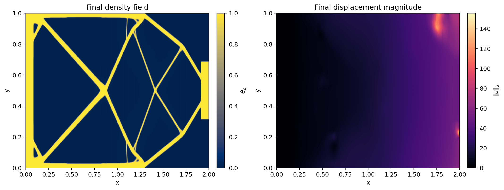
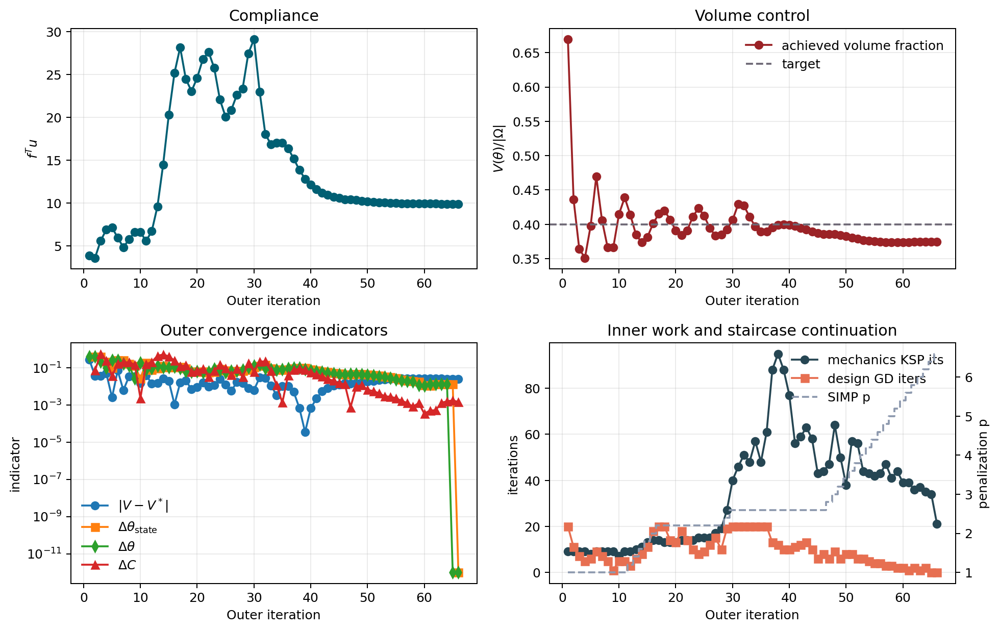
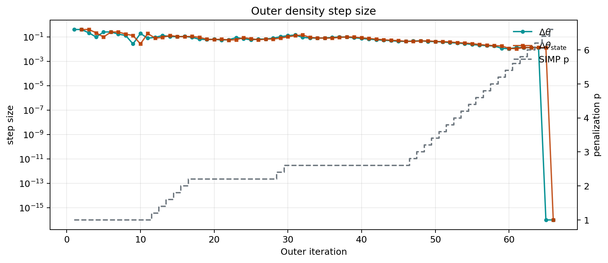
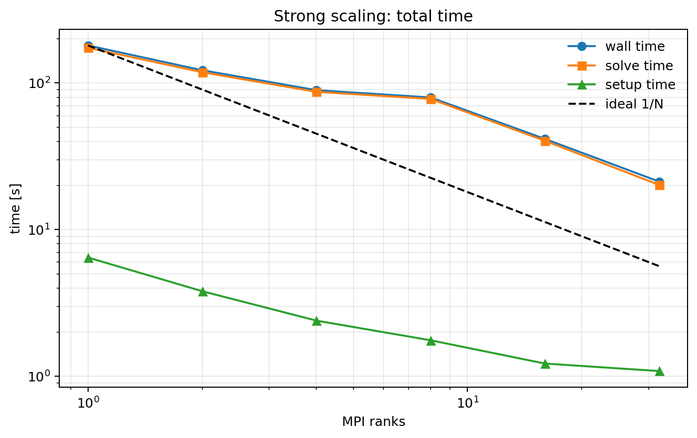
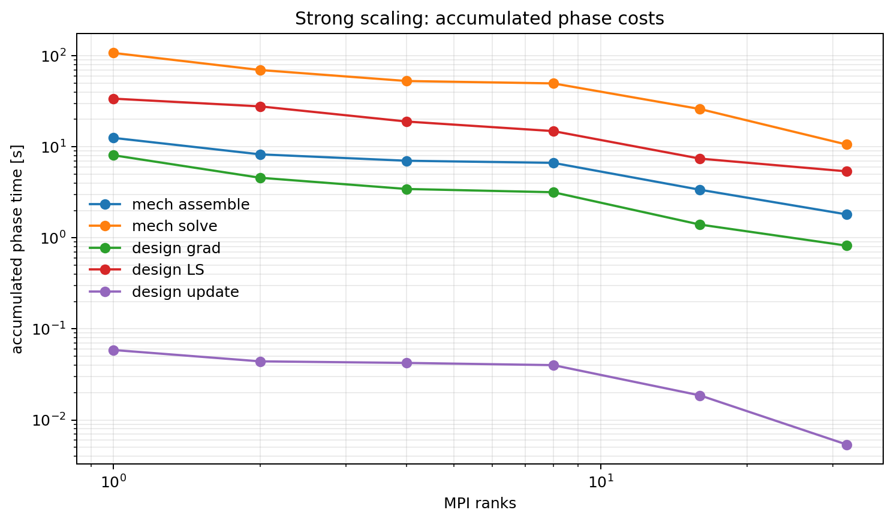
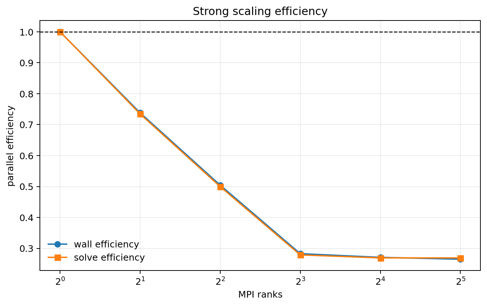
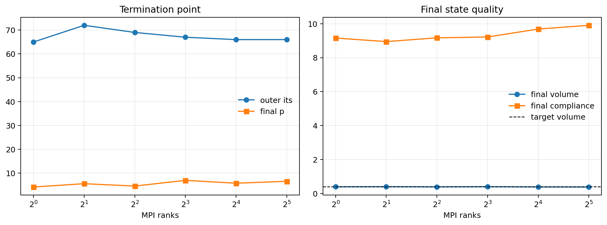

# Final JAX Topology Parallel Results

Date: 2026-03-15

This document records the cleaned final topology-parallel benchmark state after
the repository cleanup pass.

## Purpose

The goal of this report is to preserve the current stable end-to-end parallel
topology workflow:

- distributed JAX+PETSc topology solve
- cleaned final benchmark figures
- final strong-scaling summary
- reproduction commands that write into scratch output, not repo-root report
  folders

This report is intentionally based on the retained parallel baseline, not on the
many intermediate tuning branches that were used during exploration.

## Final Benchmark Configuration

The final fine-grid benchmark uses the current stable parallel policy on the
`768 x 384` mesh.

| Knob | Value |
| --- | --- |
| MPI ranks | `32` |
| Mesh | `768 x 384` |
| Target volume fraction | `0.4` |
| `theta_min` | `1e-6` |
| Mechanics solver | `fgmres + gamg` |
| Mechanics `rtol` | `1e-4` |
| Mechanics `max_it` | `100` |
| Near-nullspace | on |
| Design solver | distributed GD |
| Design LS | `golden_adaptive` |
| LS tol mode | relative to active bracket bound |
| Design `tolg` | `1e-3` |
| Design `max_it` | `20` |
| Continuation | `p += 0.2` every outer iteration |
| `p_max` | `10.0` |
| Graceful stall stop | `dtheta <= 1e-6`, `dtheta_state <= 1e-6`, `p >= 4.0` |

## Final Benchmark Result

| Metric | Value |
| --- | --- |
| Result | `completed` |
| Outer iterations | `66` |
| Final `p` | `6.6` |
| Wall time [s] | `21.269` |
| Final compliance | `9.907413` |
| Final volume fraction | `0.374866` |
| Final volume error | `-0.025134` |
| Final realized `theta_min` | `4.365e-4` |
| Stop type | graceful stall completion |

Important interpretation:

- this run is operationally stable and exits cleanly
- it is **not** exact target convergence
- the design freezes with the volume still below the `0.4` target

## Final Benchmark Figures








## MPI Shutdown Hang Fix

The final scaling/benchmark campaign includes the MPI shutdown fix that was
found late in the investigation.

- Root cause:
  - final snapshot bookkeeping was inconsistent across ranks
- Failure mode:
  - non-root ranks entered one extra final distributed snapshot gather while
    rank `0` skipped it
- Fix:
  - shared `last_snapshot_outer` bookkeeping on all ranks
- Result:
  - the retained solver now exits cleanly after writing results

## Strong Scaling Summary

The retained strong-scaling sweep uses the same fine-grid configuration and the
same graceful stall stop.

| ranks | result | outer | final `p` | final `V` | final `C` | wall [s] | solve [s] | speedup |
| --- | --- | ---: | ---: | ---: | ---: | ---: | ---: | ---: |
| 1 | completed | 65 | 4.20 | 0.388373 | 9.155944 | 180.375 | 173.923 | 1.000 |
| 2 | completed | 72 | 5.60 | 0.393204 | 8.947271 | 122.198 | 118.396 | 1.476 |
| 4 | completed | 69 | 4.60 | 0.385042 | 9.168370 | 89.414 | 87.019 | 2.017 |
| 8 | completed | 67 | 7.00 | 0.393180 | 9.217814 | 79.679 | 77.920 | 2.264 |
| 16 | completed | 66 | 5.80 | 0.379808 | 9.685915 | 41.577 | 40.356 | 4.338 |
| 32 | completed | 66 | 6.60 | 0.374866 | 9.907413 | 21.269 | 20.184 | 8.481 |

Two important caveats:

- this is an end-to-end scaling study, not a strict fixed-work strong-scaling
  measurement, because the stall stop fires at slightly different states across
  rank counts
- the mechanics phase remains the dominant cost, but it scales much better than
  the full wall time

## Scaling Figures









## Curated Raw Data

- Fine benchmark outer-history CSV:
  - [`assets/jax_topology_parallel/final_benchmark/parallel_full_outer_history.csv`](assets/jax_topology_parallel/final_benchmark/parallel_full_outer_history.csv)
- Scaling summary CSV:
  - [`assets/jax_topology_parallel/scaling/scaling_summary.csv`](assets/jax_topology_parallel/scaling/scaling_summary.csv)

## Reproduction

Final fine-grid benchmark:

```bash
mpiexec -n 32 ./.venv/bin/python topological_optimisation_jax/solve_topopt_parallel.py \
    --nx 768 --ny 384 --length 2.0 --height 1.0 \
    --traction 1.0 --load_fraction 0.2 \
    --fixed_pad_cells 32 --load_pad_cells 32 \
    --volume_fraction_target 0.4 --theta_min 1e-6 \
    --solid_latent 10.0 --young 1.0 --poisson 0.3 \
    --alpha_reg 0.005 --ell_pf 0.08 --mu_move 0.01 \
    --beta_lambda 12.0 --volume_penalty 10.0 \
    --p_start 1.0 --p_max 10.0 --p_increment 0.2 \
    --continuation_interval 1 --outer_maxit 2000 \
    --outer_tol 0.02 --volume_tol 0.001 \
    --stall_theta_tol 1e-6 --stall_p_min 4.0 \
    --design_maxit 20 --tolf 1e-6 --tolg 1e-3 \
    --linesearch_tol 0.1 --linesearch_relative_to_bound \
    --design_gd_line_search golden_adaptive \
    --mechanics_ksp_type fgmres --mechanics_pc_type gamg \
    --mechanics_ksp_rtol 1e-4 --mechanics_ksp_max_it 100 \
    --quiet --print_outer_iterations \
    --save_outer_state_history --outer_snapshot_stride 2 \
    --outer_snapshot_dir topological_optimisation_jax/report_runs/final_topology_parallel/frames \
    --json_out topological_optimisation_jax/report_runs/final_topology_parallel/parallel_full_run.json \
    --state_out topological_optimisation_jax/report_runs/final_topology_parallel/parallel_full_state.npz
```

Scaling sweep:

```bash
./.venv/bin/python topological_optimisation_jax/generate_parallel_scaling_stallstop_report.py \
    --asset-dir topological_optimisation_jax/report_runs/parallel_scaling_stallstop_fine \
    --report-path topological_optimisation_jax/report_runs/parallel_scaling_stallstop_fine/report.md
```
