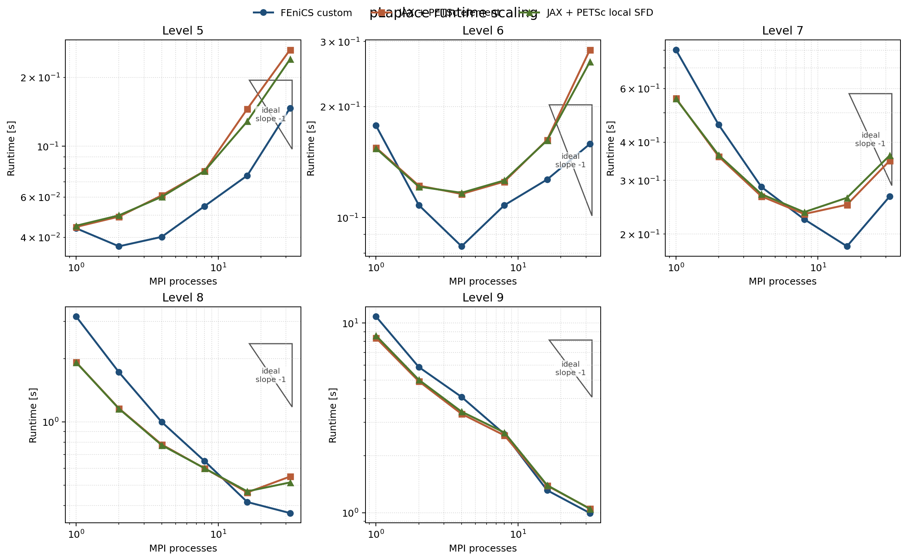
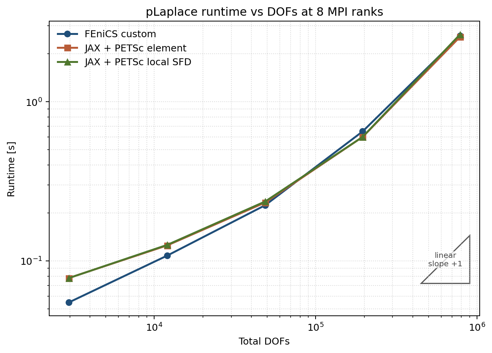
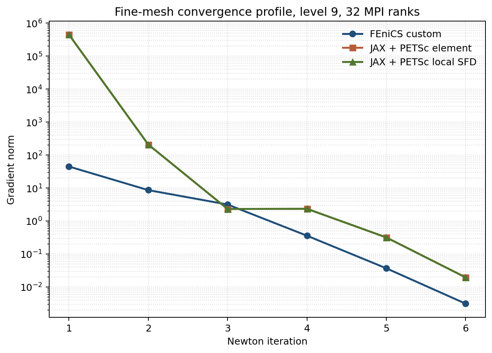

# Final pLaplace Benchmark Report

Date: 2026-03-09

## Purpose

This document mirrors the refreshed HyperElasticity final-report workflow for
the `pLaplace` example:

- the JAX + PETSc path now has a HE-style reordered overlap assembler,
- the local Hessian can be evaluated either by exact element Hessians or by
  overlap-local SFD inside the same distributed layout,
- the minimizer policy was re-swept on the finest mesh benchmark before
  freezing the final campaign settings,
- and the final suite was rerun for all solver variants across mesh levels
  `5..9` and MPI counts `1, 2, 4, 8, 16, 32`.

Raw sweep data are in
`../experiment_results_cache/plaplace_minimizer_sweep_l9_np32/`.

Raw final-suite data are in
`../experiment_results_cache/plaplace_final_suite/`.

## Current Best Settings

Unlike HyperElasticity, the HE trust-region policy is not the best choice for
this problem. On the finest `level 9`, `32`-rank benchmark, the best settings
for both FEniCS and JAX + PETSc are still the looser line-search Newton path:

| Knob | Value |
|---|---|
| nonlinear method | line-search Newton |
| line-search interval | `[-0.5, 2.0]` |
| line-search tolerance | `1e-1` |
| trust region | off |
| KSP type | `cg` |
| PC type | `hypre` |
| KSP rtol | `1e-1` |
| KSP max it | `30` |
| PC rebuild policy | rebuild every Newton iteration |
| thread count per rank | `1` |

### Fine-mesh minimizer sweep

Benchmark: `level 9`, `32` MPI ranks.

| Solver | Config | Total time [s] | Newton | Linear | Final energy |
|---|---|---:|---:|---:|---:|
| `fenics_custom` | `ls_loose` | `1.532` | `6` | `12` | `-7.960006` |
| `fenics_custom` | `ls_ref` | `1.767` | `5` | `19` | `-7.960005` |
| `fenics_custom` | `tr_stcg_r2_0` | `4.277` | `16` | `22` | `-7.960006` |
| `jax_petsc_element` | `ls_loose` | `1.207` | `6` | `11` | `-7.960003` |
| `jax_petsc_element` | `ls_ref` | `1.455` | `6` | `24` | `-7.960004` |
| `jax_petsc_element` | `tr_stcg_r2_0` | `2.310` | `18` | `24` | `-7.960006` |

Conclusion:

- the looser line-search settings are the fastest tested configuration on both
  backends,
- the HE-style trust-region variants remain robust, but they increase nonlinear
  work enough that they are not competitive on this smoother static problem,
- `level 9`, `32` MPI ranks is the recommended regression / testing benchmark.

## Implementation Summary

### 1. FEniCS custom + PETSc

The FEniCS custom solver now emits the same structured per-case output used by
the HE workflow:

- one `steps` list per case,
- per-Newton `history`,
- per-linear-solve `linear_timing`,
- optional trust-region PETSc KSP support,
- and JSON output compatible with `experiment_scripts/run_trust_region_case.py`.

### 2. JAX + PETSc reordered element path

The production `pLaplace` JAX + PETSc solver now matches the HE element design:

- reordered free-DOF ownership before PETSc split,
- overlap domains plus `Allgatherv` of the free state,
- fixed PETSc COO sparsity pattern with value-only updates,
- exact element Hessian assembly via `jax.hessian`,
- and the same structured timing / convergence output as the HE solver.

Implementation files:

- `pLaplace2D_jax_petsc/reordered_element_assembler.py`
- `pLaplace2D_jax_petsc/solver.py`

### 3. Local-SFD variant in the same layout

The second JAX + PETSc variant keeps the same reordered overlap layout, but
switches only the local Hessian evaluation:

- `local_hessian_mode=element` uses exact per-element Hessians,
- `local_hessian_mode=sfd_local` uses overlap-local distance-2 coloring plus
  local SFD HVPs.

That makes the comparison like-for-like: distribution, PETSc matrix pattern,
and nonlinear policy stay fixed while only the local Hessian mechanism changes.

## Benchmark Matrix

Final suite:

- solvers:
  - `fenics_custom`
  - `jax_petsc_element`
  - `jax_petsc_local_sfd`
- mesh levels: `5, 6, 7, 8, 9`
- MPI ranks: `1, 2, 4, 8, 16, 32`

DOF sizes:

| Level | Total DOFs |
|---|---:|
| `5` | `2945` |
| `6` | `12033` |
| `7` | `48641` |
| `8` | `195585` |
| `9` | `784385` |

## Results

### 1. Fine-mesh like-for-like comparison

`level 9`, selected MPI counts:

| Solver | MPI | Total time [s] | Newton | Linear | Assembly [s] | PC init [s] | KSP solve [s] | Line search [s] | Final energy |
|---|---:|---:|---:|---:|---:|---:|---:|---:|---:|
| `fenics_custom` | `1` | `10.833` | `5` | `10` | `1.155` | `3.421` | `1.408` | `4.199` | `-7.960005` |
| `jax_petsc_element` | `1` | `8.352` | `6` | `11` | `1.001` | `4.072` | `1.433` | `1.653` | `-7.960004` |
| `jax_petsc_local_sfd` | `1` | `8.588` | `6` | `11` | `1.287` | `4.055` | `1.417` | `1.635` | `-7.960004` |
| `fenics_custom` | `16` | `1.313` | `6` | `12` | `0.116` | `0.540` | `0.227` | `0.373` | `-7.960006` |
| `jax_petsc_element` | `16` | `1.388` | `6` | `11` | `0.189` | `0.581` | `0.198` | `0.364` | `-7.960005` |
| `jax_petsc_local_sfd` | `16` | `1.396` | `6` | `11` | `0.208` | `0.576` | `0.197` | `0.361` | `-7.960005` |
| `fenics_custom` | `32` | `0.995` | `6` | `12` | `0.080` | `0.409` | `0.238` | `0.209` | `-7.960006` |
| `jax_petsc_element` | `32` | `1.051` | `6` | `11` | `0.104` | `0.464` | `0.126` | `0.319` | `-7.960003` |
| `jax_petsc_local_sfd` | `32` | `1.048` | `6` | `11` | `0.109` | `0.459` | `0.123` | `0.318` | `-7.960003` |

Observations:

- at serial, both JAX + PETSc variants beat FEniCS on the finest mesh,
  with `jax_petsc_element` about `23%` faster than `fenics_custom`,
- at `32` ranks, FEniCS is still slightly faster overall,
  but only by about `5%`,
- the two JAX + PETSc variants are extremely close:
  on `level 9`, the local-SFD path stays within roughly `3.5%` of the element
  path across all tested MPI counts and is marginally faster at `32` ranks.

### 2. Strong scaling summary

Best observed speedups relative to serial:

| Solver | Level 9 serial [s] | Best MPI | Best time [s] | Speedup |
|---|---:|---:|---:|---:|
| `fenics_custom` | `10.833` | `32` | `0.995` | `10.88x` |
| `jax_petsc_element` | `8.352` | `32` | `1.051` | `7.95x` |
| `jax_petsc_local_sfd` | `8.588` | `32` | `1.048` | `8.20x` |

For the JAX + PETSc paths, the best runtime per level is:

| Solver | Level 5 | Level 6 | Level 7 | Level 8 | Level 9 |
|---|---:|---:|---:|---:|---:|
| `jax_petsc_element` best MPI | `1` | `4` | `8` | `16` | `32` |
| `jax_petsc_local_sfd` best MPI | `1` | `4` | `8` | `16` | `32` |

The JAX + PETSc variants scale cleanly, but on this scalar problem the
coarsest levels hit the usual small-problem crossover sooner than the HE case.

### 3. Element vs local SFD

The reordered local-SFD variant is not a fallback-quality path; it is a real
production alternative:

- same nonlinear iteration counts as the element path in every final-suite run,
- same final energies to the reported precision,
- same linear-iteration totals on the fine mesh,
- and only small runtime deltas relative to element assembly.

On the finest mesh:

- `np=1`: local SFD is about `2.8%` slower than element,
- `np=8`: local SFD is about `3.5%` slower than element,
- `np=32`: local SFD is about `0.3%` faster than element.

## Figures

### Strong scaling



### Runtime vs DOFs at 8 ranks



### Fine-mesh convergence profile



## Recommended Testing Benchmark

Use the finest parallel case as the default regression benchmark:

- mesh level: `9`
- MPI ranks: `32`
- nonlinear method: line-search Newton
- linear solver: `cg + hypre`
- tolerances: `ksp_rtol=1e-1`, `ksp_max_it=30`, `linesearch_tol=1e-1`

Why this is the right test target:

- it was the tuning benchmark used to freeze the final settings,
- it cleanly separates the three implementations,
- and it is still cheap enough to rerun during development.

## Reproduction

Fine-mesh minimizer sweep:

```bash
python experiment_scripts/sweep_plaplace_minimizer_l9_np32.py
```

Final suite:

```bash
python experiment_scripts/run_plaplace_final_suite.py --profile performance
```

Figures:

```bash
python img/generate_plaplace_final_report_figures.py
```
