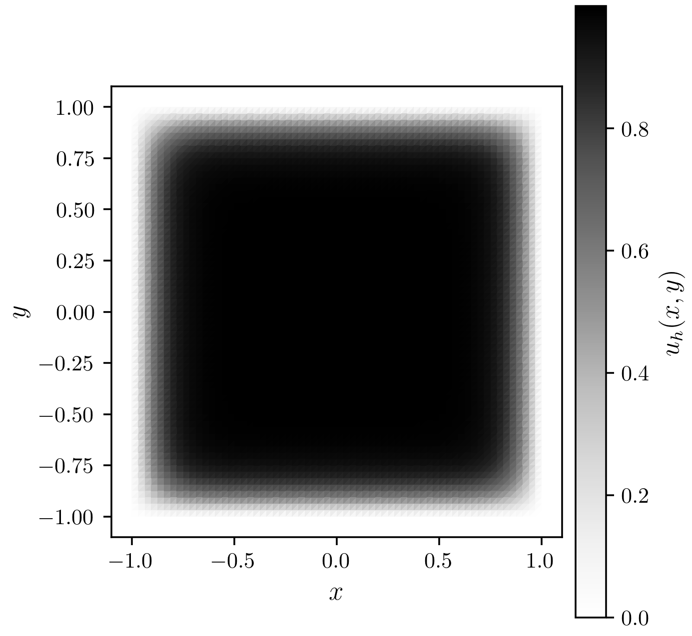
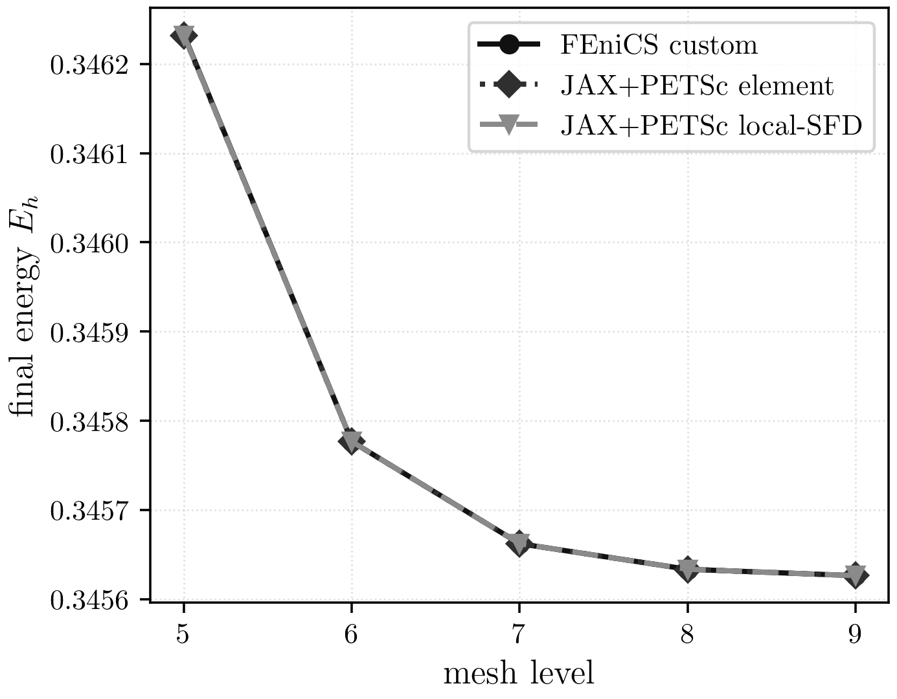

# GinzburgLandau

## Mathematical Formulation

The maintained Ginzburg-Landau benchmark solves the non-convex scalar energy
minimisation problem

$$
E(u)=\int_\Omega \frac{\varepsilon}{2}\lvert \nabla u \rvert^2
+ \frac{1}{4}(u^2-1)^2\,dx,
\qquad \varepsilon=10^{-2},
$$

on $\Omega=[-1,1]^2$ with homogeneous Dirichlet boundary data
$u=0$ on $\partial\Omega$.

This benchmark is deliberately more delicate than pLaplace: the double-well
potential introduces indefinite local curvature, so the nonlinear solve must
remain robust while still converging to the same discrete minimiser.

## Geometry, Boundary Conditions, And Discretisation

- domain: square `[-1, 1]^2`
- boundary condition: homogeneous Dirichlet on the full boundary
- maintained mesh hierarchy: levels `5..9`
- discretisation: first-order Lagrange finite elements on triangular meshes in
  `data/meshes/GinzburgLandau/`

## Maintained Implementations

| implementation | role |
| --- | --- |
| FEniCS custom Newton | maintained benchmark path and sample-state export |
| FEniCS SNES trust-region | direct comparison reference |
| JAX+PETSc element Hessian | maintained benchmark path |
| JAX+PETSc local-SFD Hessian | maintained benchmark path |

## Curated Sample Result

The sample field below is exported from the maintained FEniCS custom Newton
showcase rerun at level `5`. The maintained implementations that converge on
the shared serial comparison case agree on the final energy within the expected
nonlinear solve tolerance.



PDF: [GinzburgLandau sample result](../assets/ginzburg_landau/ginzburg_landau_sample_state.pdf)



PDF: [GinzburgLandau energy vs level](../assets/ginzburg_landau/ginzburg_landau_energy_levels.pdf)

## Energy Table Across Levels

Authoritative maintained suite values at `np=1`:

| level | FEniCS custom | JAX+PETSc element | JAX+PETSc local-SFD |
| --- | ---: | ---: | ---: |
| 5 | 0.346232 | 0.346231 | 0.346231 |
| 6 | 0.345777 | 0.345777 | 0.345777 |
| 7 | 0.345662 | 0.345662 | 0.345662 |
| 8 | 0.345634 | 0.345634 | 0.345634 |
| 9 | 0.345626 | 0.345626 | 0.345626 |

## Caveats

- The final maintained suite contains two benchmark-documented expected failures
  at `level 8`, `np=32` for the JAX+PETSc element and local-SFD variants.
- Those failures do not occur on the finest `level 9` maintained result pages,
  and the hardest maintained benchmark case still completes for all three suite
  paths.
- FEniCS SNES is useful as a direct comparison point, but the maintained suite
  keeps the custom FEniCS and JAX+PETSc paths as the authoritative campaign.

## Where To Go Next

- current maintained comparison and scaling: [GinzburgLandau results](../results/GinzburgLandau.md)
- setup and environment: [quickstart](../setup/quickstart.md)

## Commands Used

Showcase sample state:

```bash
./.venv/bin/python -u src/problems/ginzburg_landau/fenics/solve_GL_custom_jaxversion.py \
  --levels 5 --quiet \
  --json artifacts/raw_results/docs_showcase/ginzburg_landau/fenics_custom/output.json \
  --state-out artifacts/raw_results/docs_showcase/ginzburg_landau/fenics_custom/state.npz
```

Maintained suite:

```bash
./.venv/bin/python -u experiments/runners/run_gl_final_suite.py \
  --out-dir artifacts/reproduction/<campaign>/runs/ginzburg_landau/final_suite
```
