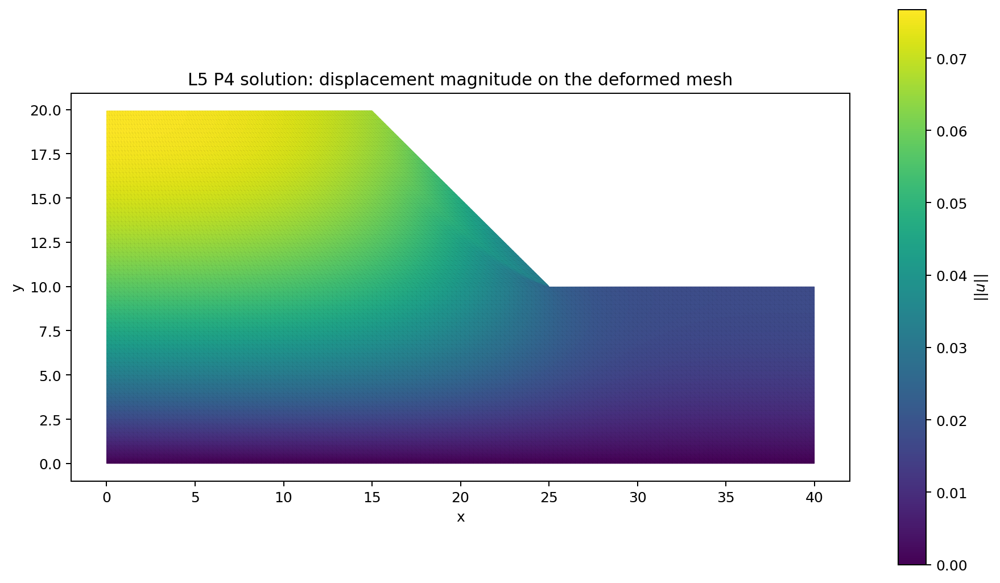
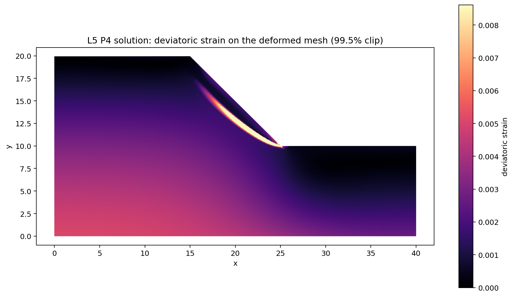

# Mohr-Coulomb Plasticity

This is the canonical problem page for the repository's plane-strain
Mohr-Coulomb plasticity implementation. The code path still lives under
`src/problems/slope_stability/` because the maintained benchmark domain is a
homogeneous 2D slope, but the model described here is the plasticity model
itself rather than a separate "slope stability" physics family.

The current docs surface has two roles:

- this page describes the constitutive model, discretisation, and maintained
  implementation choices
- [the Plasticity results page](../results/Plasticity.md) collects the current
  backend comparison, hierarchy selection, and large-scale scaling data

## Mathematical Formulation

The maintained implementation solves the plane-strain total potential

$$
J(u_{\mathrm{free}})
= \sum_{e=1}^{n_{\mathrm{el}}} \Pi_e(u_e) - f_{\mathrm{ext}}^T u,
$$

with one scalar element energy

$$
\Pi_e(u_e)
= \sum_{q=1}^{n_q} w_{eq}\,
\psi_{\mathrm{MC}}\!\left(B_{eq}u_e,\varepsilon^{p,\mathrm{old}}_{eq},
E,\nu,\phi,c,\mathrm{reg}\right).
$$

For the maintained `P4` path on triangles:

- `u_e in R^30`: `15` scalar shape functions and `2` displacement components
- `B_eq in R^(3x30)`: plane-strain engineering-shear strain operator
- `n_q = 19`: degree-aware triangle quadrature from `basix`
- `eps_p_old_eq in R^3`: stored plastic strain at each quadrature point

The local constitutive density uses the same associative Mohr-Coulomb pattern
across all maintained runs:

- trial stress from plane-strain elasticity
- principal-stress evaluation
- return to the admissible Mohr-Coulomb face or apex
- local energy density
  `sigma : (eps - eps_p_old) - 0.5 sigma : S : sigma`

### Material Parameters

The current maintained benchmark uses:

| parameter | value | meaning |
| --- | ---: | --- |
| `E` | `40000.0` | Young modulus |
| `nu` | `0.30` | Poisson ratio |
| `phi` | `45 deg` | friction angle |
| `c` | `6.0` | cohesion |
| `gamma` | `20.0` | gravity loading magnitude |
| `reg` | `1e-12` | small regularisation in the principal-stress split |
| `psi` | `0 deg` | dilation angle used by the Davis-B reduction helper |

The solver still carries a Davis-B reduction path because the same code can be
used for strength-reduction-style continuation. In the maintained plasticity
docs, however, `lambda = 1.0` means the published runs use the nominal material
parameters without additional strength reduction, so the reported `c` and
`phi` are the unreduced benchmark values.

## Geometry, Boundary Conditions, And Discretisation

- domain: homogeneous 2D slope with `x1=15`, `x2=10`, `x3=15`, `y1=10`,
  `y2=10`, `beta=45 deg`
- body force: gravity only
- boundary conditions:
  - bottom edge fixed in `x` and `y`
  - left and far-right vertical boundaries fixed in `x`
  - sloping top boundary traction-free
- maintained high-order family: same-mesh `P4` for the fine space
- maintained hierarchy family:
  - same-mesh bridge `P4(L) -> P2(L) -> P1(L)`
  - deep `P1` tail down the mesh hierarchy when running the large PMG path

The curated published runs currently cover:

- `L5 P4`: `167361` nodes, `20800` triangles, `332960` free DOFs
- `L6 P4`: `667521` nodes, `83200` triangles, `1331520` free DOFs
- `L7 P4`: `2666241` nodes, `332800` triangles, `5325440` free DOFs

## Maintained Implementations

| implementation | status | role |
| --- | --- | --- |
| scalar JAX element energy | current | local Mohr-Coulomb kernel differentiated with `jax.grad` and `jax.hessian` |
| JAX+PETSc assembled PMG path | maintained parallel path | current large-scale published implementation |
| endpoint plastic-history handling | prototype | maintained docs still use `eps_p_old = 0` endpoint states rather than a full history update loop |

This page intentionally focuses on the maintained PMG path. Wider backend and
hierarchy comparison experiments are summarised on the results page rather than
in the model description itself.

## Detailed Implementation Specification

### Scalar Element-Energy Contract

The central design choice is still one scalar element energy:

```python
element_energy(
    u_elem,
    elem_B_elem,
    quad_weight_elem,
    eps_p_old_elem,
    E,
    nu,
    phi_deg,
    cohesion,
    reg=1.0e-12,
)
```

That contract is degree-agnostic. The element size is carried entirely by
`u_elem`, `elem_B_elem`, and `quad_weight_elem`, so the same local kernel
drives both `P2` and `P4` maintained runs.

### JAX Residual / Tangent Path

The local derivatives come directly from JAX autodiff:

```python
jax.grad(element_energy, argnums=0)
jax.hessian(element_energy, argnums=0)
```

The maintained PETSc path evaluates those local derivatives element-by-element
on reordered local vectors. In the published `P4` runs, one local Hessian is a
`30 x 30` triangle block.

### Assembled Global Tangent Path

The global Newton operator is assembled from those local Hessians through a
reordered free-DOF layout:

- free DOFs are permuted into PETSc-friendly reordered ownership ranges
- local element Hessians are extracted into persistent owned-row buffers
- the global tangent is written with PETSc COO insertion
- the global residual uses the same local contract, differentiated once instead
  of twice

The maintained path is therefore still "assembled global tangent from a scalar
JAX element energy", not a hand-derived constitutive tangent.

### PMG Hierarchy Construction

Two hierarchy patterns matter in the current maintained story:

- showcase `L5` render path:
  - `P4(L5) -> P2(L5) -> P1(L5) -> P1(L4)`
- maintained large-scale PMG path:
  - `P4(L7) -> P2(L7) -> P1(L7) -> P1(L6) -> P1(L5) -> P1(L4) -> P1(L3) -> P1(L2) -> P1(L1)`

The same-mesh transfer operators are built from basis evaluation, and the deep
`P1` tail uses cached owned-row transfer construction. The current public
results page explains why the deep `P1` tail is the maintained choice.

### Nonlinear Method And Capped Linear Steps

The current maintained plasticity benchmarks use:

- Newton iterations capped explicitly for the published fixed-work scaling runs
- `armijo` line search
- `fgmres` as the outer linear solver
- capped linear steps with `ksp_max_it = 15`

For the large maintained PMG runs, a linear solve hitting `DIVERGED_MAX_IT`
does not abort the nonlinear run by default. The capped direction is kept so
the fixed-`20`-step benchmark can complete and report the final state at every
rank count. The results page calls this out explicitly so the benchmark rows
are interpreted correctly.

### Distributed Data Path

The maintained large-scale path avoids the old "full global fine tensors on
every rank" behavior:

- same-mesh heavy fine-level data is loaded rank-locally from HDF5
- MG level construction uses rank-local metadata where possible
- transfer operators are built or loaded in owned-row form
- hot-path overlap exchange uses the point-to-point overlap mode

This is the current maintained design for the `L7 P4` runs. Some lighter
global metadata is still replicated during hierarchy/layout construction, but
the heavy fine-level `P4` tensors are no longer fully duplicated on every MPI
rank in the published large runs.

## Curated Sample Result

The rendered sample state on this page is the `L5` same-mesh `P4` solve, chosen
because it gives a stable high-order visualisation while keeping the published
figures readable. The current maintained large-scale benchmark story lives on
the results page and uses the deeper PMG hierarchy on `L7`.

Curated `L5` sample state:

- space: same-mesh `P4`
- hierarchy: `P4(L5) -> P2(L5) -> P1(L5) -> P1(L4)`
- `lambda = 1.0`
- final energy: `-212.537684314790`
- final `omega = 425.515718251082`
- final `u_max = 0.076684238653`





## Resolution / Objective Table

| label | level / space | nodes | elements | free DOFs | energy | note |
| --- | --- | ---: | ---: | ---: | ---: | --- |
| curated render | `L5 P4` | 167361 | 20800 | 332960 | -212.537684315 | same-mesh `P4 -> P2 -> P1` with `L4 P1` tail |
| maintained optimization benchmark | `L6 P4` | 667521 | 83200 | 1331520 | -212.538561468 | `8` ranks, deep `P1` tail, fixed `20`-step benchmark |
| maintained scaling benchmark | `L7 P4` | 2666241 | 332800 | 5325440 | -212.538883178 | `16`-rank row from the fixed `20`-step scaling campaign |

## Caveats

- The current maintained plasticity results are still zero-history endpoint
  runs with `eps_p_old = 0`; they are not yet a full path-consistent plastic
  evolution benchmark.
- The implementation path stays under `src/problems/slope_stability/` and
  `data/meshes/SlopeStability/` because the current benchmark domain is still
  the homogeneous slope geometry.
- The published large-scale PMG results are fixed-work `20`-Newton-iteration
  campaigns, not full-to-tolerance nonlinear convergence studies.
- The current maintained benchmark domain is a specific geometry used to stress
  the solver stack; it should not be read as the full future scope of the
  plasticity family.

## Commands Used

Curated `L5 P4` sample-state solve:

```bash
./.venv/bin/python -u src/problems/slope_stability/jax_petsc/solve_slope_stability_dof.py \
  --level 5 --elem_degree 4 --lambda-target 1.0 \
  --profile performance --pc_type mg \
  --mg_strategy same_mesh_p4_p2_p1_lminus1_p1 --mg_variant legacy_pmg \
  --ksp_type fgmres --ksp_rtol 1e-2 --ksp_max_it 100 \
  --save-linear-timing --no-use_trust_region --quiet \
  --out artifacts/raw_results/docs_showcase/mc_plasticity_p4_l5/output.json \
  --state-out artifacts/raw_results/docs_showcase/mc_plasticity_p4_l5/state.npz
```

Curated docs-asset generation:

```bash
./.venv/bin/python -u experiments/analysis/generate_mc_plasticity_p4_docs_assets.py \
  --state artifacts/raw_results/docs_showcase/mc_plasticity_p4_l5/state.npz \
  --result artifacts/raw_results/docs_showcase/mc_plasticity_p4_l5/output.json \
  --out-dir docs/assets/plasticity
```
