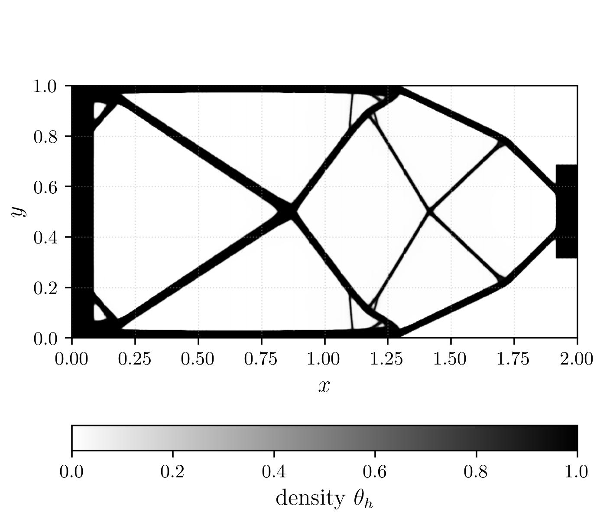
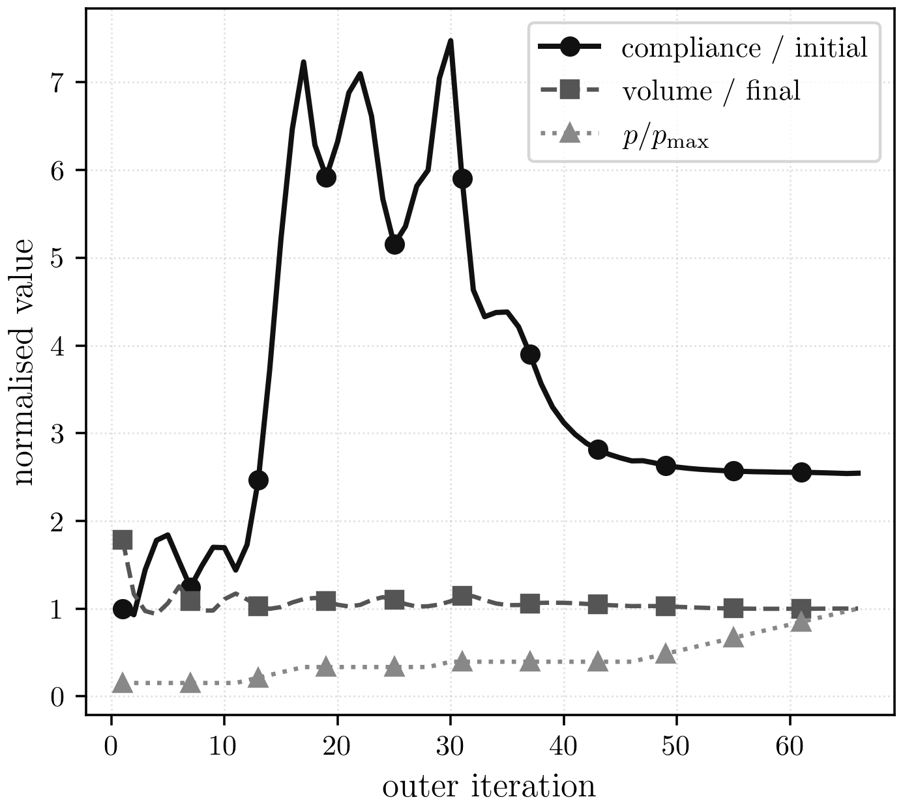

# Topology

## Mathematical Formulation

The maintained topology workflow solves a reduced compliance-minimisation
problem with a density field, phase-field regularisation, a proximal move
penalty, and staircase SIMP continuation. In shorthand, the design update
minimises

$$
\mathcal{J}(\theta, z)
= C(\theta,u)
+ \lambda_V\int_\Omega \theta\,dx
+ \alpha\int_\Omega \left(\frac{\ell}{2}\lvert\nabla\theta\rvert^2
+ \frac{1}{\ell}W(\theta)\right)\,dx
+ \frac{\mu}{2}\lVert z-z_{\mathrm{old}}\rVert^2,
$$

with target volume fraction `0.4`. The mechanics step solves the equilibrium
problem for a fixed density field, then the design step updates the latent
density variable on the same mesh family.

## Geometry, Boundary Conditions, And Discretisation

- geometry: 2D cantilever beam of length `2.0` and height `1.0`
- left boundary: clamped
- right-edge traction patch: `load_fraction = 0.2`
- maintained reference meshes:
  - serial pure-JAX reference: `192 x 96`
  - parallel fine benchmark and scaling: `768 x 384`
- mechanics path: vector elasticity solve with `fgmres + gamg`
- design path: distributed gradient-based latent-density update

The maintained parallel implementation uses structured triangular meshes,
distributed owned-plus-ghost layouts, rigid-body near-nullspace enrichment for
mechanics, and a fixed continuation schedule in the SIMP penalisation
parameter.

## Maintained Implementations

| implementation | role |
| --- | --- |
| pure JAX serial | serial reference benchmark and formulation sanity check |
| parallel JAX+PETSc | maintained fine-grid benchmark and scaling path |

## Curated Sample Result

The current showcase uses the finished fine-grid parallel benchmark rather than
an intermediate demonstration. The density field, objective history, and the
evolution animation below all come from the maintained `768 x 384`, `32`-rank
final run.



PDF: [Topology final density](../assets/topology/topology_final_density.pdf)



PDF: [Topology objective history](../assets/topology/topology_objective_history.pdf)


## Resolution / Objective Table

| label | mesh | ranks | result | outer | compliance | volume | wall [s] |
| --- | --- | ---: | --- | ---: | ---: | ---: | ---: |
| serial reference | 192x96 | 1 | completed | 121 | 4.1557 | 0.4000 | 10.033 |
| parallel final | 768x384 | 32 | completed | 66 | 9.9074 | 0.3749 | 25.105 |
| parallel scaling r1 | 768x384 | 1 | completed | 65 | 9.1559 | 0.3884 | 208.198 |
| parallel scaling r2 | 768x384 | 2 | completed | 72 | 8.9473 | 0.3932 | 138.439 |
| parallel scaling r4 | 768x384 | 4 | completed | 69 | 9.1684 | 0.3850 | 95.708 |
| parallel scaling r8 | 768x384 | 8 | completed | 67 | 9.2178 | 0.3932 | 82.140 |
| parallel scaling r16 | 768x384 | 16 | completed | 66 | 9.6859 | 0.3798 | 43.328 |
| parallel scaling r32 | 768x384 | 32 | completed | 66 | 9.9074 | 0.3749 | 25.105 |

## Caveats

- The serial pure-JAX reference and the parallel JAX+PETSc path are both
  maintained, but they do not solve the same fixed-work problem at fine scale.
- The `serial reference` wall time is the fresh 3-run median from the shared
  `192 x 96` direct-comparison reruns; the separate serial report workflow is
  still the source of the published state and asset bundle.
- The parallel fine-grid scaling study is an end-to-end scaling measurement;
  the graceful stall stop triggers at slightly different states across rank
  counts, so the final compliance/volume values are close but not identical.
- The `parallel final` row and `parallel scaling r32` row are intentionally
  aligned to the same validated `32`-rank benchmark rerun so the problem and
  results pages report one canonical fine-grid timing.
- On the smaller `192 x 96` shared direct-comparison case, the maintained
  parallel path reaches `max_outer_iterations` rather than the serial reference
  stopping state.

## Where To Go Next

- current maintained comparison and scaling: [Topology results](../results/Topology.md)
- setup and environment: [quickstart](../setup/quickstart.md)
- implementation details: [Topology JAX+PETSc implementation](../implementation/topology_jax_petsc.md)

## Commands Used

For timings comparable to the maintained topology tables, pin the JAX CPU
backend to a single thread before running the commands below:

```bash
export JAX_PLATFORMS=cpu
export OMP_NUM_THREADS=1 OPENBLAS_NUM_THREADS=1 MKL_NUM_THREADS=1
export BLIS_NUM_THREADS=1 VECLIB_MAXIMUM_THREADS=1 NUMEXPR_NUM_THREADS=1
export XLA_FLAGS="--xla_cpu_multi_thread_eigen=false intra_op_parallelism_threads=1"
```

Canonical maintained topology suite:

```bash
./.venv/bin/python -u experiments/runners/run_topology_docs_suite.py \
  --out-dir artifacts/reproduction/<campaign>/runs/topology
```

Serial reference report assets:

```bash
./.venv/bin/python -u experiments/analysis/generate_report_assets.py \
  --asset-dir artifacts/reproduction/<campaign>/runs/topology/serial_reference \
  --report-path artifacts/reproduction/<campaign>/runs/topology/serial_reference/report.md
```

Fine-grid parallel benchmark:

```bash
mpiexec -n 32 ./.venv/bin/python -u src/problems/topology/jax/solve_topopt_parallel.py \
  --nx 768 --ny 384 --length 2.0 --height 1.0 --traction 1.0 --load_fraction 0.2 \
  --fixed_pad_cells 32 --load_pad_cells 32 --volume_fraction_target 0.4 --theta_min 1e-6 \
  --solid_latent 10.0 --young 1.0 --poisson 0.3 --alpha_reg 0.005 --ell_pf 0.08 \
  --mu_move 0.01 --beta_lambda 12.0 --volume_penalty 10.0 \
  --p_start 1.0 --p_max 10.0 --p_increment 0.2 --continuation_interval 1 \
  --outer_maxit 2000 --outer_tol 0.02 --volume_tol 0.001 \
  --stall_theta_tol 1e-6 --stall_p_min 4.0 --design_maxit 20 \
  --tolf 1e-6 --tolg 1e-3 --linesearch_tol 0.1 --linesearch_relative_to_bound \
  --design_gd_line_search golden_adaptive --design_gd_adaptive_window_scale 2.0 \
  --mechanics_ksp_type fgmres --mechanics_pc_type gamg \
  --mechanics_ksp_rtol 1e-4 --mechanics_ksp_max_it 100 \
  --quiet --print_outer_iterations --save_outer_state_history --outer_snapshot_stride 2 \
  --outer_snapshot_dir artifacts/reproduction/<campaign>/runs/topology/parallel_final/frames \
  --json_out artifacts/reproduction/<campaign>/runs/topology/parallel_final/parallel_full_run.json \
  --state_out artifacts/reproduction/<campaign>/runs/topology/parallel_final/parallel_full_state.npz
```
