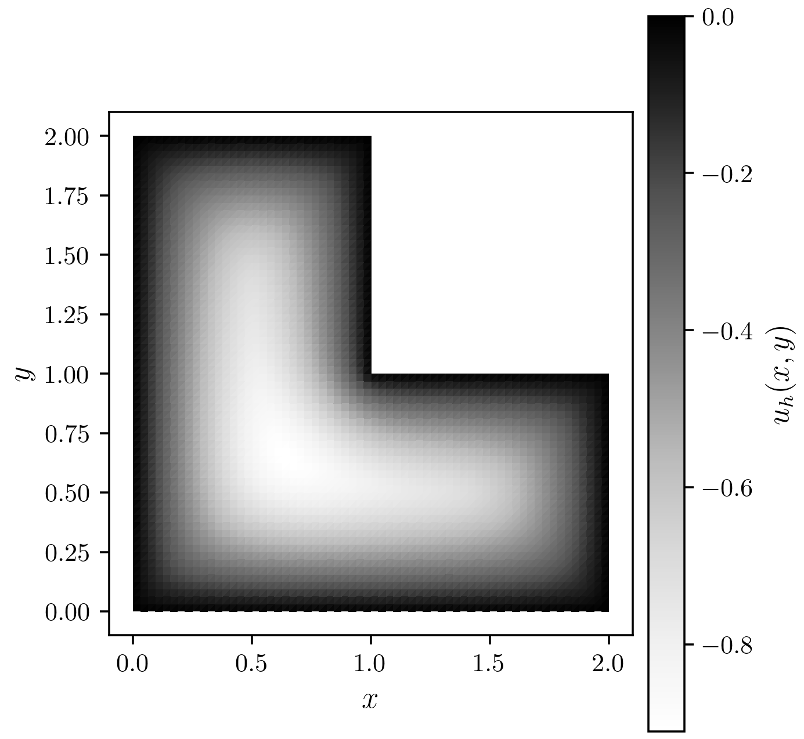
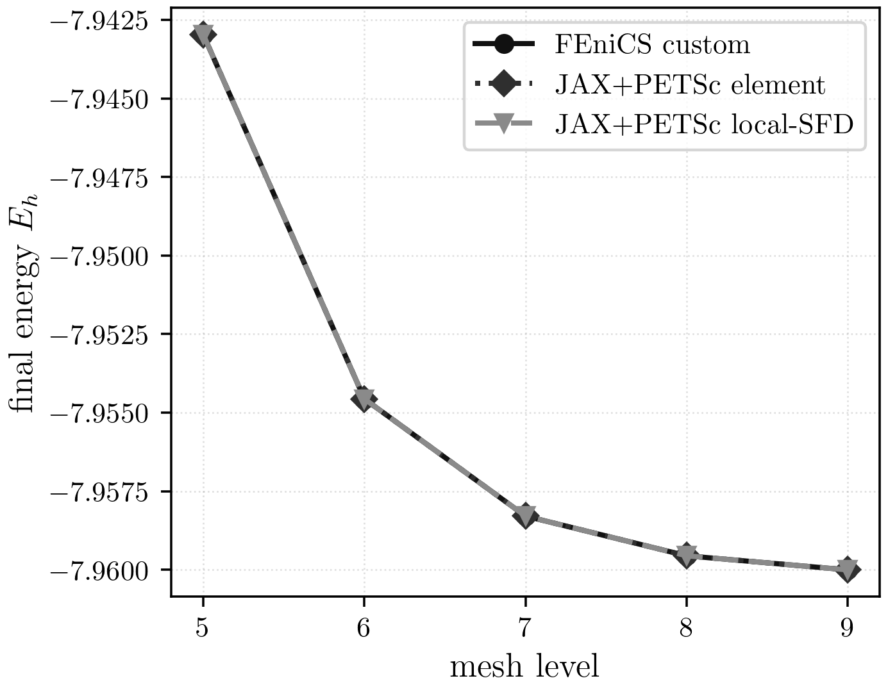

# pLaplace

## Mathematical Formulation

The maintained pLaplace benchmark solves the nonlinear scalar minimisation
problem

$$
E(u)=\int_\Omega \frac{1}{p}\lvert \nabla u \rvert^p\,dx-\int_\Omega f u\,dx,
\qquad p=3,\quad f=-10,
$$

on the unit square $\Omega=(0,1)^2$ with homogeneous Dirichlet boundary data
$u=0$ on $\partial\Omega$. The Euler-Lagrange equation is

$$
-\nabla\cdot\left(\lvert\nabla u\rvert^{p-2}\nabla u\right)=f.
$$

This is the repository's cleanest scalar nonlinear benchmark: the geometry is
simple, the forcing is fixed, and the main challenge is the genuinely nonlinear
diffusion law.

## Geometry, Boundary Conditions, And Discretisation

- domain: unit square
- boundary condition: homogeneous Dirichlet on the full boundary
- forcing: constant source `f = -10`
- maintained mesh hierarchy: levels `5..9`
- discretisation: first-order Lagrange finite elements on triangular meshes in
  `data/meshes/pLaplace/`

The problem has one degree of freedom per free node, so both the energy-vs-level
and scaling plots can be read directly as a function of mesh refinement.

## Maintained Implementations

| implementation | role |
| --- | --- |
| FEniCS custom Newton | maintained benchmark path and sample-state export |
| FEniCS SNES | direct comparison reference |
| pure JAX serial | serial reference |
| JAX+PETSc element Hessian | maintained benchmark path |
| JAX+PETSc local-SFD Hessian | maintained benchmark path |

## Curated Sample Result

The sample field below is exported from the maintained FEniCS custom Newton
showcase rerun at level `5`. On the shared level-`5` serial comparison case,
all converged maintained implementations agree on the final energy to within
the expected solver tolerance.



PDF: [pLaplace sample result](../assets/plaplace/plaplace_sample_state.pdf)



PDF: [pLaplace energy vs level](../assets/plaplace/plaplace_energy_levels.pdf)

## Energy Table Across Levels

Authoritative maintained suite values at `np=1`:

| level | FEniCS custom | JAX+PETSc element | JAX+PETSc local-SFD |
| --- | ---: | ---: | ---: |
| 5 | -7.942969 | -7.942969 | -7.942969 |
| 6 | -7.954564 | -7.954564 | -7.954564 |
| 7 | -7.958292 | -7.958292 | -7.958292 |
| 8 | -7.959556 | -7.959556 | -7.959556 |
| 9 | -7.960005 | -7.960004 | -7.960004 |

## Caveats

- The maintained pLaplace suite is stable across the current mesh/rank matrix.
- FEniCS SNES is kept as a comparison point, but the current maintained result
  pages focus on the custom FEniCS and JAX+PETSc paths.
- A previously observed FEniCS SNES MPI mesh-construction issue was fixed during
  the maintained refresh and is documented in
  `archive/results/maintained_refresh_2026-03-16/issues/`.

## Where To Go Next

- current maintained comparison and scaling: [pLaplace results](../results/pLaplace.md)
- setup and environment: [quickstart](../setup/quickstart.md)

## Commands Used

Showcase sample state:

```bash
./.venv/bin/python -u src/problems/plaplace/fenics/solve_pLaplace_custom_jaxversion.py \
  --levels 5 --quiet \
  --json artifacts/raw_results/docs_showcase/plaplace/fenics_custom/output.json \
  --state-out artifacts/raw_results/docs_showcase/plaplace/fenics_custom/state.npz
```

Maintained suite:

```bash
./.venv/bin/python -u experiments/runners/run_plaplace_final_suite.py \
  --out-dir artifacts/reproduction/<campaign>/runs/plaplace/final_suite
```
