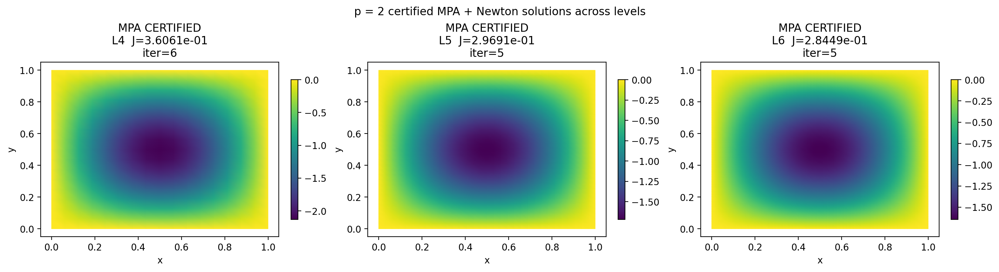
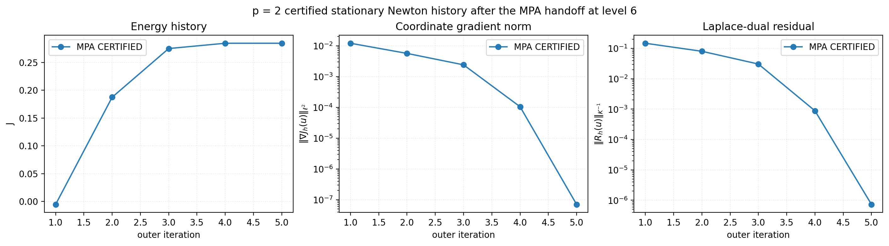
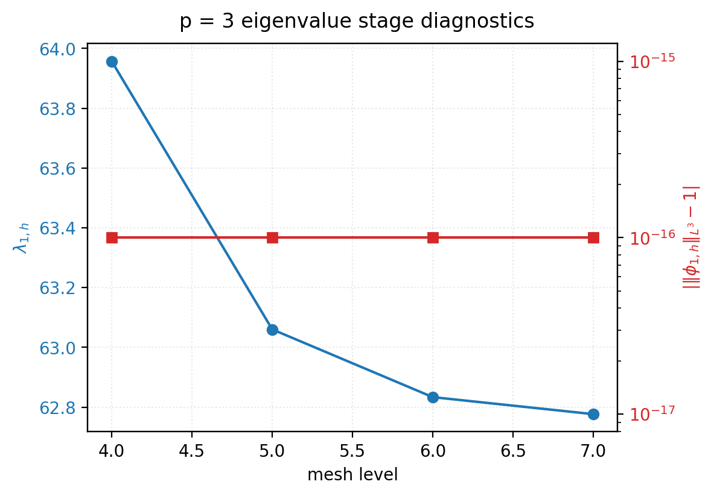
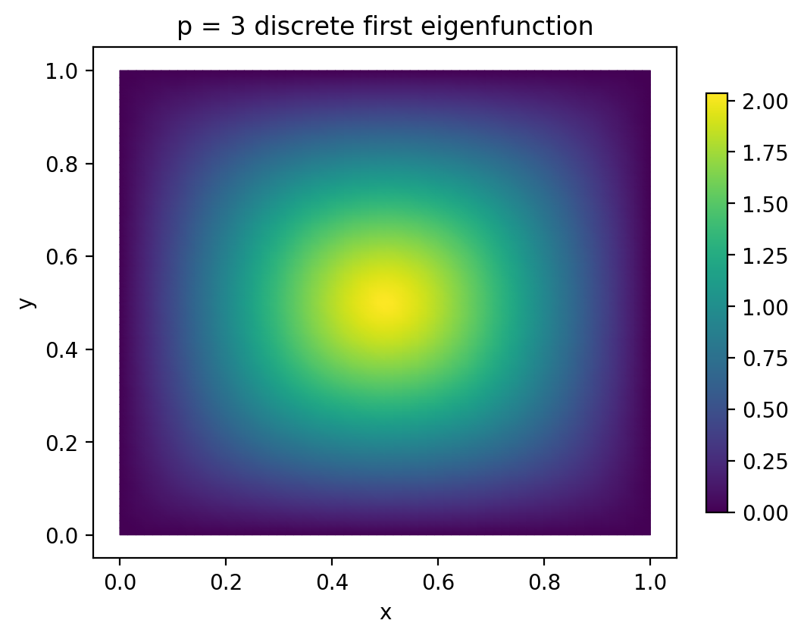
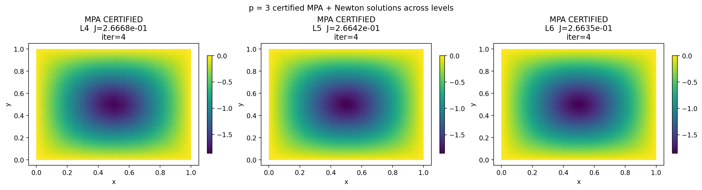
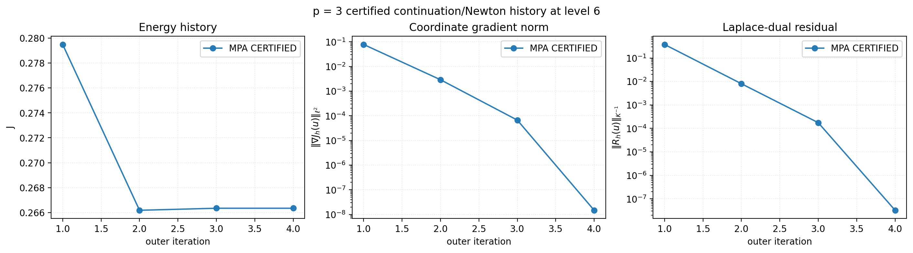
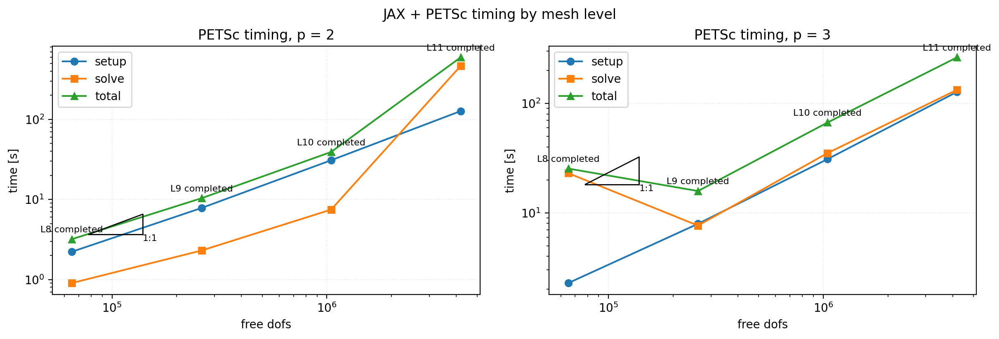
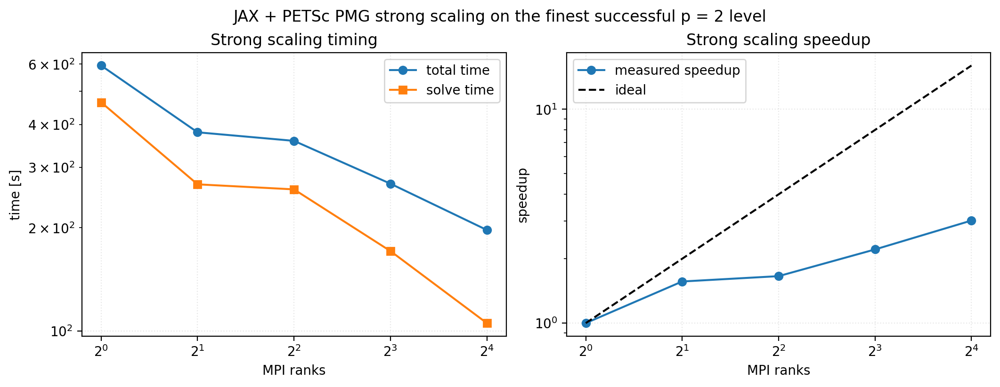
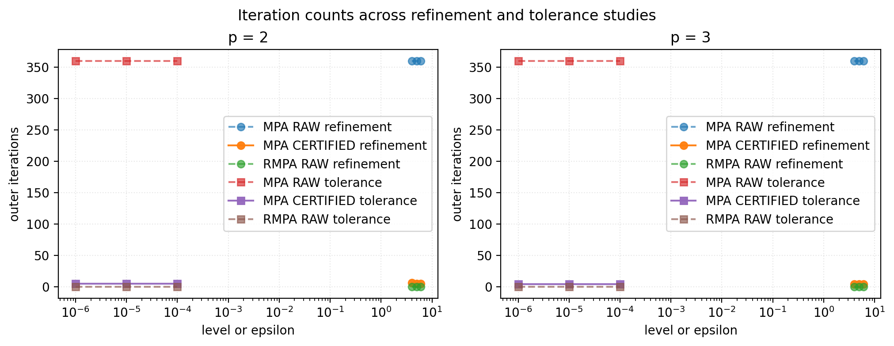
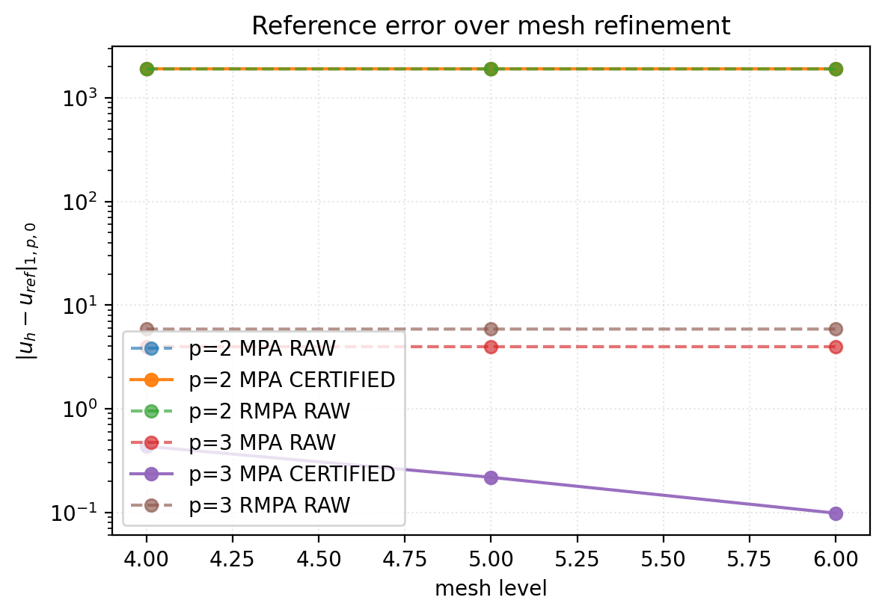

# p-Laplace Arctan Resonance on the Unit Square

Source note used for this implementation: `pLaplace_up_arctan.md` in the repo root.

## Mathematical Specification

We study the resonant Dirichlet problem

$$
-\Delta_p u = \lambda_1 |u|^{p-2}u + \arctan(u+1) \quad \text{in } \Omega=(0,1)^2, \qquad u=0 \text{ on } \partial\Omega.
$$

with the common nonlinear data

$$
g(u)=\arctan(u+1), \qquad g'(u)=\frac{1}{1+(u+1)^2},
$$

$$
G(t) = \int_0^t g(s)\,ds = (t+1)\arctan(t+1) - \tfrac12\log(1+(t+1)^2) - \left(\tfrac\pi4 - \tfrac12\log 2\right),
$$

so that `G(0)=0`. The energy used by the maintained solver is

$$
J_p(u) = \frac{1}{p}\int_\Omega |\nabla u|^p\,dx - \frac{\lambda_1}{p}\int_\Omega |u|^p\,dx - \int_\Omega G(u)\,dx.
$$

The common weak form is

$$
\int_\Omega |\nabla u|^{p-2}\nabla u\cdot\nabla v\,dx - \lambda_1\int_\Omega |u|^{p-2}uv\,dx - \int_\Omega \arctan(u+1)v\,dx = 0
$$

for all admissible test functions `v`.

### p = 2 Validation Problem

$$
-\Delta u = 2\pi^2 u + \arctan(u+1) \quad \text{in } (0,1)^2, \qquad u=0 \text{ on } \partial(0,1)^2.
$$

Here the first eigenpair is explicit:

$$
\lambda_1 = 2\pi^2, \qquad \varphi_1(x,y)=\sin(\pi x)\sin(\pi y).
$$

### p = 3 Main Problem

$$
-\operatorname{div}\bigl(|\nabla u|\nabla u\bigr) = \lambda_1 |u|u + \arctan(u+1) \quad \text{in } (0,1)^2, \qquad u=0 \text{ on } \partial(0,1)^2.
$$

The first eigenvalue is not explicit on the unit square when `p=3`, so the workflow first computes a discrete positive eigenpair `(\lambda_{1,h},\varphi_{1,h})` from

$$
-\Delta_3 \varphi_1 = \lambda_1 |\varphi_1|\varphi_1, \qquad \varphi_1|_{\partial\Omega}=0, \qquad \int_\Omega |\varphi_1|^3\,dx = 1.
$$

## Solvability And Proof Notes

For the source-note specialization of Theorem 6, the key helper quantity is

$$
F(x) = \frac{p}{x}\int_0^x g(s)\,ds - g(x), \qquad g(x)=\arctan(x+1).
$$

The source note gives the asymptotic limits `lim_{x->+∞} F(x) = (p-1)π/2` and `lim_{x->-∞} F(x) = -(p-1)π/2`.
Because `g` is bounded we also have `g(u)/|u|^{p-1} -> 0` as `|u| -> ∞` for both `p=2` and `p=3`.
This page therefore claims existence/solvability for both maintained problems. It does not claim global uniqueness, because the source note proves existence, not a uniqueness theorem for the shifted arctan forcing.

## Discretization And Algorithm Notes

- Domain: structured `P1` right-triangle meshes on `(0,1)^2`.
- Serial certified mesh ladder: levels `L4`, `L5`, `L6`; level `L7` is reserved for references and eigen diagnostics. The JAX + PETSc extension later in this page continues the same branch to finer levels.
- `p=2` uses the exact `λ₁ = 2π²`.
- `p=3` uses a level-matched discrete `λ₁,h` computed from a cached first-eigenpair stage with `||φ_{1,h}||_{L^3}=1`.
- The maintained solution path is **certified `MPA + stationary Newton`**.
- Raw `MPA/RMPA` runs are diagnostic only. Certified runs use a physically meaningful handoff state and then solve `J'(u)=0` directly.
- The convergence histories report both the coordinate gradient norm and a Laplace-dual finite-element residual norm `||R_h(u)||_{K^{-1}}`.

### Certified MPA + Newton

The public results are organized around the discrete gradient, dual residual, and stationary merit

$$
g_h(u_h)=\nabla J_{p,h}(u_h), \qquad R_h(u_h)=K^{-1}g_h(u_h), \qquad M(u_h)=\tfrac12 g_h(u_h)^\top K^{-1}g_h(u_h).
$$

The maintained algorithm is:

1. **Raw mountain-pass branch search.** Build a polygonal path from `0` to a positive endpoint `e_h` with `J_{p,h}(e_h)<J_{p,h}(0)`, and at each outer step identify the current path peak `z_k`.
2. **Auxiliary dissertation direction.** Compute the thesis-style descent direction by solving

$$
K a_k = g_h(z_k), \qquad d_k = -\frac{a_k}{|a_k|_{1,p,0}}.
$$

3. **Best-iterate handoff.** Update the polygonal path by a halved step from the peak, repair the local chain geometry, and retain the iterate with the smallest `\|R_h(z_k)\|_{K^{-1}}` as the certification handoff state.
4. **Certified stationary Newton solve.** Starting from the handoff state, use JAX autodiff to build the discrete gradient and Hessian and solve

$$
(H_k + \mu_k K)\,\delta_k = -g_h(u_k).
$$

5. **Merit-based globalization.** Accept a trial step `u_{k+1}=u_k+\alpha_k\delta_k` only when

$$
M(u_{k+1}) < M(u_k),
$$

with regularization and backtracking applied as needed.
6. **Certification stop.** Declare convergence only when

$$
\|R_h(u_k)\|_{K^{-1}} \le \varepsilon_{\mathrm{cert}}.
$$

7. **Continuation for `p=3`.** Certify the `p=2` branch first, then continue through `p=2.2, 2.4, 2.6, 2.8, 3.0` on a fixed mesh; each stage uses the previous certified state as the Newton initializer, with raw `MPA` available only as a fallback.

## p = 2 Validation Study

The validation problem is reported entirely through the certified workflow. The handoff residual shows the quality of the `MPA` branch-finder state, while the iteration columns show the raw `MPA` work, the Newton work, and their cumulative nonlinear total.

| level | certification entry | MPA handoff residual | certified residual | MPA iters | Newton iters | total nonlinear | certified J | status |
| --- | --- | --- | --- | --- | --- | --- | --- | --- |
| 4 | MPA handoff | 0.146882 | 0.000000 | 360 | 6 | 366 | 0.360607 | completed |
| 5 | MPA handoff | 0.147851 | 0.000000 | 360 | 5 | 365 | 0.296914 | completed |
| 6 | MPA handoff | 0.148094 | 0.000000 | 360 | 5 | 365 | 0.284495 | completed |

Private `L7` Newton reference residual: `5.823e-07`.





## p = 3 Eigenvalue Stage

| level | lambda1 | residual | norm error | iters | status |
| --- | --- | --- | --- | --- | --- |
| 4 | 63.956915 | 0.000003 | 0.000000 | 30 | completed |
| 5 | 63.060087 | 0.000004 | 0.000000 | 30 | completed |
| 6 | 62.833501 | 0.000005 | 0.000000 | 48 | completed |
| 7 | 62.776603 | 0.000001 | 0.000000 | 69 | completed |





## p = 3 Main Study

For `p=3`, the main published solution is the certified continuation branch. The continuation step itself is the essential globalization device; once a certified nearby state is available, the stationary Newton solve is short and robust, and the table reports both the `MPA` contribution and the Newton contribution explicitly.

| level | lambda1,h | certification entry | certified residual | MPA iters | Newton iters | total nonlinear | certified J | status |
| --- | --- | --- | --- | --- | --- | --- | --- | --- |
| 4 | 63.956915 | Continuation direct | 0.000000 | 0 | 4 | 4 | 0.266679 | completed |
| 5 | 63.060087 | Continuation direct | 0.000000 | 0 | 4 | 4 | 0.266424 | completed |
| 6 | 62.833501 | Continuation direct | 0.000000 | 0 | 4 | 4 | 0.266353 | completed |

Representative `L6` continuation path:

| from p | to p | path | certified residual | status |
| --- | --- | --- | --- | --- |
| 2.0 | 2.2 | direct | 0.000000 | completed |
| 2.2 | 2.4 | direct | 0.000000 | completed |
| 2.4 | 2.6 | direct | 0.000000 | completed |
| 2.6 | 2.8 | direct | 0.000000 | completed |
| 2.8 | 3.0 | direct | 0.000000 | completed |

Private `L7` certified reference residual: `7.809e-14`.





## JAX + PETSc Backend

The local stationary certification solve has now been rewritten as a JAX + PETSc backend. The branch-finding stage is still the certified `MPA` workflow described above, but the expensive fine-mesh Newton solve now uses PETSc `FGMRES` with a structured PMG preconditioner built from the stiffness matrix.

The Hessian assembly uses a zero-safe element regularization

$$
|x|_{\varepsilon_h}^q = \bigl(x^2 + \varepsilon_h^2\bigr)^{q/2} - \varepsilon_h^q, \qquad \varepsilon_h=10^{-12},
$$

which keeps the transferred warm-start Hessians finite while remaining visually indistinguishable from the unsmoothed functional at plotting scale.

**Accepted PMG configuration**

- Krylov solver: `FGMRES`
- Preconditioner: fixed-stiffness Galerkin PMG
- Multigrid smoother: **Chebyshev + Jacobi**
- Coarse level: PETSc default coarse backend from the solver CLI
- Near the tolerance floor: a small stagnation guard accepts convergence when the residual is already at the target scale and no further regularized step can produce a numerically resolvable merit decrease

## PETSc Timing And Scaling

The PETSc timing study extends the maintained ladder beyond the serial publication meshes. For `p=2` the warm-started PMG solve is continued to finer levels, and for `p=3` the PETSc backend is reported as a tuned continuation backend using the finest available certified eigenvalue cache from the serial study. The PETSc tables expose nonlinear outer iterations, Newton iterations, and cumulative Krylov iterations so the PMG workload is visible directly in the published summary. In this backend the nonlinear counter coincides with the Newton outer loop. The timing figure is log-log with an ideal `1:1` triangle, and the strong-scaling speedup panel is also shown on log-log axes against the ideal line.

| level | free dofs | status | residual | setup [s] | solve [s] | total [s] | nonlinear its | Newton iters | linear its |
| --- | --- | --- | --- | --- | --- | --- | --- | --- | --- |
| 8 | 65025 | completed | 0.000000 | 2.222 | 0.903 | 3.192 | 3 | 3 | 42 |
| 9 | 261121 | completed | 0.000000 | 7.824 | 2.303 | 10.361 | 3 | 3 | 44 |
| 10 | 1046529 | completed | 0.000000 | 30.873 | 7.463 | 39.167 | 3 | 3 | 47 |
| 11 | 4190209 | completed | 0.000000 | 126.844 | 464.449 | 594.462 | 6 | 6 | 119 |

| level | free dofs | status | residual | setup [s] | solve [s] | total [s] | nonlinear its | Newton iters | linear its |
| --- | --- | --- | --- | --- | --- | --- | --- | --- | --- |
| 8 | 65025 | completed | 0.000000 | 2.279 | 23.035 | 25.375 | 7 | 7 | 571 |
| 9 | 261121 | completed | 0.000000 | 7.930 | 7.642 | 15.817 | 4 | 4 | 462 |
| 10 | 1046529 | completed | 0.000000 | 30.970 | 35.139 | 66.922 | 4 | 4 | 603 |
| 11 | 4190209 | completed | 0.000000 | 127.456 | 133.156 | 263.536 | 3 | 3 | 609 |



Strong-scaling rows are reported on the finest successful `p=2` PETSc level `L11`.

| ranks | status | total [s] | nonlinear its | Newton iters | linear its | speedup | efficiency | residual |
| --- | --- | --- | --- | --- | --- | --- | --- | --- |
| 1 | completed | 594.462 | 6 | 6 | 119 | 1.000 | 1.000 | 0.000000 |
| 2 | completed | 379.720 | 5 | 5 | 84 | 1.566 | 0.783 | 0.000000 |
| 4 | completed | 358.531 | 8 | 8 | 129 | 1.658 | 0.415 | 0.000000 |
| 8 | completed | 268.941 | 7 | 7 | 110 | 2.210 | 0.276 | 0.000000 |
| 16 | completed | 197.076 | 5 | 5 | 77 | 3.016 | 0.189 | 0.000000 |



## Cross-Method Comparison

The cross-method material is retained for completeness, but it is annexed below so the main narrative stays focused on the certified `MPA + stationary Newton` path.

## Raw Versus Certified Diagnostics

The remainder of the page is annex material. It records the raw globalization behavior and the failing `RMPA` variants so the successful certified path above stays readable and unambiguous.

### Annex A — Cross-Method Diagnostics

**`p=2` mesh-refinement diagnostics**

| method | level | raw status | raw residual | certified status | certified residual | raw seed | certified handoff |
| --- | --- | --- | --- | --- | --- | --- | --- |
| MPA | 4 | maxit | 0.146882 | completed | 0.000000 | sine | MPA handoff |
| MPA | 5 | maxit | 0.147851 | completed | 0.000000 | sine | MPA handoff |
| MPA | 6 | maxit | 0.148094 | completed | 0.000000 | sine | MPA handoff |
| RMPA | 4 | failed | 0.165378 | failed | 0.165378 | sine | - |
| RMPA | 5 | failed | 0.181815 | failed | 0.181815 | sine | - |
| RMPA | 6 | failed | 0.185979 | failed | 0.185979 | sine | - |

**`p=3` mesh-refinement diagnostics**

| method | level | raw status | raw residual | certified status | certified residual | raw seed | certified handoff |
| --- | --- | --- | --- | --- | --- | --- | --- |
| MPA | 4 | maxit | 0.136526 | completed | 0.000000 | eigenfunction | Continuation direct |
| MPA | 5 | maxit | 0.136630 | completed | 0.000000 | eigenfunction | Continuation direct |
| MPA | 6 | maxit | 0.136651 | completed | 0.000000 | eigenfunction | Continuation direct |
| RMPA | 4 | failed | 1.188997 | failed | 1.188997 | eigenfunction | - |
| RMPA | 5 | failed | 1.205242 | failed | 1.205242 | eigenfunction | - |
| RMPA | 6 | failed | 1.209430 | failed | 1.209430 | eigenfunction | - |





### Annex B — RMPA And Failed Paths

**`p=2` RMPA diagnostics**

| level | raw status | raw residual | ray kind | stable interior ray maximum? | rationale |
| --- | --- | --- | --- | --- | --- |
| 4 | failed | 0.165378 | maximum | no | Certification skipped because the ray audit did not show a stable interior maximum. |
| 5 | failed | 0.181815 | maximum | no | Certification skipped because the ray audit did not show a stable interior maximum. |
| 6 | failed | 0.185979 | maximum | no | Certification skipped because the ray audit did not show a stable interior maximum. |

**`p=3` RMPA diagnostics**

| level | raw status | raw residual | ray kind | stable interior ray maximum? | rationale |
| --- | --- | --- | --- | --- | --- |
| 4 | failed | 1.188997 | maximum | no | Certification skipped because the ray audit did not show a stable interior maximum. |
| 5 | failed | 1.205242 | maximum | no | Certification skipped because the ray audit did not show a stable interior maximum. |
| 6 | failed | 1.209430 | maximum | no | Certification skipped because the ray audit did not show a stable interior maximum. |

### Annex C — Tolerance Comparison

| p | method | epsilon | raw status | raw residual | certified status | certified residual |
| --- | --- | --- | --- | --- | --- | --- |
| 2 | MPA | 1e-04 | maxit | 0.148094 | completed | 0.000000 |
| 2 | MPA | 1e-05 | maxit | 0.148094 | completed | 0.000000 |
| 2 | MPA | 1e-06 | maxit | 0.148094 | completed | 0.000000 |
| 2 | RMPA | 1e-04 | failed | 0.185979 | failed | 0.185979 |
| 2 | RMPA | 1e-05 | failed | 0.185979 | failed | 0.185979 |
| 2 | RMPA | 1e-06 | failed | 0.185979 | failed | 0.185979 |
| 3 | MPA | 1e-04 | maxit | 0.136651 | completed | 0.000000 |
| 3 | MPA | 1e-05 | maxit | 0.136651 | completed | 0.000000 |
| 3 | MPA | 1e-06 | maxit | 0.136651 | completed | 0.000000 |
| 3 | RMPA | 1e-04 | failed | 1.209430 | failed | 1.209430 |
| 3 | RMPA | 1e-05 | failed | 1.209430 | failed | 1.209430 |
| 3 | RMPA | 1e-06 | failed | 1.209430 | failed | 1.209430 |

Why `RMPA` stays in the annexes:

- The ray audit does not show the stable interior ray maximum required by the classical `RMPA` projection logic on the positive arctan branch.
- Raw `RMPA` therefore fails before it can provide a reliable Newton handoff iterate.
- Tightening the raw tolerance does not materially change the `RMPA` residuals on the published ladder.
- The maintained successful path is **certified `MPA + stationary Newton`**, with continuation in `p` providing the decisive stabilization for `p=3`.

## Commands Used

```bash
./.venv/bin/python -u experiments/runners/run_plaplace_up_arctan_suite.py \
  --out-dir artifacts/raw_results/plaplace_up_arctan_full \
  --summary artifacts/raw_results/plaplace_up_arctan_full/summary.json
```

```bash
./.venv/bin/python -u experiments/runners/run_plaplace_up_arctan_petsc_suite.py \
  --out-dir artifacts/raw_results/plaplace_up_arctan_petsc \
  --summary artifacts/raw_results/plaplace_up_arctan_petsc/summary.json
```

```bash
./.venv/bin/python -u experiments/analysis/generate_plaplace_up_arctan_report.py \
  --summary artifacts/raw_results/plaplace_up_arctan_full/summary.json \
  --petsc-summary artifacts/raw_results/plaplace_up_arctan_petsc/summary.json \
  --out artifacts/reports/plaplace_up_arctan/README.md \
  --asset-dir docs/assets/plaplace_up_arctan
```

```bash
./.venv/bin/python -u experiments/analysis/generate_plaplace_up_arctan_problem_page.py \
  --summary artifacts/raw_results/plaplace_up_arctan_full/summary.json \
  --petsc-summary artifacts/raw_results/plaplace_up_arctan_petsc/summary.json \
  --out docs/problems/pLaplace_up_arctan.md \
  --asset-dir docs/assets/plaplace_up_arctan
```

## Artifacts

- Raw study summary: `artifacts/raw_results/plaplace_up_arctan_full/summary.json`
- JAX + PETSc timing summary: `artifacts/raw_results/plaplace_up_arctan_petsc/summary.json`
- Internal report: `artifacts/reports/plaplace_up_arctan/README.md`
- Cached `p=3` eigen stage: `artifacts/raw_results/plaplace_up_arctan_full/lambda_cache/`
- No separate `docs/results/pLaplace_up_arctan.md` page is maintained for this family.
