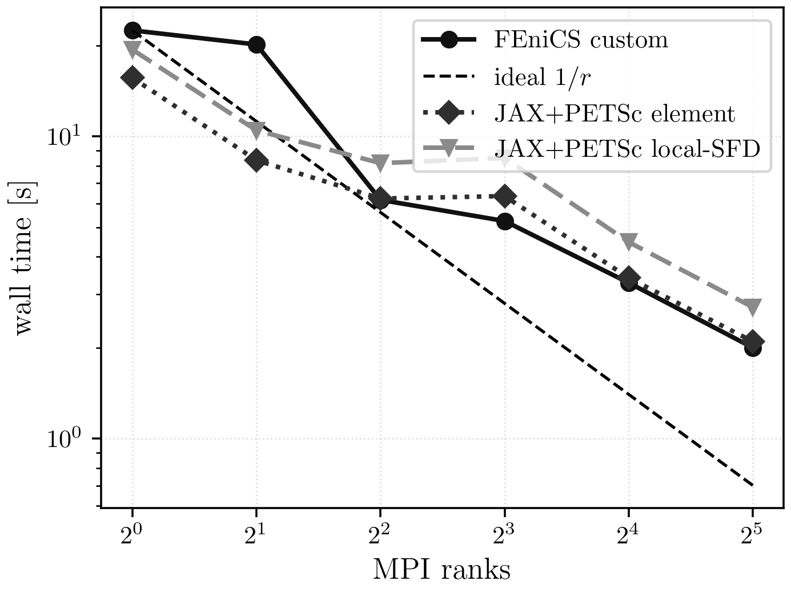
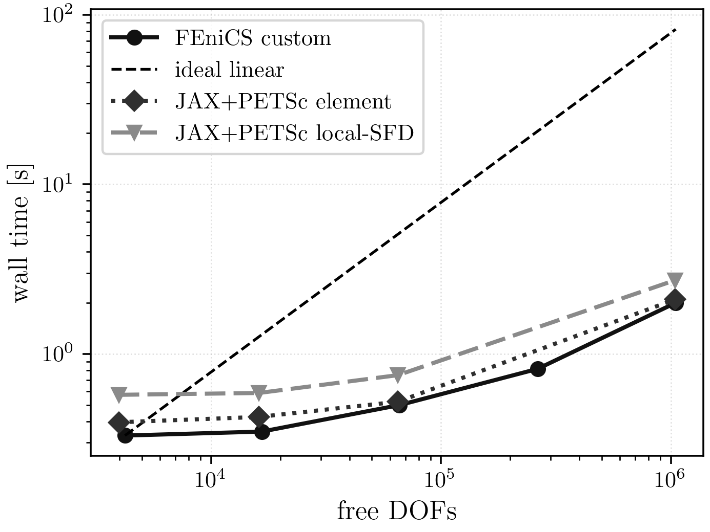

# GinzburgLandau Results

## Current Maintained Comparison

The current maintained GinzburgLandau campaign covers levels `5..9` and MPI
counts `1, 2, 4, 8, 16, 32` for:

- FEniCS custom Newton
- JAX+PETSc element Hessian
- JAX+PETSc local-SFD Hessian

The direct serial comparison at level `5` also retains FEniCS SNES.

## Current Best Settings

| knob | value |
| --- | --- |
| nonlinear method | line-search Newton |
| line-search interval | `[-0.5, 2.0]` |
| line-search tolerance | `1e-3` |
| trust region | off in the maintained final suite |
| KSP type | `gmres` |
| PC type | `hypre` |
| KSP rtol | `1e-3` |
| KSP max it | `200` |

## Shared-Case Result Equivalence

Shared comparison case: level `5`, `np=1`.

| implementation | energy | rel. diff vs ref | Newton | linear | wall [s] |
| --- | ---: | ---: | ---: | ---: | ---: |
| FEniCS custom | 0.346232 | 0.000 | 8 | 33 | 0.1134 |
| FEniCS SNES | 0.346200 | 0.000 | 10 | 0 | 0.0355 |
| JAX+PETSc element | 0.346231 | 0.000 | 8 | 33 | 0.0949 |
| JAX+PETSc local-SFD | 0.346231 | 0.000 | 8 | 33 | 0.2467 |

## Scaling



PDF: [GinzburgLandau strong scaling](../assets/ginzburg_landau/ginzburg_landau_strong_scaling.pdf)



PDF: [GinzburgLandau mesh timing](../assets/ginzburg_landau/ginzburg_landau_mesh_timing.pdf)

Finest maintained strong-scaling case: level `9`.

| implementation | ranks | time [s] | Newton | linear | energy |
| --- | ---: | ---: | ---: | ---: | ---: |
| FEniCS custom | 1 | 22.4303 | 7 | 22 | 0.345626 |
| FEniCS custom | 2 | 20.1437 | 11 | 42 | 0.345626 |
| FEniCS custom | 4 | 6.1668 | 6 | 22 | 0.345626 |
| FEniCS custom | 8 | 5.2501 | 8 | 32 | 0.345626 |
| FEniCS custom | 16 | 3.2796 | 10 | 33 | 0.345626 |
| FEniCS custom | 32 | 2.0010 | 8 | 37 | 0.345626 |
| JAX+PETSc element | 1 | 15.6401 | 9 | 33 | 0.345626 |
| JAX+PETSc element | 2 | 8.3382 | 7 | 29 | 0.345626 |
| JAX+PETSc element | 4 | 6.2320 | 7 | 27 | 0.345626 |
| JAX+PETSc element | 8 | 6.3483 | 8 | 35 | 0.345626 |
| JAX+PETSc element | 16 | 3.4059 | 8 | 38 | 0.345626 |
| JAX+PETSc element | 32 | 2.0973 | 7 | 39 | 0.345626 |
| JAX+PETSc local-SFD | 1 | 19.3800 | 9 | 33 | 0.345626 |
| JAX+PETSc local-SFD | 2 | 10.4746 | 7 | 29 | 0.345626 |
| JAX+PETSc local-SFD | 4 | 8.1573 | 7 | 27 | 0.345626 |
| JAX+PETSc local-SFD | 8 | 8.4876 | 8 | 35 | 0.345626 |
| JAX+PETSc local-SFD | 16 | 4.4732 | 8 | 38 | 0.345626 |
| JAX+PETSc local-SFD | 32 | 2.7230 | 7 | 39 | 0.345626 |

## Reproduction Commands

Maintained suite:

```bash
./.venv/bin/python -u experiments/runners/run_gl_final_suite.py \
  --out-dir artifacts/reproduction/<campaign>/runs/ginzburg_landau/final_suite
```

Curated figures are published under `docs/assets/ginzburg_landau/` and built from:

- `experiments/analysis/docs_assets/data/ginzburg_landau/parity_showcase.csv`
- `experiments/analysis/docs_assets/data/ginzburg_landau/strong_scaling.csv`
- `experiments/analysis/docs_assets/data/ginzburg_landau/mesh_timing.csv`

## Notes

- The final maintained suite retains two expected failures at `level 8`, `np=32`
  for the JAX+PETSc element and local-SFD paths.
- Those expected failures do not affect the finest `level 9` maintained
  comparison shown here.
- FEniCS custom and JAX+PETSc element are effectively tied on the hardest
  maintained case.
