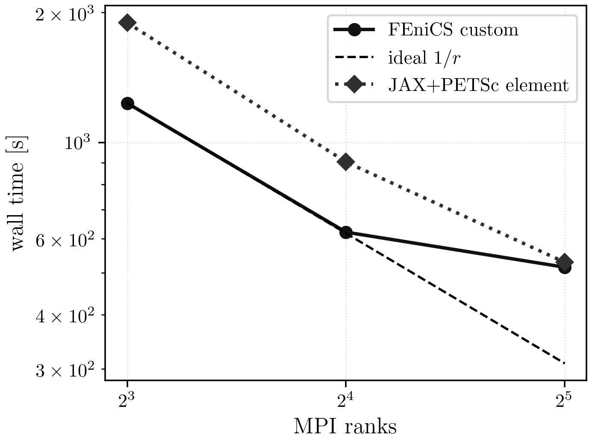
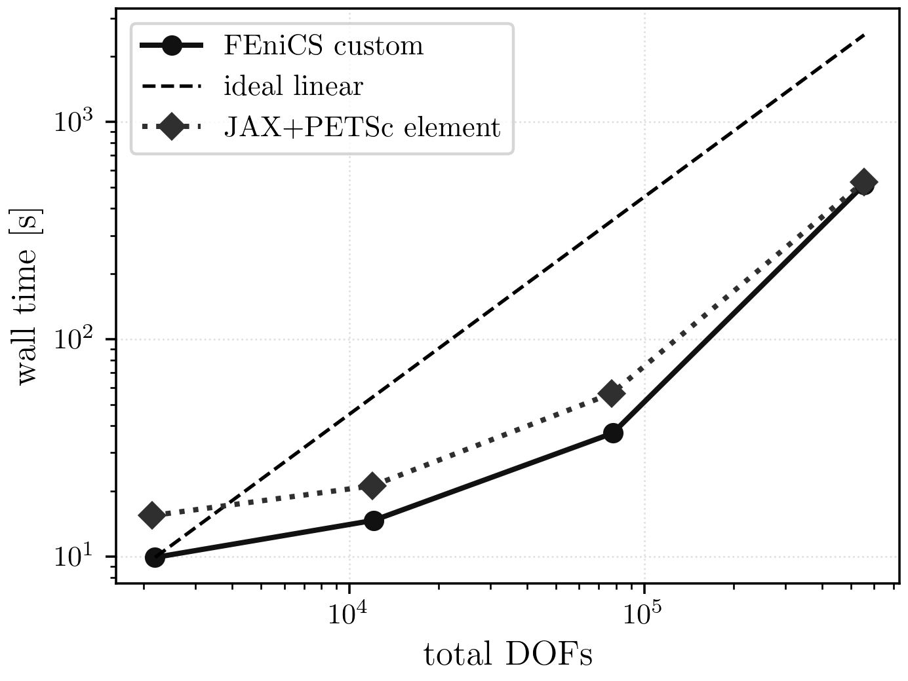

# HyperElasticity Results

## Current Maintained Comparison

The maintained HyperElasticity comparison is split into:

- distributed MPI suite: FEniCS custom trust-region Newton vs JAX+PETSc element
- serial reference suite: pure JAX up to level `3`

The current distributed benchmark uses `24` and `96` load-step trajectories on
levels `1..4`. The finest maintained scaling figures here use the `24`-step
path at level `4`, and the published parity/scaling tables below are sourced
from that completed `24`-step slice plus the maintained pure-JAX serial
reference.

## Current Best Settings

| knob | value |
| --- | --- |
| nonlinear method | trust region with `rho` acceptance |
| trust-region KSP | `stcg` |
| post trust-subproblem line search | on |
| line-search interval | `[-0.5, 2.0]` |
| line-search tolerance | `1e-1` |
| trust radius init | `0.5` |
| trust shrink / expand | `0.5 / 1.5` |
| trust eta shrink / expand | `0.05 / 0.75` |
| trust max reject | `6` |
| PC type | `gamg` |
| KSP rtol / max it | `1e-1 / 30` |
| GAMG threshold / agg nsmooths | `0.05 / 1` |
| near-nullspace | on |
| GAMG coordinates | on |
| JAX+PETSc assembly mode | `element` |
| JAX+PETSc reorder mode | `block_xyz` |

## Shared-Case Result Equivalence

Shared parity case: level `1`, `24` load steps, `np=1`.

| implementation | completed steps | energy | rel. diff vs ref | Newton | linear | wall [s] |
| --- | ---: | ---: | ---: | ---: | ---: | ---: |
| FEniCS custom | 24 | 197.775 | 0.000 | 671 | 8722 | 6.512 |
| JAX+PETSc element | 24 | 197.755 | 0.000 | 793 | 10595 | 9.359 |
| pure JAX serial | 24 | 197.750 | 0.000 | 559 | 2284 | 41.540 |

## Scaling



PDF: [HyperElasticity strong scaling](../assets/hyperelasticity/hyperelasticity_strong_scaling.pdf)



PDF: [HyperElasticity mesh timing](../assets/hyperelasticity/hyperelasticity_mesh_timing.pdf)

Finest maintained strong-scaling case: level `4`, `24` steps.

| implementation | ranks | time [s] | Newton | linear | energy |
| --- | ---: | ---: | ---: | ---: | ---: |
| FEniCS custom | 8 | 1234.307 | 705 | 16117 | 87.723 |
| FEniCS custom | 16 | 620.862 | 689 | 16032 | 87.723 |
| FEniCS custom | 32 | 515.131 | 711 | 16016 | 87.723 |
| JAX+PETSc element | 8 | 1894.188 | 813 | 18932 | 87.722 |
| JAX+PETSc element | 16 | 902.409 | 783 | 18775 | 87.722 |
| JAX+PETSc element | 32 | 528.833 | 831 | 18940 | 87.722 |

## Reproduction Commands

MPI maintained suite:

```bash
./.venv/bin/python -u experiments/runners/run_he_final_suite_best.py \
  --out-dir artifacts/reproduction/<campaign>/runs/hyperelasticity/final_suite_best \
  --no-seed-known-results
```

Pure-JAX reference suite:

```bash
./.venv/bin/python -u experiments/runners/run_he_pure_jax_suite_best.py \
  --out-dir artifacts/reproduction/<campaign>/runs/hyperelasticity/pure_jax_suite_best
```

## Notes

- FEniCS SNES is excluded from the parity table because it fails on the shared
  showcase case.
- Pure JAX is intentionally excluded from the scaling figures; the maintained
  pure-JAX path is single-process only and is kept as a serial reference.
- The current fine-scale comparison is between FEniCS custom and JAX+PETSc
  element at level `4`, `24` steps.
- The maintained `96`-step distributed path remains part of the benchmark
  setup, but the currently published HE figures and tables are built from the
  completed `24`-step distributed slice.
