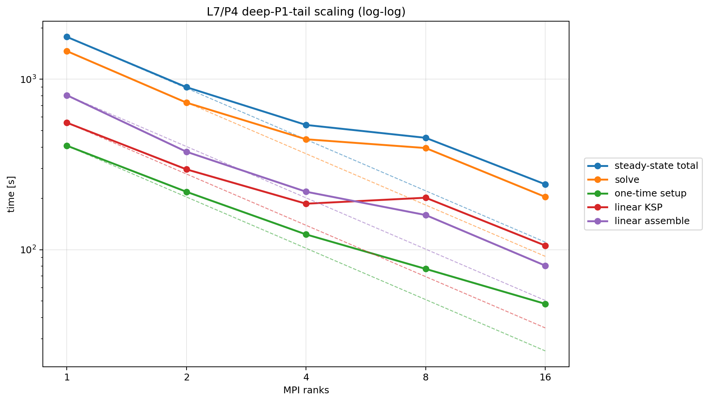
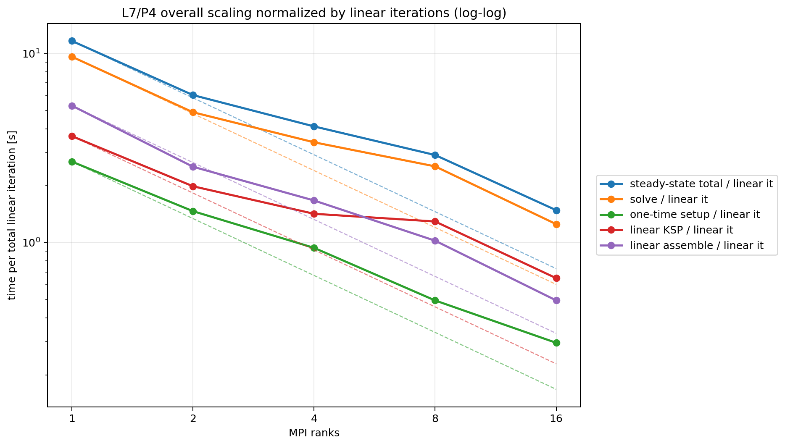
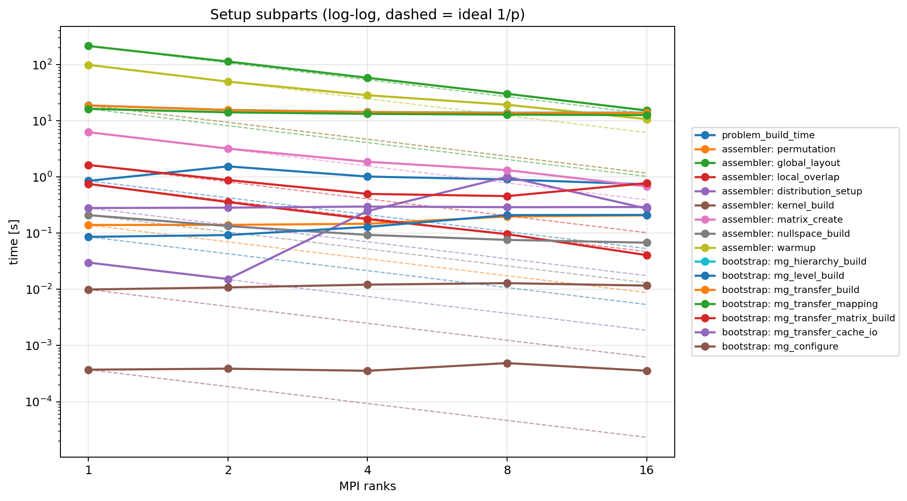
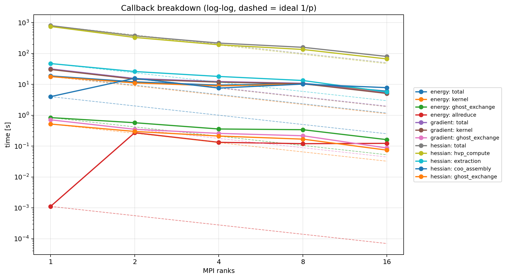
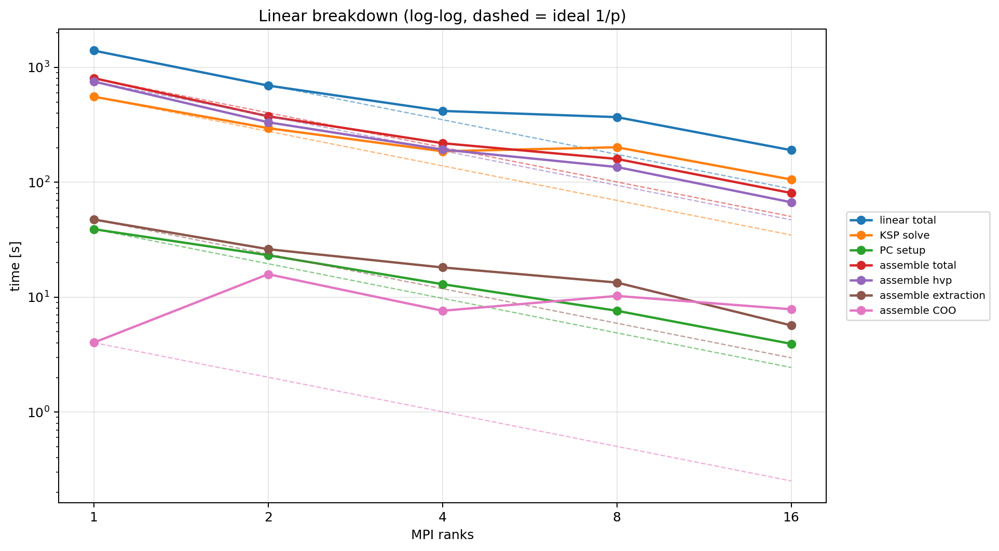
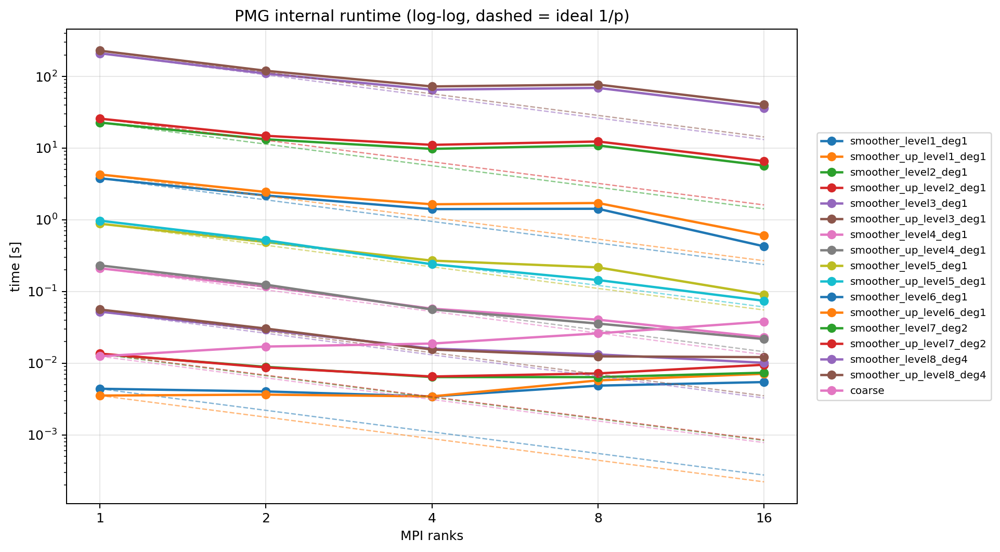

# Plasticity Results

## Current Maintained Comparison

The maintained plasticity story is built from four completed experiment slices:

- `L5/P4` backend comparison to decide which solver family remains published
- `L6/P4` deep-tail hierarchy search to identify the best PMG bottom
- `L6/P4` optimization comparison to lock the maintained nonlinear/linear
  policy on the fixed-work benchmark
- `L7/P4` `1/2/4/8/16` sweep as the current large-scale scaling campaign

The published implementation is still the JAX+PETSc assembled tangent path in
`src/problems/slope_stability/`, but the docs/results surface treats it as the
repository's Mohr-Coulomb plasticity model rather than as a benchmark-specific
"slope stability" family.

## Current Best Settings

Current maintained large-scale `P4` stack:

| knob | value |
| --- | --- |
| model | plane-strain Mohr-Coulomb plasticity, `lambda = 1.0` |
| fine space | `P4(L7)` |
| maintained hierarchy | `1:1,2:1,3:1,4:1,5:1,6:1,7:1,7:2,7:4` |
| nonlinear method | Newton with `armijo` line search |
| trust region | off in the maintained plasticity PMG runs |
| linear method | `fgmres` |
| `ksp_rtol / ksp_max_it` | `1e-2 / 15` |
| capped linear-step policy | keep the `DIVERGED_MAX_IT` direction by default so the fixed `20`-step campaign completes |
| fine / bridge / tail smoothers | `richardson + sor`, `3` steps on `P4`, `P2`, and `P1` |
| coarse solve | `rank0_lu_broadcast` |
| problem build mode | `rank_local` |
| MG level build mode | `rank_local` |
| transfer build mode | `owned_rows` |
| hot-path overlap | `overlap_p2p` |
| benchmark mode | `warmup_once_then_solve` |

## Backend / Hierarchy Selection Summary

### Solver-Family Context (`L5/P4`)

The `L5` backend comparison keeps PMG as the maintained backend:

| backend | success | Newton | linear | solve [s] | conclusion |
| --- | --- | ---: | ---: | ---: | --- |
| PCMG same-mesh | yes | 23 | 205 | 133.641 | viable, but slower than the tailed PMG hierarchy |
| PCMG with `L4` tail | yes | 21 | 185 | 98.800 | maintained PMG backend reference |
| tuned Hypre BoomerAMG | yes | 23 | 445 | 931.384 | converges, but far too expensive to publish as the maintained path |
| tuned GAMG | no | 1 | 300 | 29.674 | fails on the first Newton solve |

### Hierarchy Context (`L6/P4`, `8` ranks, fixed `20` steps)

The deep `P1` tail is the maintained hierarchy family because it wins both
against the short-tail baseline and against the skipped-tail shortcut:

| hierarchy | steady-state [s] | linear | final energy | final grad | conclusion |
| --- | ---: | ---: | ---: | ---: | --- |
| short tail `same_mesh_p4_p2_p1_lminus1_p1` | 277.579 | 172 | -212.538561070 | n/a | much slower than the deep tail |
| deep `P1` tail `1:1,2:1,3:1,4:1,5:1,6:1,6:2,6:4` | 141.067 | 165 | -212.538561978 | n/a | current maintained PMG family |
| skipped tail `1:1,6:1,6:2,6:4` | 129.184 | 180 | -212.536775667 | 3.580049 | slower and clearly degraded against the optimized deep-tail baseline |

### Nonlinear / Linear Policy Context (`L6/P4`, `8` ranks, fixed `20` steps)

The local optimization pass established the maintained nonlinear/linear policy:

| variant | steady-state [s] | linear | final energy | final grad | takeaway |
| --- | ---: | ---: | ---: | ---: | --- |
| Armijo + capped solve baseline | 115.390 | 139 | -212.538561468 | 0.097546 | baseline fixed-work benchmark policy |
| guarded capped-step acceptance | 115.383 | 139 | -212.538561468 | 0.097546 | best accepted result in the L6 optimization study |
| PETSc-only top-smoother alternatives | 29.450 to 120.724 | 15 to 227 | degraded in many cases | degraded | no safe top-smoother replacement survived the end-state guard |

The current large `L7` scaling campaign keeps the same Armijo + capped-step
idea, but continuation on linear max-it is left on by default so the fixed
`20`-step benchmark does not stop early at higher resolutions.

## Scaling

The current maintained scaling story is the `L7/P4` deep-tail campaign on
`1/2/4/8/16` ranks, with the benchmark intentionally capped at `20` Newton
iterations.





`L7/P4` scaling summary:

| ranks | steady-state [s] | solve [s] | linear | accepted capped | final energy | final grad | worst true rel | peak RSS [GiB] | steady-state speedup |
| ---: | ---: | ---: | ---: | ---: | ---: | ---: | ---: | ---: | ---: |
| 1 | 1773.004 | 1463.176 | 152 | 5 | -212.538905102 | 0.863975 | 0.045641 | 133.164 | 1.000 |
| 2 | 898.776 | 729.314 | 149 | 4 | -212.538884244 | 0.412285 | 0.041881 | 139.649 | 1.973 |
| 4 | 539.679 | 444.726 | 131 | 3 | -212.538874972 | 0.452117 | 0.032682 | 142.272 | 3.285 |
| 8 | 453.525 | 395.011 | 156 | 4 | -212.538857729 | 2.450104 | 0.065093 | 147.969 | 3.909 |
| 16 | 242.044 | 204.202 | 163 | 3 | -212.538883178 | 0.283207 | 0.030607 | 161.673 | 7.325 |

The per-linear-iteration view is included because the total linear-iteration
count is not perfectly rank-invariant on this capped benchmark, especially at
`8` and `16` ranks.

## Component Breakdown

The component-wise plots below use the same `L7/P4` `1/2/4/8/16` campaign and
include ideal `1/p` guide lines for visual comparison.









The main repeated bottlenecks on the maintained `L7` run are:

| component | 1 rank [s] | 16 ranks [s] | speedup | interpretation |
| --- | ---: | ---: | ---: | --- |
| Hessian stage total | 806.013 | 80.635 | 10.00x | still the largest repeated cost, but much better than the PMG-top and KSP pieces |
| KSP solve | 556.256 | 105.780 | 5.26x | major repeated cost and still far from ideal strong scaling |
| top `P4` smoother down sweep | 210.628 | 36.408 | 5.79x | dominant PMG-internal repeated cost |
| top `P4` smoother up sweep | 229.084 | 40.772 | 5.62x | same story on the return leg of the V-cycle |
| energy total | 18.861 | 6.040 | 3.12x | line-search energy work remains a visible nonlinear bottleneck |

The worst one-time setup bottlenecks are different:

| setup component | 1 rank [s] | 16 ranks [s] | speedup |
| --- | ---: | ---: | ---: |
| `assembler: global_layout` | 215.390 | 15.326 | 14.05x |
| `bootstrap: mg_hierarchy_build` | 18.868 | 14.076 | 1.34x |
| `bootstrap: mg_transfer_mapping` | 16.425 | 12.669 | 1.30x |

So the maintained publication story is:

- the deep `P1` tail fixes the old coarse-end collapse
- the remaining repeated bottlenecks have moved to the top `P4` smoother, the
  outer `KSP` solve, and nonlinear energy work
- hierarchy build and transfer mapping still scale poorly as one-time setup
  costs, even after the rank-local loading work

## Reproduction Commands

Featured large `L7` single-case run:

```bash
./.venv/bin/python -u experiments/runners/run_slope_stability_l7_p4_deep_p1_tail_best_np8_maxit20.py
```

Maintained `L7` scaling sweep:

```bash
./.venv/bin/python -u experiments/runners/run_slope_stability_l7_p4_deep_p1_tail_scaling_maxit20.py
./.venv/bin/python -u experiments/analysis/generate_slope_stability_l7_p4_deep_p1_tail_scaling_maxit20_report.py
```

## Notes

- The `20`-Newton cap in the `L7` scaling campaign is intentional. It turns the
  published scaling table into a fixed-work comparison rather than a
  full-to-tolerance nonlinear solve.
- Rows marked `status=failed` in that campaign mean the benchmark hit the
  requested `20`-step cap. They do not automatically mean a solver breakdown.
- The current maintained default keeps capped `DIVERGED_MAX_IT` linear
  directions instead of aborting the Newton run, because otherwise the fixed
  `20`-step benchmark would stop early and hide the final state.
- The `L5` backend comparison remains the published solver-family context even
  though the maintained large-scale hierarchy now uses the deeper custom `P1`
  tail discovered later on `L6`.
