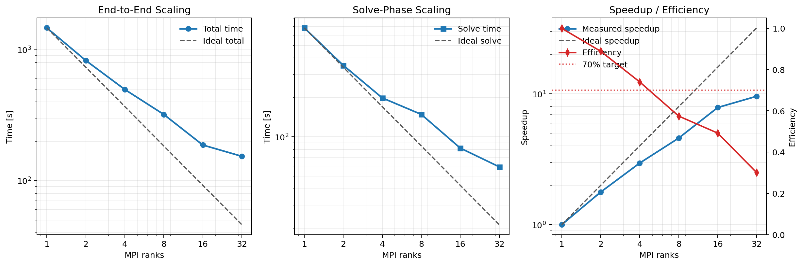
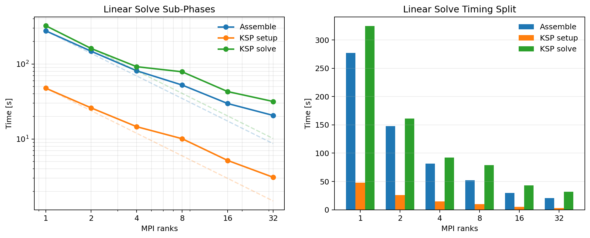
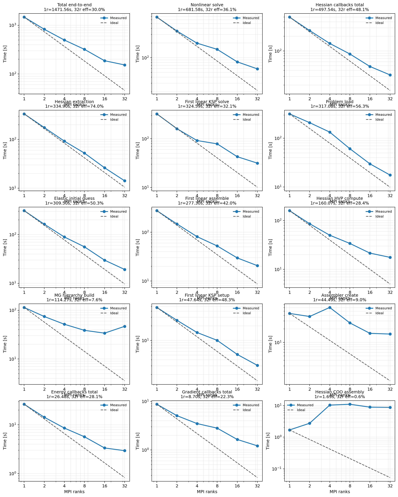
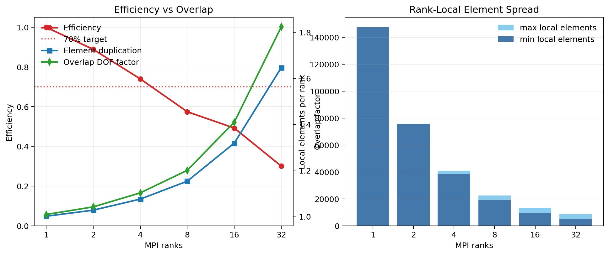

# Plasticity3D Results

## Current Maintained Comparison

The current 3D plasticity documentation is built from two completed experiment
families:

- corrected-frame `P2(L1), lambda = 1.6` from-scratch solve with an elastic
  initial guess, documented on the 3D problem page
- `P4(L1_2), lambda = 1.5` fixed-work parallel scaling campaign on
  `1/2/4/8/16/32` MPI ranks with the mixed same-mesh plus refined-tail PMG
  hierarchy

The first result is the source-parity formulation check. The second result is
the current large-scale 3D PMG scaling study.

## Current Best Settings

Current maintained large-scale `P4` stack:

| knob | value |
| --- | --- |
| model | heterogeneous 3D Mohr-Coulomb plasticity, `lambda = 1.5` |
| fine space | `P4(L1_2)` |
| maintained hierarchy | `P4(L1_2) -> P2(L1_2) -> P1(L1_2) -> P1(L1)` |
| nonlinear method | Newton with `armijo` line search |
| benchmark mode | fixed-work `maxit = 1` |
| initial guess | elastic solve on the same PMG stack |
| Newton tangent | pure plastic autodiff tangent |
| linear method | `fgmres` |
| `ksp_rtol / ksp_max_it` | `1e-2 / 100` |
| fine / bridge smoothers | `chebyshev + jacobi`, `5` steps on `P4`, `P2`, and `P1(L1_2)` |
| coarse solve | `cg + hypre` on `P1(L1)` with near-nullspace |
| problem build mode | `rank_local` |
| MG level build mode | `rank_local` |
| transfer build mode | `owned_rows` |
| hot-path overlap | `overlap_p2p` |
| reorder mode | `block_xyz` |
| thread caps | `OMP/JAX/BLAS = 1` thread per rank |

## Scaling

The current maintained 3D scaling story is the `P4(L1_2), lambda = 1.5`
campaign on `1/2/4/8/16/32` ranks. Like the 2D fixed-work results page, this
is intentionally a capped benchmark: each row runs one Newton iteration after
setup and elastic bootstrap.



`P4(L1_2)` fixed-work scaling summary:

| ranks | total [s] | solve [s] | speedup | total efficiency | solve efficiency |
| ---: | ---: | ---: | ---: | ---: | ---: |
| 1 | 1471.560 | 681.581 | 1.000 | 1.000 | 1.000 |
| 2 | 828.032 | 352.479 | 1.777 | 0.889 | 0.967 |
| 4 | 497.182 | 198.540 | 2.960 | 0.740 | 0.858 |
| 8 | 320.267 | 148.539 | 4.595 | 0.574 | 0.574 |
| 16 | 187.008 | 82.080 | 7.869 | 0.492 | 0.519 |
| 32 | 153.333 | 58.974 | 9.597 | 0.300 | 0.361 |

The practical reading is:

- end-to-end efficiency stays above the `70%` target through `4` ranks
- the nonlinear solve itself stays above `85%` efficiency through `4` ranks
- the curve bends down more sharply beyond `8` ranks because overlap
  duplication and non-scaling setup pieces become visible

## Linear Solve Timing Split



| ranks | assemble [s] | KSP setup [s] | KSP solve [s] |
| ---: | ---: | ---: | ---: |
| 1 | 277.295 | 47.641 | 324.589 |
| 2 | 148.037 | 25.968 | 161.079 |
| 4 | 81.257 | 14.582 | 92.065 |
| 8 | 52.379 | 10.075 | 78.730 |
| 16 | 29.710 | 5.170 | 42.892 |
| 32 | 20.616 | 3.085 | 31.639 |

The first assembled linearization keeps scaling reasonably well, especially in
assembly and setup. The Krylov solve improves with rank too, but it remains one
of the largest repeated costs on the refined benchmark.

## Component Breakdown



Largest repeated or user-visible components:

| component | 1 rank [s] | 32 ranks [s] | speedup | interpretation |
| --- | ---: | ---: | ---: | --- |
| Hessian stage total | 497.537 | 32.356 | 15.38x | still the largest repeated nonlinear cost |
| Hessian extraction | 334.900 | 14.143 | 23.68x | one of the healthiest scaling callback pieces |
| first linear KSP solve | 324.589 | 31.639 | 10.26x | major repeated cost and still far from ideal |
| problem load | 317.082 | 17.597 | 18.02x | now finite and scalable after the rank-local load fixes |
| elastic initial guess | 309.500 | 19.214 | 16.11x | scales well enough and no longer dominates |
| first linear assemble | 277.295 | 20.616 | 13.45x | good but not ideal strong scaling |

Worst-scaling pieces:

| component | 1 rank [s] | 32 ranks [s] | speedup | interpretation |
| --- | ---: | ---: | ---: | --- |
| MG hierarchy build | 114.274 | 46.788 | 2.44x | still a weak one-time setup phase |
| assembler create | 44.488 | 15.379 | 2.89x | setup-side distributed metadata cost remains visible |
| Hessian HVP compute | 160.067 | 17.615 | 9.09x | repeated callback cost that lags the extraction stage |
| Hessian COO assembly | 1.690 | 8.761 | 0.19x | regresses badly at high rank counts |

So the current refined 3D PMG story is:

- the catastrophic `P4(L1_2)` setup blow-up is fixed
- `problem_load` and the elastic bootstrap now scale in a usable way
- the remaining structural limits are the overlap-heavy fine-level assembly
  path and the non-scaling MG hierarchy build

## Overlap / Duplication



| ranks | local elements min | local elements max | element duplication factor | overlap DOF factor |
| ---: | ---: | ---: | ---: | ---: |
| 1 | 147352 | 147352 | 1.000 | 1.008 |
| 2 | 75476 | 75757 | 1.026 | 1.041 |
| 4 | 38248 | 40902 | 1.074 | 1.101 |
| 8 | 18880 | 22482 | 1.152 | 1.200 |
| 16 | 9762 | 13250 | 1.318 | 1.409 |
| 32 | 5017 | 8625 | 1.646 | 1.824 |

The duplication table explains the late-rank bend in the scaling curves. The
current overlap-domain assembly remains productive through `4` ranks, but by
`16` and especially `32` the duplicated local work is already a large part of
the remaining time.

## Reproduction Commands

For timings comparable to the maintained 3D table, pin the CPU backend to one
thread per rank before running the commands below:

```bash
export JAX_PLATFORMS=cpu
export OMP_NUM_THREADS=1 OPENBLAS_NUM_THREADS=1 MKL_NUM_THREADS=1
export BLIS_NUM_THREADS=1 VECLIB_MAXIMUM_THREADS=1 NUMEXPR_NUM_THREADS=1
export XLA_FLAGS="--xla_cpu_multi_thread_eigen=false intra_op_parallelism_threads=1"
```

Run the maintained refined `1/2/4/8/16/32` sweep:

```bash
bash experiments/analysis/run_p4_l1_2_uniform_tail_scaling_serial.sh
```

Regenerate the report assets:

```bash
./.venv/bin/python experiments/analysis/generate_p4_l1_2_uniform_tail_scaling_assets.py
```

## Notes

- Rows marked `status=failed` on this page are fixed-work rows that hit the
  intentional `maxit = 1` cap. They do not indicate a solver crash.
- The current problem-card result for source-parity and field quality is still
  the from-scratch `P2(L1), lambda = 1.6` solve documented on
  [Plasticity3D](../problems/Plasticity3D.md).
- The large-scale refined `P4` campaign is the current maintained parallel
  scaling benchmark for the 3D path.
