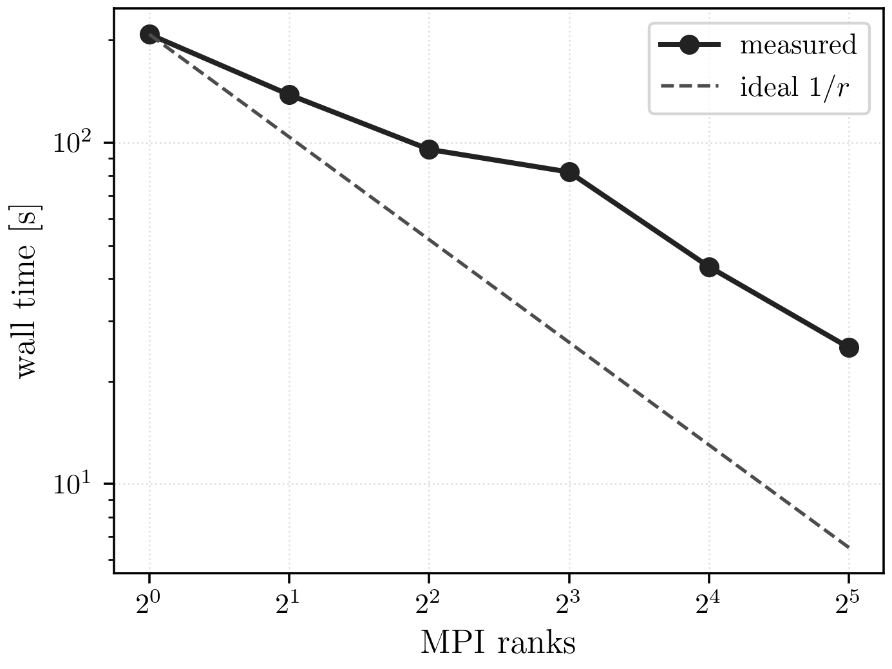
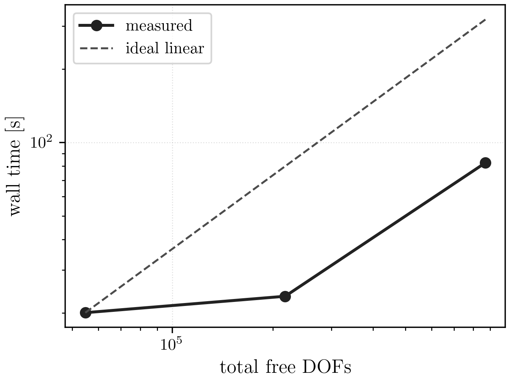

# Topology Results

## Current Maintained Comparison

The topology family has two maintained roles:

- pure JAX serial reference on `192 x 96`
- parallel JAX+PETSc fine-grid benchmark and scaling on `768 x 384`

The serial reference is the clean formulation baseline. The parallel path is
the maintained large-scale workflow and the source of the current fine-grid
benchmark and scaling figures.

## Current Best Settings

Fine-grid maintained parallel benchmark:

| knob | value |
| --- | --- |
| mesh | `768 x 384` |
| ranks | `32` |
| target volume fraction | `0.4` |
| `theta_min` | `1e-6` |
| mechanics solver | `fgmres + gamg` |
| mechanics `rtol` / `max_it` | `1e-4 / 100` |
| near-nullspace | on |
| design solver | distributed gradient descent |
| design line search | `golden_adaptive` |
| `tolg` / `tolf` | `1e-3 / 1e-6` |
| continuation | `p += 0.2` every outer iteration |
| graceful stall stop | enabled |

## Result Equivalence And Status

Shared smaller direct-comparison case: `192 x 96`.
Wall times below are the fresh 3-run medians for that shared case.

Completed shared-case results:

| implementation | ranks | status | compliance | volume | wall [s] |
| --- | ---: | --- | ---: | ---: | ---: |
| pure JAX serial | 1 | completed | 4.1557 | 0.4000 | 10.033 |

Direct comparison status table:

| implementation | ranks | status | wall [s] | compliance | volume |
| --- | ---: | --- | ---: | ---: | ---: |
| parallel JAX+PETSc | 1 | max_outer_iterations | 47.086 | 29.7952 | 0.3963 |
| pure JAX serial | 1 | completed | 10.033 | 4.1557 | 0.4000 |
| parallel JAX+PETSc | 2 | max_outer_iterations | 31.317 | 29.6444 | 0.3946 |
| parallel JAX+PETSc | 4 | max_outer_iterations | 22.601 | 29.4616 | 0.3919 |

## Scaling



PDF: [Topology strong scaling](../assets/topology/topology_strong_scaling.pdf)



PDF: [Topology mesh timing](../assets/topology/topology_mesh_timing.pdf)

Fine-grid parallel scaling (`768 x 384`):

| ranks | result | outer | p | volume | compliance | wall [s] | speedup |
| --- | ---: | ---: | ---: | ---: | ---: | ---: | ---: |
| 1 | completed | 65 | 4.20 | 0.3884 | 9.1559 | 208.198 | 1.000 |
| 2 | completed | 72 | 5.60 | 0.3932 | 8.9473 | 138.439 | 1.504 |
| 4 | completed | 69 | 4.60 | 0.3850 | 9.1684 | 95.708 | 2.175 |
| 8 | completed | 67 | 7.00 | 0.3932 | 9.2178 | 82.140 | 2.535 |
| 16 | completed | 66 | 5.80 | 0.3798 | 9.6859 | 43.328 | 4.805 |
| 32 | completed | 66 | 6.60 | 0.3749 | 9.9074 | 25.105 | 8.293 |

## Reproduction Commands

For timings comparable to the maintained topology tables, pin the JAX CPU
backend to a single thread before running the commands below:

```bash
export JAX_PLATFORMS=cpu
export OMP_NUM_THREADS=1 OPENBLAS_NUM_THREADS=1 MKL_NUM_THREADS=1
export BLIS_NUM_THREADS=1 VECLIB_MAXIMUM_THREADS=1 NUMEXPR_NUM_THREADS=1
export XLA_FLAGS="--xla_cpu_multi_thread_eigen=false intra_op_parallelism_threads=1"
```

Canonical maintained topology suite:

```bash
./.venv/bin/python -u experiments/runners/run_topology_docs_suite.py \
  --out-dir artifacts/reproduction/<campaign>/runs/topology
```

Serial reference assets:

```bash
./.venv/bin/python -u experiments/analysis/generate_report_assets.py \
  --asset-dir artifacts/reproduction/<campaign>/runs/topology/serial_reference \
  --report-path artifacts/reproduction/<campaign>/runs/topology/serial_reference/report.md
```

Parallel fine-grid benchmark:

```bash
mpiexec -n 32 ./.venv/bin/python -u src/problems/topology/jax/solve_topopt_parallel.py \
  --nx 768 --ny 384 --length 2.0 --height 1.0 --traction 1.0 --load_fraction 0.2 \
  --fixed_pad_cells 32 --load_pad_cells 32 --volume_fraction_target 0.4 --theta_min 1e-6 \
  --solid_latent 10.0 --young 1.0 --poisson 0.3 --alpha_reg 0.005 --ell_pf 0.08 \
  --mu_move 0.01 --beta_lambda 12.0 --volume_penalty 10.0 \
  --p_start 1.0 --p_max 10.0 --p_increment 0.2 --continuation_interval 1 \
  --outer_maxit 2000 --outer_tol 0.02 --volume_tol 0.001 \
  --stall_theta_tol 1e-6 --stall_p_min 4.0 --design_maxit 20 \
  --tolf 1e-6 --tolg 1e-3 --linesearch_tol 0.1 --linesearch_relative_to_bound \
  --design_gd_line_search golden_adaptive --design_gd_adaptive_window_scale 2.0 \
  --mechanics_ksp_type fgmres --mechanics_pc_type gamg \
  --mechanics_ksp_rtol 1e-4 --mechanics_ksp_max_it 100 \
  --quiet --print_outer_iterations --save_outer_state_history --outer_snapshot_stride 2 \
  --outer_snapshot_dir artifacts/reproduction/<campaign>/runs/topology/parallel_final/frames \
  --json_out artifacts/reproduction/<campaign>/runs/topology/parallel_final/parallel_full_run.json \
  --state_out artifacts/reproduction/<campaign>/runs/topology/parallel_final/parallel_full_state.npz
```

Parallel scaling report:

```bash
./.venv/bin/python -u experiments/analysis/generate_parallel_scaling_stallstop_report.py \
  --asset-dir artifacts/reproduction/<campaign>/runs/topology/parallel_scaling \
  --report-path artifacts/reproduction/<campaign>/runs/topology/parallel_scaling/report.md
```

## Notes

- The serial pure-JAX reference is the only implementation that completes the
  smaller shared direct-comparison case.
- Shared-case wall times on this page use the fresh 3-run medians from the
  `192 x 96` direct-comparison reruns.
- The parallel JAX+PETSc path is still the maintained fine-grid benchmark and
  scaling implementation.
- The rank-32 scaling row is aligned to the validated final benchmark rerun so
  the scaling table and the showcased benchmark report one canonical timing.
- The fine-grid scaling study is end-to-end rather than strict fixed-work
  scaling because the stall-stop criterion triggers at slightly different
  states across rank counts.
