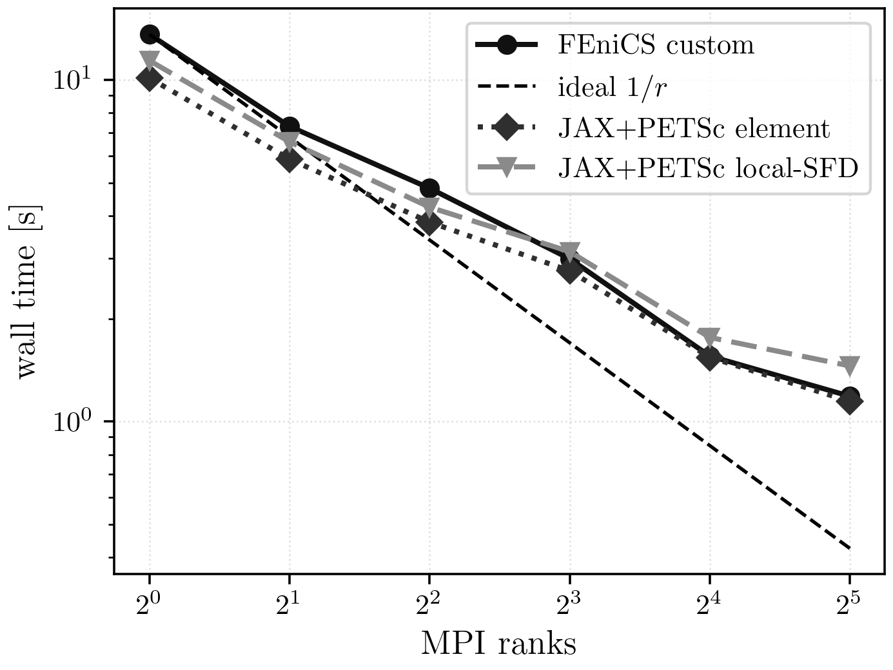
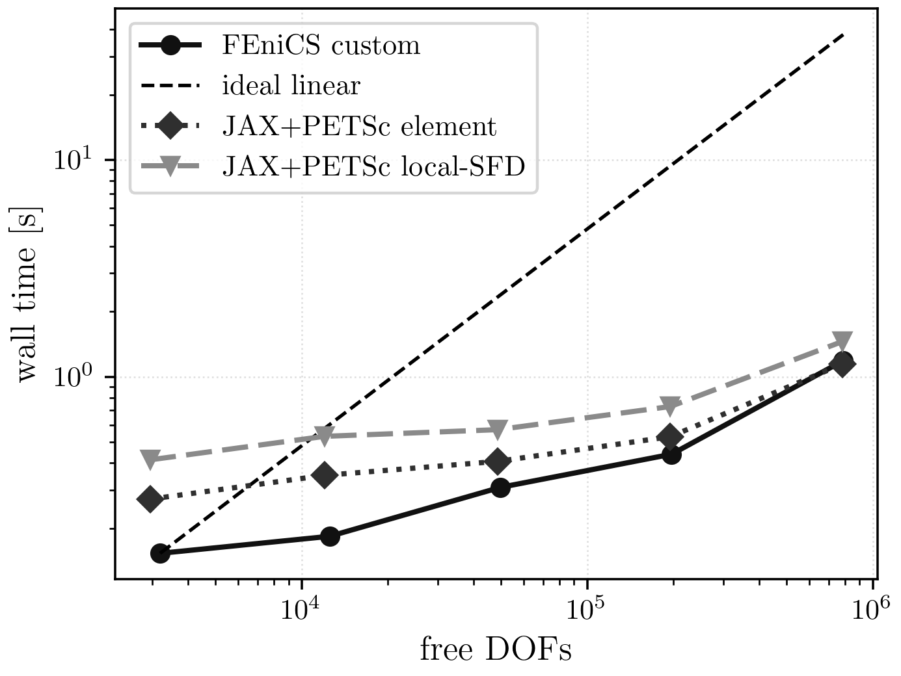

# pLaplace Results

## Current Maintained Comparison

The current maintained pLaplace campaign covers levels `5..9` and MPI counts
`1, 2, 4, 8, 16, 32` for the authoritative paths:

- FEniCS custom Newton
- JAX+PETSc element Hessian
- JAX+PETSc local-SFD Hessian

The direct serial comparison at level `5` also includes FEniCS SNES and pure
JAX serial.

## Current Best Settings

| knob | value |
| --- | --- |
| nonlinear method | line-search Newton |
| line-search interval | `[-0.5, 2.0]` |
| line-search tolerance | `1e-1` |
| trust region | off |
| KSP type | `cg` |
| PC type | `hypre` |
| KSP rtol | `1e-1` |
| KSP max it | `30` |
| PC rebuild policy | every Newton iteration |

## Shared-Case Result Equivalence

Shared comparison case: level `5`, `np=1`.

| implementation | energy | rel. diff vs ref | Newton | linear | wall [s] |
| --- | ---: | ---: | ---: | ---: | ---: |
| FEniCS custom | -7.942969 | 0.000 | 5 | 15 | 0.0782 |
| FEniCS SNES | -7.943000 | 0.000 | 10 | 0 | 0.0672 |
| pure JAX serial | -7.943000 | 0.000 | 6 | 0 | 0.1003 |
| JAX+PETSc element | -7.942969 | 0.000 | 6 | 17 | 0.0798 |
| JAX+PETSc local-SFD | -7.942969 | 0.000 | 6 | 6 | 0.1945 |

## Scaling



PDF: [pLaplace strong scaling](../assets/plaplace/plaplace_strong_scaling.pdf)



PDF: [pLaplace mesh timing](../assets/plaplace/plaplace_mesh_timing.pdf)

Finest maintained strong-scaling case: level `9`.

| implementation | ranks | time [s] | Newton | linear | energy |
| --- | ---: | ---: | ---: | ---: | ---: |
| FEniCS custom | 1 | 13.5950 | 5 | 10 | -7.960005 |
| FEniCS custom | 2 | 7.3096 | 5 | 10 | -7.960005 |
| FEniCS custom | 4 | 4.8163 | 6 | 12 | -7.960006 |
| FEniCS custom | 8 | 2.9932 | 6 | 12 | -7.960006 |
| FEniCS custom | 16 | 1.5535 | 6 | 12 | -7.960006 |
| FEniCS custom | 32 | 1.1851 | 6 | 12 | -7.960006 |
| JAX+PETSc element | 1 | 10.1311 | 6 | 11 | -7.960004 |
| JAX+PETSc element | 2 | 5.8636 | 6 | 11 | -7.960005 |
| JAX+PETSc element | 4 | 3.8318 | 6 | 11 | -7.960005 |
| JAX+PETSc element | 8 | 2.7606 | 6 | 11 | -7.960005 |
| JAX+PETSc element | 16 | 1.5409 | 6 | 11 | -7.960005 |
| JAX+PETSc element | 32 | 1.1444 | 6 | 11 | -7.960003 |
| JAX+PETSc local-SFD | 1 | 11.3922 | 6 | 11 | -7.960004 |
| JAX+PETSc local-SFD | 2 | 6.5895 | 6 | 11 | -7.960005 |
| JAX+PETSc local-SFD | 4 | 4.2395 | 6 | 11 | -7.960005 |
| JAX+PETSc local-SFD | 8 | 3.1409 | 6 | 11 | -7.960005 |
| JAX+PETSc local-SFD | 16 | 1.7617 | 6 | 11 | -7.960005 |
| JAX+PETSc local-SFD | 32 | 1.4540 | 6 | 11 | -7.960003 |

## Reproduction Commands

Maintained suite:

```bash
./.venv/bin/python -u experiments/runners/run_plaplace_final_suite.py \
  --out-dir artifacts/reproduction/<campaign>/runs/plaplace/final_suite
```

Curated figures are published under `docs/assets/plaplace/` and built from:

- `experiments/analysis/docs_assets/data/plaplace/parity_showcase.csv`
- `experiments/analysis/docs_assets/data/plaplace/strong_scaling.csv`
- `experiments/analysis/docs_assets/data/plaplace/mesh_timing.csv`

## Notes

- The current maintained fine-grid fastest path is JAX+PETSc element.
- FEniCS custom remains close while preserving the reference FEniCS pathway.
- The local-SFD Hessian path remains valid and close, but pays a consistent
  overhead relative to exact element Hessians.
