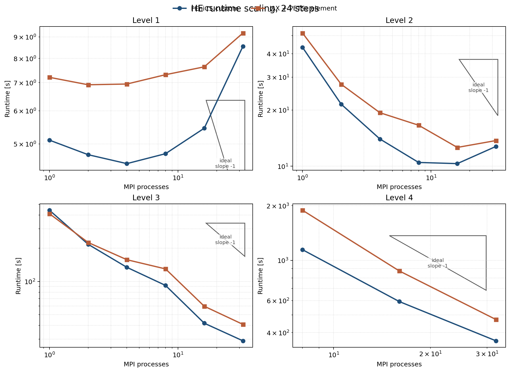
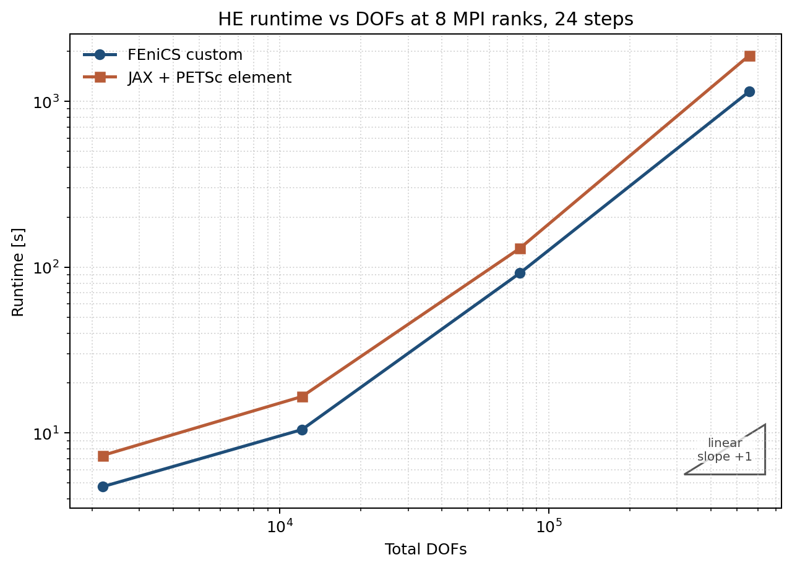
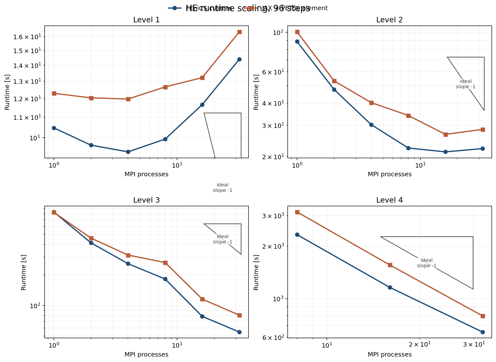
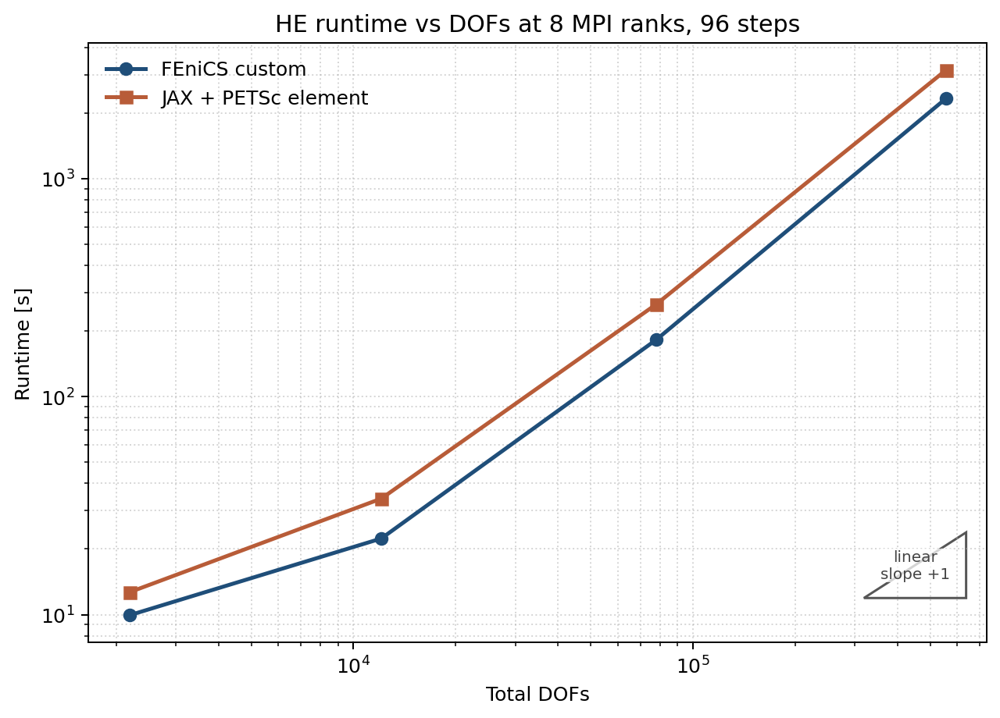

# Final HE Benchmark Report

Date: 2026-03-09

Previous snapshot archived at
`final_HE_results_archive_2026-03-08.md`.

## Purpose

This document restarts the final HyperElasticity3D benchmark campaign with the
same reporting scheme as before, but with the currently best PETSc trust-region
policy selected from the new STCG-based tuning work.

The distributed like-for-like campaign compares:

- `fenics_custom`
- `jax_petsc_element`

This report now also includes the pure-JAX serial HE reference path, rebuilt on
the same outer trust-region policy up to mesh level `3`.

## Current Best Settings

These are the default settings for the new benchmark campaign.

### Common nonlinear / linear policy

| Knob | Value | Notes |
|---|---|---|
| nonlinear method | `rho`-based trust region | implemented in `tools_petsc4py/minimizers.py` |
| trust subproblem solver | `stcg` | PETSc trust-region KSP |
| post trust-subproblem line search | on | line search applied after the STCG step |
| line-search interval | `[-0.5, 2.0]` | same interval kept across the campaign |
| line-search tolerance | `1e-1` | chosen from the new STCG tuning sweep |
| trust radius init | `0.5` | common cross-backend compromise |
| trust radius min | `1e-8` | |
| trust radius max | `1e6` | |
| trust shrink | `0.5` | |
| trust expand | `1.5` | |
| trust eta shrink | `0.05` | |
| trust eta expand | `0.75` | |
| trust max reject | `6` | |
| KSP type | `stcg` | trust-region KSP, not GMRES |
| PC type | `gamg` | |
| KSP rtol | `1e-1` | |
| KSP max it | `30` | selected after the fine-mesh comparison |
| PC rebuild policy | rebuild every Newton iteration | `pc_setup_on_ksp_cap=False` |
| GAMG threshold | `0.05` | |
| GAMG agg nsmooths | `1` | |
| GAMG coordinates | on | |
| near nullspace | on | |

### JAX + PETSc implementation knobs

| Knob | Value |
|---|---|
| assembly mode | `element` |
| distribution strategy | overlap + `Allgatherv` of the free state |
| element reorder mode | `block_xyz` |
| local Hessian mode | `element` |
| local coloring | on |
| thread count per rank | `1` |

### Pure JAX serial implementation knobs

| Knob | Value |
|---|---|
| nonlinear method | same `rho`-based trust region as PETSc paths |
| trust subproblem solver | serial Steihaug-Toint CG (`serial_stcg`) |
| post trust-subproblem line search | on |
| line-search interval | `[-0.5, 2.0]` |
| line-search tolerance | `1e-1` |
| trust radius init | `0.5` |
| trust update | `shrink=0.5`, `expand=1.5`, `eta_shrink=0.05`, `eta_expand=0.75` |
| linear operator | explicit sparse JAX Hessian |
| preconditioner | `pyamg.smoothed_aggregation_solver(..., smooth="energy")` |
| linear tolerance | `1e-1` |
| linear max it | `30` |

### Why this is the current campaign default

This campaign uses one shared trust-region policy across the PETSc backends.
The best backend-specific radii from the level-3 STCG sweep were:

- `fenics_custom`: `trust_radius_init=1.0`
- `jax_petsc_element`: `trust_radius_init=0.5`

The campaign default is intentionally fixed at `trust_radius_init=0.5` because:

- it was the best JAX + PETSc radius tested,
- it remained near-best on FEniCS,
- and it was the only tested FEniCS radius in that sweep that avoided any KSP
  `max_it` hits.

The detailed rationale is recorded in Annex A.

## Implementation Summary

### 1. Pure JAX serial

Current production design for the refreshed serial reference:

- JAX energy, gradient, and sparse finite-difference Hessian assembly through
  `tools/jax_diff.py`,
- explicit serial sparse Hessian matrix,
- PyAMG energy-smoothed aggregation preconditioner rebuilt every Newton
  iteration,
- serial Steihaug-Toint trust-subproblem solve plus the same post line search
  used in the PETSc campaign,
- benchmarked here on levels `1..3` only.

### 2. JAX + PETSc

Current production design:

- exact elementwise Hessian assembly,
- reordered free DOFs before PETSc ownership split,
- overlap domains so each rank can assemble all owned matrix rows locally,
- whole-local JAX calls for energy and gradient,
- per-element Hessian evaluation batched over local elements,
- fixed PETSc COO sparsity pattern with value-only updates each Newton iteration.

### 3. FEniCS custom + PETSc

Current production design:

- residual and tangent assembled from FEniCS forms,
- PETSc KSP/PC stack for the trust-subproblem solve,
- same outer `rho`-based trust-region logic as the JAX + PETSc path,
- same STCG + post-line-search policy as the JAX + PETSc path.

## Benchmark Matrix

The refreshed PETSc campaign keeps the same distributed scope:

- mesh levels: `1, 2, 3, 4`
- MPI process counts: `1, 2, 4, 8, 16, 32`
- load-step discretizations:
  - `24` steps over the full trajectory
  - `96` steps over the full trajectory

Pure JAX serial reference coverage in this report:

- mesh levels: `1, 2, 3`
- process count: `1`
- load-step discretizations:
  - `24` steps
  - `96` steps

Pure JAX is included in the serial comparison tables, but not in the MPI
scaling plots, because that implementation is single-process only.

## Kill-Switch Policy

Default safety rule:

- if any single time step exceeds `100 s`, terminate that run,
- mark the configuration as failed by kill-switch,
- skip clearly harder configurations for that solver family unless a later
  targeted rerun explicitly overrides the cap.

## Metrics To Record Per Time Step

For every completed time step, record:

- Newton iterations
- cumulative linear iterations
- wall time
- energy

For timed breakdowns, record:

- assembly time
- preconditioner setup time
- KSP solve time
- line-search / globalization time

If available, also record:

- communication time
- extraction / sparse fill time
- trust-region rejects

### Measurement definitions

| Field | Scope | Meaning |
|---|---|---|
| `Newton iters` | per step | nonlinear iterations performed in that load step |
| `Linear iters` | per step | cumulative Krylov iterations across Newton iterations |
| `Energy` | per step | final total energy at the accepted solution of that load step |
| `Time [s]` | per step | end-to-end wall time for the load step |
| `Assembly [s]` | per step | cumulative Hessian / operator assembly time |
| `PC init [s]` | per step | cumulative preconditioner setup time |
| `KSP solve [s]` | per step | cumulative linear-solve time |
| `Line search [s]` | per step | cumulative globalization time |
| `TR rejects` | per step | number of rejected trust-region trial steps |
| `Status` | per step | converged, maxit, non-finite, kill-switch, or other stop reason |

### Failure / kill-switch fields

| Field | Meaning |
|---|---|
| `Completed steps` | number of fully finished load steps before stop |
| `First failed step` | first step that exceeded time budget or failed numerically |
| `Failure mode` | `kill-switch`, `maxit`, `non-finite`, `KSP failure`, or other explicit reason |
| `Failure time [s]` | observed wall time in the failing step before termination, if available |
| `Skipped harder cases` | whether harder configurations were intentionally skipped |

## Table Templates

### Per-step trajectory table

| Solver | Level | MPI | Total steps | Step | Newton iters | Linear iters | Energy | Time [s] | Assembly [s] | PC init [s] | KSP solve [s] | Line search [s] | Status |
|---|---:|---:|---:|---:|---:|---:|---:|---:|---:|---:|---:|---:|---|

### Aggregated run table

| Solver | Level | MPI | Total steps | Completed steps | Total Newton iters | Total linear iters | Total time [s] | Mean step time [s] | Max step time [s] | Result |
|---|---:|---:|---:|---:|---:|---:|---:|---:|---:|---|

### Scaling summary table

| Solver | Total steps | Level | MPI | Total time [s] | Speedup vs 1 rank | Notes |
|---|---:|---:|---:|---:|---:|---|

### Failure summary table

| Solver | Level | MPI | Total steps | Completed steps | First failed step | Failure mode | Failure time [s] | Skipped harder cases | Notes |
|---|---:|---:|---:|---:|---:|---|---:|---|---|

## Results

### 1. Final benchmark settings

Current campaign default:

- nonlinear solver: STCG-based `rho` trust region + post line search
- line search interval: `[-0.5, 2.0]`
- line search tolerance: `1e-1`
- trust radius init: `0.5`
- trust update: `shrink=0.5`, `expand=1.5`,
  `eta_shrink=0.05`, `eta_expand=0.75`
- linear solver: `stcg + gamg`
- PETSc tolerances: `ksp_rtol=1e-1`, `ksp_max_it=30`
- rebuild PC every Newton iteration

Mesh sizes used in the report:

| Level | Total DOFs |
|---|---:|
| `1` | `2187` |
| `2` | `12075` |
| `3` | `78003` |
| `4` | `555747` |

### 2. Pure JAX results

All pure-JAX results in this section are generated by
`HyperElasticity3D_jax/solve_HE_jax_newton.py` and indexed in
`experiment_results_cache/he_pure_jax_stcg_best/summary.md`.

Important note:

- the table uses the same full DOF counts as the PETSc runs,
- but the serial linear system size is the free-DOF count after Dirichlet
  elimination, which is recorded separately.

#### 2.1 Pure-JAX serial runs

| Total steps | Level | Total DOFs | Free DOFs | Total time [s] | Newton | Linear | Max step [s] | Result |
|---:|---:|---:|---:|---:|---:|---:|---:|---|
| `24` | `1` | `2187` | `2133` | `35.451` | `559` | `2284` | `1.786` | completed |
| `24` | `2` | `12075` | `11925` | `260.603` | `669` | `5176` | `22.919` | completed |
| `24` | `3` | `78003` | `77517` | `1684.886` | `745` | `10257` | `120.986` | completed |
| `96` | `1` | `2187` | `2133` | `66.518` | `1065` | `5661` | `1.956` | completed |
| `96` | `2` | `12075` | `11925` | `451.622` | `1181` | `11186` | `12.932` | completed |
| `96` | `3` | `78003` | `77517` | `2842.431` | `1243` | `19792` | `102.116` | completed |

#### 2.2 Serial comparison at one rank

##### 24 steps

| Level | FEniCS [s] | JAX + PETSc [s] | Pure JAX [s] | Pure / FEniCS | Pure / JAX+PETSc |
|---:|---:|---:|---:|---:|---:|
| `1` | `5.104` | `7.209` | `35.451` | `6.946` | `4.918` |
| `2` | `43.293` | `51.642` | `260.603` | `6.019` | `5.047` |
| `3` | `441.560` | `410.488` | `1684.886` | `3.816` | `4.105` |

##### 96 steps

| Level | FEniCS [s] | JAX + PETSc [s] | Pure JAX [s] | Pure / FEniCS | Pure / JAX+PETSc |
|---:|---:|---:|---:|---:|---:|
| `1` | `10.468` | `12.291` | `66.518` | `6.354` | `5.412` |
| `2` | `88.773` | `100.583` | `451.622` | `5.087` | `4.490` |
| `3` | `836.371` | `830.500` | `2842.431` | `3.399` | `3.423` |

Readout:

- The pure-JAX path now uses the same outer trust-region policy as the PETSc
  backends, so these serial comparisons are finally like-for-like at the
  nonlinear-solver level.
- It remains clearly slower than both PETSc implementations on levels `1..3`,
  mainly because it rebuilds a serial PyAMG preconditioner on every Newton
  iteration and never benefits from distributed assembly or distributed linear
  solves.
- Raw pure-JAX case data are stored in
  `experiment_results_cache/he_pure_jax_stcg_best/`, with one `.json` and one
  human-readable `.md` file per run.

### 3. Cross-method comparison: 24 steps

All figures in this section are generated from
`experiment_results_cache/he_final_suite_stcg_best/summary.json` by
`img/generate_he_final_report_figures.py`.

#### 3.1 Scaling on levels 1 to 4

##### Level 1

| MPI | FEniCS [s] | JAX + PETSc [s] | JAX / FEniCS |
|---:|---:|---:|---:|
| 1 | 5.104 | 7.209 | 1.412 |
| 2 | 4.713 | 6.920 | 1.468 |
| 4 | 4.487 | 6.948 | 1.548 |
| 8 | 4.739 | 7.314 | 1.543 |
| 16 | 5.451 | 7.636 | 1.401 |
| 32 | 8.549 | 9.195 | 1.076 |

##### Level 2

| MPI | FEniCS [s] | JAX + PETSc [s] | JAX / FEniCS |
|---:|---:|---:|---:|
| 1 | 43.293 | 51.642 | 1.193 |
| 2 | 21.480 | 27.458 | 1.278 |
| 4 | 13.991 | 19.343 | 1.383 |
| 8 | 10.478 | 16.579 | 1.582 |
| 16 | 10.328 | 12.610 | 1.221 |
| 32 | 12.767 | 13.724 | 1.075 |

##### Level 3

| MPI | FEniCS [s] | JAX + PETSc [s] | JAX / FEniCS |
|---:|---:|---:|---:|
| 1 | 441.560 | 410.488 | 0.930 |
| 2 | 216.963 | 225.325 | 1.039 |
| 4 | 134.231 | 157.335 | 1.172 |
| 8 | 92.001 | 129.823 | 1.411 |
| 16 | 41.843 | 59.613 | 1.425 |
| 32 | 28.969 | 40.816 | 1.409 |

##### Level 4

| MPI | FEniCS [s] | JAX + PETSc [s] | JAX / FEniCS |
|---:|---:|---:|---:|
| 8 | 1144.050 | 1887.400 | 1.650 |
| 16 | 592.675 | 873.976 | 1.475 |
| 32 | 359.945 | 471.584 | 1.310 |

#### 3.2 Runtime dependence on DOF count at 8 MPI ranks

| Level | DOFs | FEniCS [s] | JAX + PETSc [s] | JAX / FEniCS |
|---:|---:|---:|---:|---:|
| 1 | 2187 | 4.739 | 7.314 | 1.543 |
| 2 | 12075 | 10.478 | 16.579 | 1.582 |
| 3 | 78003 | 92.001 | 129.823 | 1.411 |
| 4 | 555747 | 1144.050 | 1887.400 | 1.650 |

### 4. Cross-method comparison: 96 steps

#### 4.1 Scaling on levels 1 to 4

##### Level 1

| MPI | FEniCS [s] | JAX + PETSc [s] | JAX / FEniCS |
|---:|---:|---:|---:|
| 1 | 10.468 | 12.291 | 1.174 |
| 2 | 9.659 | 12.036 | 1.246 |
| 4 | 9.362 | 11.968 | 1.278 |
| 8 | 9.934 | 12.663 | 1.275 |
| 16 | 11.660 | 13.220 | 1.134 |
| 32 | 14.402 | 16.362 | 1.136 |

##### Level 2

| MPI | FEniCS [s] | JAX + PETSc [s] | JAX / FEniCS |
|---:|---:|---:|---:|
| 1 | 88.773 | 100.583 | 1.133 |
| 2 | 47.660 | 53.314 | 1.119 |
| 4 | 30.245 | 40.222 | 1.330 |
| 8 | 22.347 | 34.057 | 1.524 |
| 16 | 21.258 | 26.653 | 1.254 |
| 32 | 22.176 | 28.441 | 1.283 |

##### Level 3

| MPI | FEniCS [s] | JAX + PETSc [s] | JAX / FEniCS |
|---:|---:|---:|---:|
| 1 | 836.371 | 830.500 | 0.993 |
| 2 | 415.518 | 462.341 | 1.113 |
| 4 | 258.624 | 314.545 | 1.216 |
| 8 | 182.548 | 265.440 | 1.454 |
| 16 | 78.241 | 115.700 | 1.479 |
| 32 | 54.834 | 80.416 | 1.467 |

##### Level 4

| MPI | FEniCS [s] | JAX + PETSc [s] | JAX / FEniCS |
|---:|---:|---:|---:|
| 8 | 2329.637 | 3143.300 | 1.349 |
| 16 | 1160.797 | 1561.647 | 1.345 |
| 32 | 643.560 | 796.708 | 1.238 |

#### 4.2 Runtime dependence on DOF count at 8 MPI ranks

| Level | DOFs | FEniCS [s] | JAX + PETSc [s] | JAX / FEniCS |
|---:|---:|---:|---:|---:|
| 1 | 2187 | 9.934 | 12.663 | 1.275 |
| 2 | 12075 | 22.347 | 34.057 | 1.524 |
| 3 | 78003 | 182.548 | 265.440 | 1.454 |
| 4 | 555747 | 2329.637 | 3143.300 | 1.349 |

### 5. 24-step versus 96-step comparison at 8 MPI ranks

| Level | DOFs | FEniCS 24 [s] | FEniCS 96 [s] | 96 / 24 | JAX 24 [s] | JAX 96 [s] | 96 / 24 |
|---:|---:|---:|---:|---:|---:|---:|---:|
| 1 | 2187 | 4.739 | 9.934 | 2.096 | 7.314 | 12.663 | 1.731 |
| 2 | 12075 | 10.478 | 22.347 | 2.133 | 16.579 | 34.057 | 2.054 |
| 3 | 78003 | 92.001 | 182.548 | 1.984 | 129.823 | 265.440 | 2.045 |
| 4 | 555747 | 1144.050 | 2329.637 | 2.036 | 1887.400 | 3143.300 | 1.665 |

### 6. Final conclusions

- FEniCS custom is faster in most completed comparisons, especially on the fine
  mesh and at low to medium MPI counts.
- JAX + PETSc is closest at high ranks. The finest `96`-step case at `np=32`
  is within a factor of `1.238`, and the finest `24`-step case at `np=32` is
  within a factor of `1.310`.
- On `level 3`, JAX + PETSc is slightly faster than FEniCS custom only in the
  serial runs (`24` steps: `0.930x`; `96` steps: `0.993x`), but FEniCS scales
  better once MPI is increased.
- The `96 / 24` runtime ratio stays close to `2x` for FEniCS across all levels.
  For JAX + PETSc it is also close to `2x` on levels `2` and `3`, but lower on
  the finest mesh (`1.665x` at `np=8`), indicating a different balance between
  nonlinear and linear work on the hardest case.

## Annexes

### Annex A. Rationale for the Current Best Settings

The current campaign default is based on the following experiment sequence.

#### A1. The older reduced 2D trust-region hybrid is worse than the PETSc STCG path

Comparable fine-case runs on JAX + PETSc, `level 4`, `24/24`, `np=32`:

| Nonlinear variant | Result | Total [s] | Newton | Linear | Final energy | Max step [s] |
|---|---|---:|---:|---:|---:|---:|
| old reduced 2D trust + LS hybrid | failed (`maxit`) | 1216.334 | 1902 | 39933 | 93.614285 | 70.577 |
| pure line search | completed | 727.141 | 1256 | 19788 | 87.722639 | 39.557 |
| `stcg` trust only | completed | 556.092 | 877 | 20705 | 87.721927 | 33.025 |
| `stcg` trust + post LS | completed | 555.196 | 794 | 19221 | 87.721950 | 27.716 |

Readout:

- The old reduced-space trust-region hybrid is the only one of these four that
  does not complete the full fine trajectory.
- It is also dramatically worse in both Newton work and end-to-end time.
- That is the direct evidence for replacing the old reduced 2D trust step with
  PETSc `stcg`.

#### A2. The trust + post-line-search combination is the best current variant

The fine-case table above already shows that `stcg + post LS` is the fastest of
the fully converged variants on the hardest directly comparable JAX run.

The level-3, `32`-rank, full `24/24` sweep confirms that keeping the post line
search is the best overall choice:

| Backend | Variant | All 24 converged | Total [s] | Newton | Linear |
|---|---|---|---:|---:|---:|
| `fenics_custom` | `stcg_only` | yes | 41.883 | 743 | 17235 |
| `fenics_custom` | `stcg + post LS`, `tol=1e-1` | yes | 37.526 | 645 | 20716 |
| `jax_petsc_element` | `stcg_only` | no | 57.329 | 843 | 21029 |
| `jax_petsc_element` | `stcg + post LS`, `tol=1e-1` | yes | 54.887 | 711 | 25364 |

Readout:

- On FEniCS, the post-line-search variant is clearly faster.
- On JAX + PETSc, `stcg_only` does not complete the full trajectory.
  Step `10` ends with `Trust-region radius exhausted before full convergence`.
- So the chosen campaign variant is not just “trust region” and not just “line
  search”, but specifically `stcg` trust region with post line search.

#### A3. `linesearch_tol=1e-1` is the best tested post-LS tolerance

Level-3, `32`-rank, full `24/24` STCG + post-LS sweep:

| Backend | `linesearch_tol` | All 24 converged | Total [s] | Newton | Linear | KSP cap hits |
|---|---:|---|---:|---:|---:|---:|
| `fenics_custom` | `1e-1` | yes | 37.526 | 645 | 20716 | 3 |
| `fenics_custom` | `1e-3` | yes | 40.019 | 653 | 21173 | 4 |
| `fenics_custom` | `1e-6` | yes | 45.946 | 656 | 21263 | 7 |
| `jax_petsc_element` | `1e-1` | yes | 54.887 | 711 | 25364 | 24 |
| `jax_petsc_element` | `1e-3` | yes | 62.076 | 711 | 24951 | 18 |
| `jax_petsc_element` | `1e-6` | yes | 69.343 | 713 | 25032 | 17 |

Readout:

- `1e-1` is the lowest wall-time option on both backends.
- Tightening the line search did not improve robustness.
- It only increased total runtime.

#### A4. Trust-radius tuning selected the common `0.5` compromise

Level-3, `32`-rank, full `24/24`, STCG + post-LS, `linesearch_tol=1e-1`:

| Backend | Radius init | Total [s] | Newton | Linear | Used KSP max it |
|---|---:|---:|---:|---:|---|
| `fenics_custom` | `0.5` | 40.188 | 668 | 20154 | no |
| `fenics_custom` | `1.0` | 39.069 | 655 | 20397 | yes |
| `fenics_custom` | `2.0` | 41.348 | 654 | 21568 | yes |
| `fenics_custom` | `4.0` | 41.075 | 643 | 21448 | yes |
| `jax_petsc_element` | `0.5` | 54.769 | 720 | 23509 | yes |
| `jax_petsc_element` | `1.0` | 57.259 | 716 | 23553 | yes |
| `jax_petsc_element` | `2.0` | 57.957 | 712 | 25470 | yes |
| `jax_petsc_element` | `4.0` | 59.322 | 711 | 26877 | yes |

Readout:

- Fastest FEniCS radius: `1.0`
- Fastest JAX + PETSc radius: `0.5`
- The campaign chooses `0.5` because it is the best JAX setting, remains close
  to the best FEniCS time, and is the only tested FEniCS radius that avoided
  any KSP `max_it` hits.

#### A5. The base trust-update parameters remain the best tested update rule

FEniCS update tuning at `trust_radius_init=1.0`:

| Variant | `shrink` | `expand` | `eta_shrink` | `eta_expand` | Total [s] |
|---|---:|---:|---:|---:|---:|
| `base` | `0.5` | `1.5` | `0.05` | `0.75` | 39.745 |
| `expand2` | `0.5` | `2.0` | `0.05` | `0.75` | 42.091 |
| `stricter` | `0.5` | `1.5` | `0.1` | `0.9` | 42.430 |
| `strong_shrink` | `0.25` | `1.5` | `0.1` | `0.75` | 42.907 |

JAX + PETSc update tuning at `trust_radius_init=0.5`:

| Variant | `shrink` | `expand` | `eta_shrink` | `eta_expand` | Total [s] |
|---|---:|---:|---:|---:|---:|
| `base` | `0.5` | `1.5` | `0.05` | `0.75` | 58.091 |
| `expand2` | `0.5` | `2.0` | `0.05` | `0.75` | 60.405 |
| `stricter` | `0.5` | `1.5` | `0.1` | `0.9` | 59.243 |
| `strong_shrink` | `0.25` | `1.5` | `0.1` | `0.75` | 59.508 |

Readout:

- None of the tested update-rule variants improved either backend.
- So the base rule stays frozen:
  `trust_shrink=0.5`, `trust_expand=1.5`,
  `trust_eta_shrink=0.05`, `trust_eta_expand=0.75`.

#### A6. `ksp_max_it=30` beats `100` on the fine case

Fine `level 4`, `24/24`, `np=32`, STCG + post-LS, common best trust settings:

| Backend | `ksp_max_it` | Total [s] | Newton | Linear | Max step [s] | KSP cap hits |
|---|---:|---:|---:|---:|---:|---:|
| `fenics_custom` | `30` | 360.318 | 708 | 16046 | 17.710 | 415 |
| `fenics_custom` | `100` | 430.905 | 708 | 22611 | 20.555 | 0 |
| `jax_petsc_element` | `30` | 479.569 | 825 | 18925 | 23.191 | 496 |
| `jax_petsc_element` | `100` | 557.517 | 814 | 27187 | 37.287 | 20 |

Readout:

- `30` is faster than `100` on both backends.
- On FEniCS, Newton work is identical, so the `100`-iteration run is simply
  paying more linear-solver cost.
- On JAX + PETSc, `100` reduces Newton iterations slightly, but the extra
  linear work dominates and still makes the run slower.

#### A7. Rebuild-every-iteration is the current frozen PC policy

The STCG tuning sweeps that selected the current line-search, radius, and KSP
settings all used:

- rebuild PC every Newton iteration
- `pc_setup_on_ksp_cap=False`

This is therefore the policy frozen into the refreshed campaign.

#### A8. Final campaign default

The current best shared setting for the refreshed final HE campaign is:

- trust region on
- PETSc trust-subproblem solver `stcg`
- post-STCG line search on
- `linesearch_interval=[-0.5, 2.0]`
- `linesearch_tol=1e-1`
- `trust_radius_init=0.5`
- `trust_radius_min=1e-8`
- `trust_radius_max=1e6`
- `trust_shrink=0.5`
- `trust_expand=1.5`
- `trust_eta_shrink=0.05`
- `trust_eta_expand=0.75`
- `trust_max_reject=6`
- `pc_type=gamg`
- `ksp_rtol=1e-1`
- `ksp_max_it=30`
- rebuild PC every Newton iteration

This is the setting to use unless a later annex documents a stronger
replacement.
