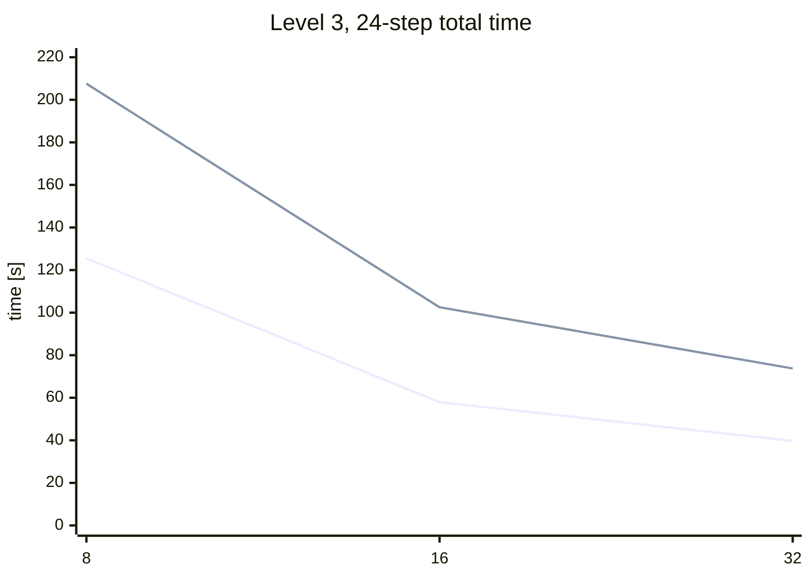
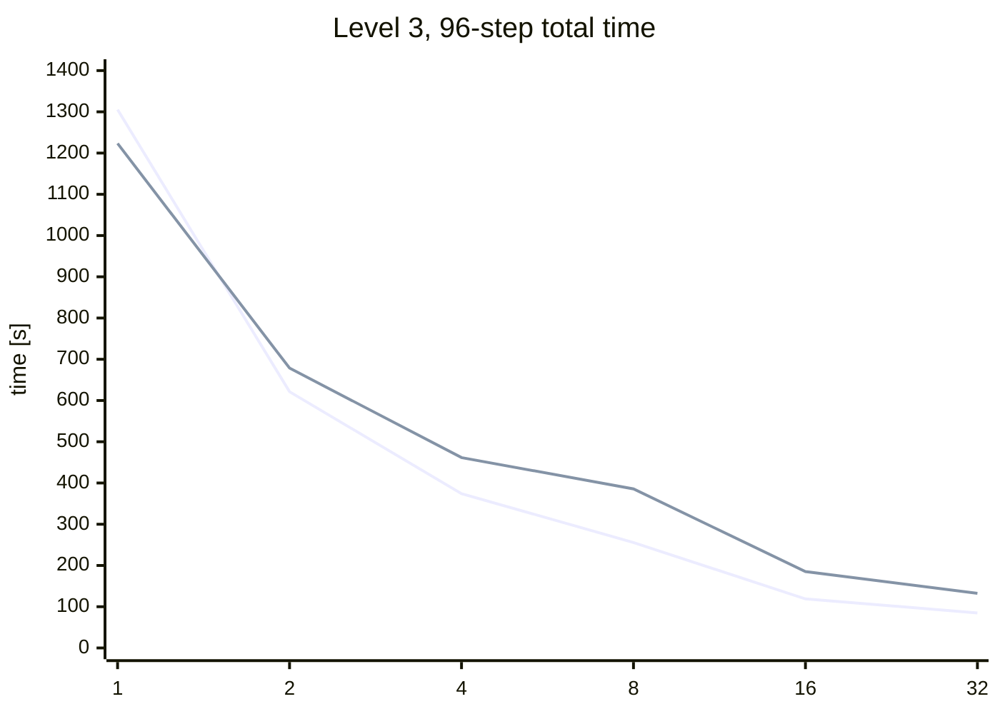
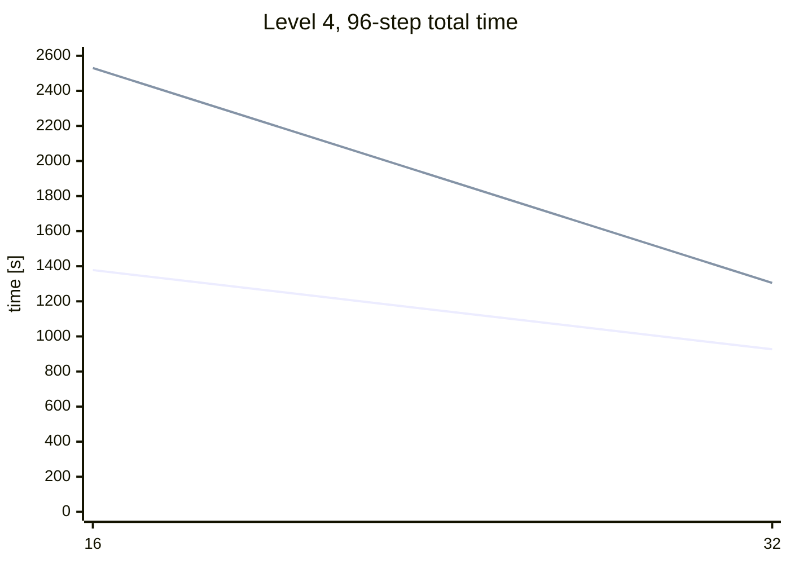
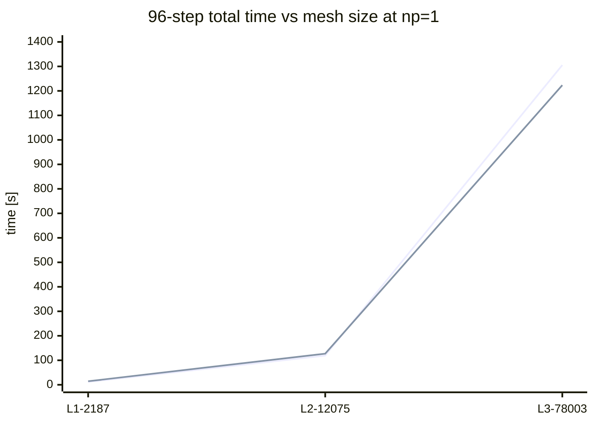
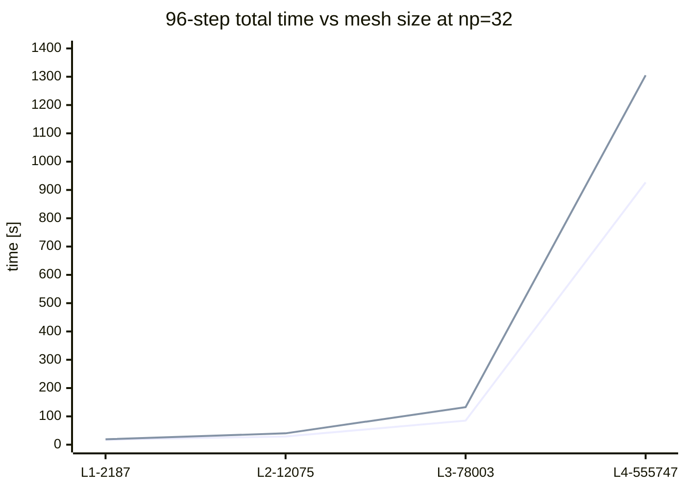

# Final HE Benchmark Plan

Date: 2026-03-06

## Purpose

This document will hold the final HyperElasticity3D benchmark results after the
solver implementations and benchmark methodology are frozen.

The benchmark campaign will compare:

- pure JAX serial implementation
- JAX + PETSc implementation
- FEniCS custom assembly + PETSc implementation

The tables will be filled in sequentially as the runs are completed.

## Current Status

The current production JAX + PETSc assembly path is the reordered-overlap
element implementation in
`HyperElasticity3D_jax_petsc/reordered_element_assembler.py`.

Important caveat before running the final campaign:

- the PETSc-based solvers already use the new `rho`-based trust-region +
  line-search minimizer from `tools_petsc4py/minimizers.py`
- the current pure-JAX serial HE driver still uses the older serial minimizer
  from `tools/minimizers.py`

So the pure-JAX path still needs to be brought onto the same nonlinear-solver
policy before the final apples-to-apples benchmark tables are complete.

## Task List

- [ ] Freeze the solver set included in the final comparison.
- [ ] Port the pure-JAX HE driver to the new `rho`-based trust-region
      minimizer.
- [ ] Confirm that all compared methods use the same nonlinear-solver policy.
- [ ] Freeze the trust-region + line-search settings for the final campaign.
- [ ] Add a benchmark kill-switch:
      if one time step exceeds `100 s`, abort that run and skip all more
      difficult configurations for that solver family.
- [ ] Define the exact output JSON schema used by all benchmark runners.
- [ ] Run `24`-step trajectories for mesh levels `1..4` and process counts
      `1, 2, 4, 8, 16, 32`.
- [ ] Run `96`-step trajectories for mesh levels `1..4` and process counts
      `1, 2, 4, 8, 16, 32`.
- [ ] Aggregate per-step metrics into tables for each solver family.
- [ ] Write final conclusions about robustness, scaling, and assembly/solve cost.

## Final Solver Policy

Target policy for the final benchmark campaign:

- Nonlinear solver:
  the new `rho`-based trust-region + line-search algorithm from
  `tools_petsc4py/minimizers.py`
- Line search interval:
  `[-0.5, 2.0]`
- Linear solver for PETSc-based methods:
  `GMRES + GAMG`
- Linear solver for pure JAX:
  `CG + pyamg.smoothed_aggregation_solver(..., smooth="energy")`

### Trust-region candidate to start from

Current best tested HyperElasticity setting from
`TRUST_REGION_LINESEARCH_TUNING.md`:

- `use_trust_region=True`
- `trust_radius_init=0.2`
- `linesearch_interval=[0, 1]`

However, this is not yet the final benchmark choice because the requested final
campaign should use line search on `[-0.5, 2.0]`.

So the benchmark preparation still needs:

- a stability check for trust-region-on with `linesearch_interval=[-0.5, 2.0]`
- if that is not robust enough across the full benchmark matrix, a documented
  fallback decision

## Implementation Summary

### 1. Pure JAX serial

Target description for the final benchmark:

- energy defined in `HyperElasticity3D_jax/jax_energy.py`
- automatic differentiation for gradient and Hessian-related operators
- sparse linear solve preconditioned by `pyamg`
- same nonlinear solver policy as the PETSc-based methods

Current implementation note:

- this path still needs to be updated to the new trust-region implementation
  before the final benchmark tables are authoritative

### 2. JAX + PETSc

Current production design:

- mainline assembly mode is exact elementwise Hessian assembly
- free DOFs are reordered before PETSc ownership split
- overlap domains are built so each rank owns a local enlarged subdomain that
  contains all element data needed to assemble its owned matrix rows
- the current free-vector state is exchanged with `Allgatherv`
- local energy is evaluated over all overlap elements in one JAX call
- local gradient is evaluated over all overlap elements in one JAX call
- local Hessian values are evaluated elementwise in one batched JAX call and
  scattered into the preallocated PETSc COO buffer
- matrix sparsity is fixed up front, so per-iteration work only updates values

Overlap-domain construction, at a high level:

- build PETSc ownership on reordered free DOFs
- mark each element whose reordered DOFs intersect the owned row range
- include all nodes touched by those elements in the local overlap domain
- compute all owned matrix rows entirely from that overlap-local data
- no Hessian value reduction is needed after local assembly because each rank
  writes only its owned COO entries

### 3. FEniCS custom + PETSc

Current target description for the final benchmark:

- residual and tangent assembled through FEniCS forms
- PETSc KSP/PC stack used for the linear solves
- same nonlinear solver policy as the JAX + PETSc method
- `GMRES + GAMG` for the final PETSc linear comparison

## Benchmark Matrix

The final campaign will cover:

- mesh levels: `1, 2, 3, 4`
- MPI process counts: `1, 2, 4, 8, 16, 32`
- load-step discretizations:
  - `24` steps over the full trajectory
  - `96` steps over the full trajectory

## Kill-Switch Policy

Benchmark safety rule:

- if any single time step exceeds `100 s`, terminate that run
- mark the configuration as failed due to time limit
- do not continue to more difficult configurations for the same solver family

“More difficult” means:

- finer mesh at the same or larger process count
- same mesh with fewer steps (`24` instead of `96`) if the larger load increment
  is known to be harder

This rule is intended to prevent wasting time on clearly non-competitive or
non-robust branches.

## Metrics To Record Per Time Step

For every completed time step, record:

- Newton iterations
- cumulative linear iterations
- wall time
- energy

For timed breakdowns, record:

- assembly time
- preconditioner setup time
- KSP solve time
- line-search / globalization time

If available, also record:

- communication time
- value-extraction / COO fill time
- trust-region rejects

### Measurement definitions

| Field | Scope | Meaning | Notes |
|---|---|---|---|
| `Newton iters` | per step | nonlinear iterations performed in that load step | reported directly by the nonlinear solver |
| `Linear iters` | per step | cumulative Krylov iterations across all Newton iterations in that load step | for pure JAX this means cumulative CG iterations |
| `Energy` | per step | final total energy at the accepted solution of that load step | scalar objective value |
| `Time [s]` | per step | end-to-end wall time for the full load step | includes assembly, linear solves, line search, and trust-region retries |
| `Assembly [s]` | per step | cumulative Hessian / operator assembly time across Newton iterations in that load step | for JAX + PETSc this includes local extraction and PETSc COO value insertion |
| `PC init [s]` | per step | cumulative preconditioner setup time across Newton iterations in that load step | PETSc `KSPSetUp` / AMG setup time |
| `KSP solve [s]` | per step | cumulative linear-solve time across Newton iterations in that load step | PETSc KSP time or pure-JAX linear solver time |
| `Line search [s]` | per step | cumulative globalization time spent evaluating trial steps | includes trust-region acceptance logic where separable |
| `Communication [s]` | per step | cumulative communication time directly attributable to distributed assembly | only recorded when exposed by the implementation |
| `Extraction [s]` | per step | cumulative time spent mapping local derivatives into sparse value buffers | relevant mainly for JAX + PETSc assembly diagnostics |
| `TR rejects` | per step | number of rejected trust-region trial steps before acceptance / failure | only recorded when exposed by the minimizer history |
| `Status` | per step | solver outcome for that load step | e.g. converged, maxit, non-finite, kill-switch |

### Failure / kill-switch fields

| Field | Meaning |
|---|---|
| `Completed steps` | number of fully finished load steps before stop |
| `First failed step` | first step that exceeded time budget or failed numerically |
| `Failure mode` | `kill-switch`, `maxit`, `non-finite`, `KSP failure`, or other explicit stop reason |
| `Failure time [s]` | observed wall time spent in the failing step before termination, if available |
| `Skipped harder cases` | whether the benchmark policy excluded more difficult configurations after this failure |

## Table Templates

### Per-step trajectory table

| Solver | Level | MPI | Total steps | Step | Newton iters | Linear iters | Energy | Time [s] | Assembly [s] | PC init [s] | KSP solve [s] | Line search [s] | Status |
|---|---:|---:|---:|---:|---:|---:|---:|---:|---:|---:|---:|---:|---|

### Aggregated run table

| Solver | Level | MPI | Total steps | Completed steps | Total Newton iters | Total linear iters | Total time [s] | Mean step time [s] | Max step time [s] | Result |
|---|---:|---:|---:|---:|---:|---:|---:|---:|---:|---|

### Scaling summary table

| Solver | Total steps | Level | MPI | Total time [s] | Speedup vs 1 rank | Notes |
|---|---:|---:|---:|---:|---:|---|

### Failure summary table

| Solver | Level | MPI | Total steps | Completed steps | First failed step | Failure mode | Failure time [s] | Skipped harder cases | Notes |
|---|---:|---:|---:|---:|---:|---|---:|---|---|

## Sections To Fill

### 1. Final benchmark settings

Compared methods in the current like-for-like tables:

- `fenics_custom`
- `jax_petsc_element`

Shared solver policy for these comparisons:

- nonlinear solver: `rho`-based trust region + line search
- trust-region seed: `trust_radius_init=2.0`
- line-search interval: `[-0.5, 2.0]`
- linear solver: `GMRES + GAMG`
- PETSc tolerances: `ksp_rtol=1e-1`, `ksp_max_it=30`
- PETSc options: `pc_setup_on_ksp_cap`, `gamg_threshold=0.05`,
  `gamg_agg_nsmooths=1`, coordinates on, near-nullspace on
- `24`-step rows follow the suite kill-switch policy: abort a case when one
  load step exceeds `100 s`
- `96`-step fine `level 4` rows at `np=16` and `np=32` were rerun uncapped to
  complete the comparison matrix

Mesh sizes used in the report:

| Level | Total DOFs |
|---|---:|
| `1` | `2187` |
| `2` | `12075` |
| `3` | `78003` |
| `4` | `555747` |

Comparison coverage used below:

- `24` steps: levels `3` and `4`, MPI `8`, `16`, `32`
- `96` steps: full common set for levels `1` to `4`, with direct cross-method
  comparisons reported where both methods were run

### 2. Pure JAX results

Not included in the one-to-one tables below. The current pure-JAX HE path
still has not been frozen onto the exact same benchmark policy as the two
PETSc-backed implementations, so the cross-method comparison here stays on the
PETSc pair only.

### 3. JAX + PETSc results

Current readout for the production reordered-overlap element path:

- robust on `96`-step trajectories through the full tested matrix now
  available in the suite cache
- stable on `24` steps at `level 3` for `np=8`, `16`, and `32`
- much weaker on fine `level 4`, `24` steps:
  - `np=8`: kill-switch at step `2`
  - `np=16`: kill-switch at step `4`
  - `np=32`: all `24` steps executed, but the terminal status is
    `Maximum number of iterations reached`
- fine `96`-step scaling improves strongly with MPI on the current
  implementation:
  - `level 4`: `2530.1 s -> 1305.2 s` from `np=16 -> 32`

### 4. FEniCS custom + PETSc results

Current readout for the FEniCS custom assembly path:

- stronger robustness than JAX + PETSc on the hard `24`-step fine case
- completes the fine `level 4`, `24`-step case at both `np=16` and `np=32`
- on the same fine `24`-step case, only `np=8` still hits the suite
  kill-switch, and later than JAX + PETSc:
  - `np=8`: step `8`
  - `np=16`: completed in `940.9 s`
  - `np=32`: completed in `718.6 s`
- fine `96`-step scaling is consistently better than JAX + PETSc in the
  completed matrix:
  - `level 4`: `1378.1 s -> 926.6 s` from `np=16 -> 32`

### 5. Cross-method comparison

#### Representative Time-Step Comparison

Cell format in the next two tables: `time [s] / Newton / linear / energy`.

Step `3` of the `24`-step trajectory:

| Level | MPI | `fenics_custom` | `jax_petsc_element` | Readout |
|---|---:|---|---|---|
| `3` | `8` | `6.496 / 47 / 722 / 1.468261` | `9.146 / 50 / 744 / 1.463129` | JAX 1.41x FEniCS step time |
| `3` | `16` | `3.113 / 45 / 686 / 1.474158` | `4.633 / 52 / 793 / 1.463169` | JAX 1.49x FEniCS step time |
| `3` | `32` | `2.327 / 50 / 796 / 1.469870` | `4.013 / 60 / 1032 / 1.463161` | JAX 1.72x FEniCS step time |
| `4` | `8` | `70.615 / 47 / 708 / 1.415997` | `not reached` | JAX run does not reach this step |
| `4` | `16` | `28.386 / 39 / 572 / 1.491654` | `65.229 / 58 / 943 / 1.368600` | JAX 2.30x FEniCS step time |
| `4` | `32` | `26.412 / 62 / 934 / 1.368045` | `32.614 / 58 / 868 / 1.368248` | JAX 1.23x FEniCS step time |

Step `12` of the `96`-step trajectory:

| Level | MPI | `fenics_custom` | `jax_petsc_element` | Readout |
|---|---:|---|---|---|
| `1` | `1` | `0.128 / 13 / 166 / 3.117375` | `0.162 / 14 / 176 / 3.117344` | JAX 1.27x FEniCS step time |
| `2` | `1` | `1.452 / 19 / 264 / 1.824558` | `1.280 / 19 / 269 / 1.824516` | JAX 0.88x FEniCS step time |
| `3` | `1` | `14.407 / 21 / 299 / 1.463244` | `13.669 / 24 / 347 / 1.463250` | JAX 0.95x FEniCS step time |
| `1` | `32` | `0.151 / 13 / 168 / 3.117376` | `0.190 / 13 / 173 / 3.117410` | JAX 1.26x FEniCS step time |
| `2` | `32` | `0.304 / 17 / 237 / 1.824997` | `0.420 / 19 / 258 / 1.824550` | JAX 1.38x FEniCS step time |
| `3` | `32` | `0.931 / 21 / 300 / 1.463301` | `1.520 / 24 / 352 / 1.463139` | JAX 1.63x FEniCS step time |
| `4` | `16` | `15.258 / 23 / 291 / 1.370872` | `29.023 / 29 / 374 / 1.368119` | JAX 1.90x FEniCS step time |
| `4` | `32` | `15.015 / 31 / 469 / 1.367951` | `17.711 / 31 / 516 / 1.367910` | JAX 1.18x FEniCS step time |

#### Full-Trajectory Comparison

Cell format in the next two tables:
`completed steps / result / total time [s] / total Newton / total linear`.

`24`-step trajectories at mesh levels `3` and `4`:

| Level | MPI | `fenics_custom` | `jax_petsc_element` | Readout |
|---|---:|---|---|---|
| `3` | `8` | `24 / completed / 125.498 / 889 / 14392` | `24 / completed / 207.586 / 1104 / 17963` | JAX 1.65x slower end-to-end |
| `3` | `16` | `24 / completed / 57.904 / 854 / 13643` | `24 / completed / 102.527 / 1134 / 18376` | JAX 1.77x slower end-to-end |
| `3` | `32` | `24 / completed / 39.700 / 850 / 13489` | `24 / completed / 73.759 / 1113 / 17384` | JAX 1.86x slower end-to-end |
| `4` | `8` | `7 / kill-switch / 503.517 / 321 / 5346` | `1 / kill-switch / 178.306 / 83 / 1152` | FEniCS reaches much farther before the cap |
| `4` | `16` | `24 / completed / 940.888 / 1111 / 22287` | `3 / kill-switch / 267.968 / 235 / 3990` | FEniCS completes; JAX fails at step `4` |
| `4` | `32` | `24 / completed / 718.576 / 1246 / 31867` | `24 / failed / 1208.325 / 1902 / 39933` | same step count, but JAX ends in `maxit` |

`96`-step trajectories at mesh levels `3` and `4`:

| Level | MPI | `fenics_custom` | `jax_petsc_element` | Readout |
|---|---:|---|---|---|
| `3` | `8` | `96 / completed / 255.687 / 1898 / 27971` | `96 / completed / 385.740 / 2071 / 32413` | JAX 1.51x slower end-to-end |
| `3` | `16` | `96 / completed / 118.992 / 1865 / 27715` | `96 / completed / 185.180 / 2120 / 32702` | JAX 1.56x slower end-to-end |
| `3` | `32` | `96 / completed / 84.894 / 1904 / 27801` | `96 / completed / 132.395 / 2073 / 31919` | JAX 1.56x slower end-to-end |
| `4` | `16` | `96 / completed / 1378.126 / 1947 / 28417` | `96 / completed / 2530.093 / 2373 / 37665` | JAX 1.84x slower end-to-end |
| `4` | `32` | `96 / completed / 926.639 / 1898 / 27681` | `96 / completed / 1305.155 / 2312 / 36351` | JAX 1.41x slower end-to-end |

#### Scaling Views

Level `3`, `24`-step total time vs MPI:

Level `3`, `96`-step total time vs MPI:

Level `4`, `96`-step total time vs MPI:

No level-`4`, `24`-step scaling curve is plotted: the outcome mix is
`kill-switch / completed / completed` for FEniCS versus
`kill-switch / kill-switch / maxit-after-24-steps` for JAX, so the table above
is the more honest comparison.

#### Mesh-Size (DOFs) vs Time

`96`-step total time at `np=1` and `np=32`:

| Level | DOFs | `fenics_custom`, `np=1` | `jax_petsc_element`, `np=1` | `fenics_custom`, `np=32` | `jax_petsc_element`, `np=32` |
|---|---:|---:|---:|---:|---:|
| `1` | `2187` | 11.642 | 14.453 | 17.309 | 18.908 |
| `2` | `12075` | 119.272 | 127.092 | 28.983 | 40.085 |
| `3` | `78003` | 1305.398 | 1223.320 | 84.894 | 132.395 |
| `4` | `555747` | - | - | 926.639 | 1305.155 |

`np=1` (common levels `1` to `3`):

`np=32` (common levels `1` to `4`):

Level `4`, `np=1` is intentionally absent from the common chart: it was not
part of the reduced final-suite scope.

### 6. Final conclusions

Compact readout from the current PETSc-backed comparison:

- on the stable `96`-step trajectories, `fenics_custom` is faster across the
  whole common matrix
- on `level 3`, the JAX + PETSc gap is moderate and fairly stable: about
  `1.5x` at `np=8`, `16`, and `32`
- on the fine `level 4`, `96`-step block the gap narrows with more ranks:
  `1.84x` at `np=16`, `1.41x` at `np=32`
- on the harder `24`-step fine block, robustness is the real separator:
  - FEniCS completes `7`, `24`, and `24` steps at `np=8`, `16`, and `32`
  - JAX completes `1`, `3`, and then all `24` steps but still ends in
    `maxit`

Where the remaining JAX + PETSc gap sits on representative completed cases:

| Case | Extra JAX total [s] | Extra assembly [s] | Extra PC init [s] | Extra KSP solve [s] | Extra line search [s] | Readout |
|---|---:|---:|---:|---:|---:|---|
| `level 3`, `24` steps, `np=32` | `34.06` | `11.55` | `1.74` | `4.01` | `15.83` | gap is mostly assembly + line search |
| `level 3`, `96` steps, `np=32` | `47.50` | `18.21` | `1.38` | `0.87` | `25.43` | solve cost is close; globalization and assembly dominate |
| `level 4`, `96` steps, `np=32` | `378.52` | `227.98` | `0.19` | `-23.80` | `163.55` | fine-mesh gap is almost entirely assembly + line search, not KSP solve |

So the clean compact takeaway is: the production JAX + PETSc implementation is
now competitive in the stable `96`-step regime, especially at higher MPI
counts, but it still trails FEniCS on both total cost and robustness, with the
remaining gap concentrated in assembly and globalization rather than in the
PETSc solve path itself.

## Annexes

### Annex A. Trust-region setting check on fine `1/24` trajectory

Purpose:

- screen the FEniCS custom + PETSc implementation on the hardest currently
  relevant large-step case before launching the full final benchmark matrix
- compare plain line search against several trust-region radii while keeping the
  final target line-search interval `[-0.5, 2.0]`
- identify whether any candidate survives the fine `level 4`, `24`-step,
  `32`-rank trajectory well enough to promote into the main benchmark plan

Configuration:

- solver: FEniCS custom + PETSc
- mesh level: `4`
- MPI ranks: `32`
- total steps: `24`
- executed steps requested: all `24`
- line-search interval: `[-0.5, 2.0]`
- nonlinear solver policy:
  - `rho`-based trust-region implementation from `tools_petsc4py/minimizers.py`
  - `require_all_convergence=True`
- linear solver:
  - `GMRES + GAMG`
  - `ksp_rtol=1e-1`
  - `ksp_max_it=30`
  - `pc_setup_on_ksp_cap=True`
  - `pc_gamg_threshold=0.05`
  - `pc_gamg_agg_nsmooths=1`
  - coordinates on
  - near-nullspace on

Screening method:

- each setting was run with a `120 s` hard cap
- completed load steps were recovered from the rank-0 solver log via
  `Step N finished` records
- this is a screening annex, not the final benchmark campaign; it is meant to
  rank settings quickly on the hardest case

Settings screened:

| Case | Trust region | `trust_radius_init` | Line search |
|---|---|---:|---|
| `ls_only` | no | - | `[-0.5, 2.0]` |
| `tr_r0_2` | yes | 0.2 | `[-0.5, 2.0]` |
| `tr_r0_5` | yes | 0.5 | `[-0.5, 2.0]` |
| `tr_r1_0` | yes | 1.0 | `[-0.5, 2.0]` |
| `tr_r2_0` | yes | 2.0 | `[-0.5, 2.0]` |

Observed results:

| Case | Completed steps | First failed step | Failure mode | Failure time [s] | Notes |
|---|---:|---:|---|---:|---|
| `ls_only` | 3 | 4 | hard-timeout | 120 | plain line search lags the trust-region variants |
| `tr_r0_2` | 4 | 5 | hard-timeout | 120 | best group, tied on completed steps |
| `tr_r0_5` | 4 | 5 | hard-timeout | 120 | best group, tied on completed steps |
| `tr_r1_0` | 4 | 5 | hard-timeout | 120 | best group, tied on completed steps |
| `tr_r2_0` | 4 | 5 | hard-timeout | 120 | best group, tied on completed steps |

Detailed completed-step reruns:

- to recover per-step timings and linear-iteration counts, each screened variant
  was rerun only for the number of steps it completed in the hard-cap screen
- rerun outputs are stored under
  `experiment_results_cache/he_fenics_trust_annex_l4_np32_detail/`

Prefix summary from those reruns:

| Case | Steps rerun | Total Newton | Total linear | Total time [s] | Assembly [s] | PC init [s] | KSP solve [s] | Line search [s] | TR rejects | Final energy |
|---|---:|---:|---:|---:|---:|---:|---:|---:|---:|---:|
| `ls_only` | 3 | 130 | 2756 | 68.431 | 8.360 | 5.805 | 46.988 | 6.401 | 0 | 1.369944 |
| `tr_r0_2` | 4 | 237 | 3255 | 106.337 | 15.602 | 8.864 | 65.450 | 14.519 | 3 | 2.431804 |
| `tr_r0_5` | 4 | 219 | 3217 | 103.276 | 14.667 | 9.500 | 63.716 | 13.525 | 1 | 2.431817 |
| `tr_r1_0` | 4 | 213 | 3003 | 101.119 | 14.367 | 8.760 | 62.604 | 13.517 | 4 | 2.431820 |
| `tr_r2_0` | 4 | 252 | 3912 | 125.311 | 16.786 | 12.544 | 76.467 | 17.472 | 8 | 2.431868 |

Per-step detail from those reruns:

| Case | Step | Newton | Linear | Energy | Time [s] | Assembly [s] | PC init [s] | KSP solve [s] | Line search [s] | TR rejects |
|---|---:|---:|---:|---:|---:|---:|---:|---:|---:|---:|
| `ls_only` | 1 | 42 | 401 | 0.152046 | 15.378 | 2.670 | 0.667 | 9.737 | 2.055 | 0 |
| `ls_only` | 2 | 37 | 1583 | 0.607892 | 30.422 | 2.446 | 2.545 | 23.409 | 1.767 | 0 |
| `ls_only` | 3 | 51 | 772 | 1.369944 | 22.631 | 3.243 | 2.593 | 13.842 | 2.580 | 0 |
| `tr_r0_2` | 1 | 56 | 468 | 0.152042 | 21.113 | 3.684 | 0.492 | 12.884 | 3.596 | 1 |
| `tr_r0_2` | 2 | 56 | 806 | 0.607952 | 25.736 | 3.695 | 2.441 | 15.820 | 3.350 | 1 |
| `tr_r0_2` | 3 | 60 | 913 | 1.368230 | 28.425 | 3.938 | 2.784 | 17.426 | 3.738 | 0 |
| `tr_r0_2` | 4 | 65 | 1068 | 2.431804 | 31.064 | 4.285 | 3.148 | 19.320 | 3.835 | 1 |
| `tr_r0_5` | 1 | 43 | 420 | 0.152100 | 17.051 | 2.847 | 0.616 | 10.734 | 2.562 | 0 |
| `tr_r0_5` | 2 | 51 | 766 | 0.607969 | 23.664 | 3.335 | 2.427 | 14.398 | 3.070 | 1 |
| `tr_r0_5` | 3 | 66 | 1094 | 1.367985 | 32.340 | 4.456 | 3.283 | 19.973 | 4.056 | 0 |
| `tr_r0_5` | 4 | 59 | 937 | 2.431817 | 30.222 | 4.029 | 3.175 | 18.610 | 3.837 | 0 |
| `tr_r1_0` | 1 | 43 | 416 | 0.152017 | 17.652 | 2.854 | 0.832 | 10.846 | 2.739 | 0 |
| `tr_r1_0` | 2 | 51 | 765 | 0.608027 | 24.299 | 3.412 | 2.476 | 14.855 | 3.085 | 0 |
| `tr_r1_0` | 3 | 59 | 880 | 1.368274 | 28.464 | 4.016 | 2.398 | 17.751 | 3.830 | 4 |
| `tr_r1_0` | 4 | 60 | 942 | 2.431820 | 30.704 | 4.085 | 3.056 | 19.153 | 3.863 | 0 |
| `tr_r2_0` | 1 | 51 | 423 | 0.151999 | 19.973 | 3.436 | 0.719 | 12.033 | 3.412 | 0 |
| `tr_r2_0` | 2 | 55 | 868 | 0.607946 | 27.557 | 3.660 | 2.852 | 16.699 | 3.924 | 5 |
| `tr_r2_0` | 3 | 90 | 1767 | 1.368033 | 50.108 | 5.919 | 6.199 | 30.947 | 6.254 | 3 |
| `tr_r2_0` | 4 | 56 | 854 | 2.431868 | 27.674 | 3.772 | 2.773 | 16.787 | 3.882 | 0 |

Conclusion:

- the fine `level 4`, `24`-step, `32`-rank FEniCS case remains difficult for all
  screened settings
- trust region is still preferable to plain line search on this screen:
  every trust-radius variant reaches step `4`, while plain line search reaches
  only step `3`
- there is no clear winner among `trust_radius_init in {0.2, 0.5, 1.0, 2.0}`
  from this coarse screen; all four tie on completed steps
- the previously preferred `trust_radius_init=0.2` is therefore not singled out
  as the best fine `1/24` choice when the line-search interval is widened to
  `[-0.5, 2.0]`

Uncapped follow-up for the best surviving screened radius:

- after the hard-cap screen, `trust_radius_init=2.0` was rerun on the full
  `level 4`, `32`-rank, `24`-step trajectory with no external time cap
- this run did converge through all `24` steps

Uncapped full-run summary for `tr_r2_0`:

| Case | Completed steps | Total Newton | Total linear | Total time [s] | Assembly [s] | PC init [s] | KSP solve [s] | Line search [s] | TR rejects | Final energy | Max step time [s] |
|---|---:|---:|---:|---:|---:|---:|---:|---:|---:|---:|---:|
| `tr_r2_0`, uncapped | 24 | 1246 | 31867 | 718.576 | 81.775 | 74.534 | 480.247 | 72.478 | 52 | 87.721840 | 45.055 |

Late-step cost is the main issue:

- step `21`: `45.055 s`, `2628` linear iterations
- step `22`: `37.358 s`, `2160` linear iterations
- step `23`: `35.580 s`, `2064` linear iterations
- step `24`: `35.209 s`, `2003` linear iterations

So `r=2.0` is viable without a hard cap, but it is still expensive on the fine
`1/24` trajectory.

Implication for the main benchmark plan:

- do not freeze the final `24`-step HE benchmark on the basis of
  `trust_radius_init=0.2` alone
- either:
  - run a narrower second-stage screen around the tied trust-radius group, with
    full per-step timing capture
  - or choose one of the tied trust-radius settings pragmatically and document
    that the fine `1/24` regime remains near the robustness boundary

Artifacts:

- `experiment_results_cache/he_fenics_trust_annex_l4_np32/summary.json`
- `experiment_results_cache/he_fenics_trust_annex_l4_np32/summary.md`
- `experiment_results_cache/he_fenics_trust_annex_l4_np32/*.log`
- `experiment_results_cache/he_fenics_trust_annex_l4_np32_detail/*.json`
- `experiment_results_cache/he_fenics_trust_annex_l4_np32_detail/*.log`
- `experiment_results_cache/he_fenics_tr_r2_0_l4_np32_full24.json`
- `experiment_results_cache/he_fenics_tr_r2_0_l4_np32_full24.log`

### Annex B. Trust-region setting check on `level 3`, `16` ranks, `1/24` trajectory

Purpose:

- repeat the same trust-setting screen from Annex A on a less extreme but still
  distributed case
- determine whether the tied fine-case settings separate more clearly at
  `level 3`, `16` MPI ranks

Configuration:

- solver: FEniCS custom + PETSc
- mesh level: `3`
- MPI ranks: `16`
- total steps: `24`
- line-search interval: `[-0.5, 2.0]`
- nonlinear solver policy:
  - `rho`-based trust-region implementation from `tools_petsc4py/minimizers.py`
  - `require_all_convergence=True`
- linear solver:
  - `GMRES + GAMG`
  - `ksp_rtol=1e-1`
  - `ksp_max_it=30`
  - `pc_setup_on_ksp_cap=True`
  - `pc_gamg_threshold=0.05`
  - `pc_gamg_agg_nsmooths=1`
  - coordinates on
  - near-nullspace on

Observed results:

| Case | Completed steps | First failed step | Failure mode | Failure time [s] | Notes |
|---|---:|---:|---|---:|---|
| `ls_only` | 24 | - | - | - | completed full trajectory |
| `tr_r0_2` | 17 | 18 | hard-timeout | 120 | times out before the final third of the trajectory |
| `tr_r0_5` | 24 | - | - | - | completed full trajectory |
| `tr_r1_0` | 24 | - | - | - | completed full trajectory |
| `tr_r2_0` | 24 | - | - | - | completed full trajectory and has the best total time of the completed trust-radius group |

Detailed completed-step reruns:

- completed variants use the JSON from the main screen directly
- `tr_r0_2` uses a dedicated `17`-step prefix rerun so the step-level metrics
  are recorded structurally

Prefix summary from those reruns:

| Case | Steps rerun | Total Newton | Total linear | Total time [s] | Assembly [s] | PC init [s] | KSP solve [s] | Line search [s] | TR rejects | Final energy |
|---|---:|---:|---:|---:|---:|---:|---:|---:|---:|---:|
| `ls_only` | 24 | 1104 | 19083 | 73.113 | 14.844 | 8.105 | 36.051 | 12.660 | 0 | 93.704920 |
| `tr_r0_2` | 17 | 1117 | 26320 | 86.402 | 15.473 | 11.183 | 42.857 | 15.323 | 0 | 47.022571 |
| `tr_r0_5` | 24 | 1346 | 25792 | 98.258 | 18.714 | 11.971 | 47.490 | 18.229 | 0 | 93.704652 |
| `tr_r1_0` | 24 | 1168 | 19565 | 81.813 | 16.428 | 8.917 | 38.481 | 16.402 | 0 | 93.704619 |
| `tr_r2_0` | 24 | 1117 | 17835 | 76.503 | 15.936 | 8.050 | 35.684 | 15.313 | 0 | 93.704643 |

Per-step detail from those reruns:

| Case | Step | Newton | Linear | Energy | Time [s] | Assembly [s] | PC init [s] | KSP solve [s] | Line search [s] | TR rejects |
|---|---:|---:|---:|---:|---:|---:|---:|---:|---:|---:|
| `ls_only` | 1 | 38 | 442 | 0.162699 | 2.268 | 0.504 | 0.111 | 1.164 | 0.439 | 0 |
| `ls_only` | 2 | 47 | 683 | 0.650373 | 2.948 | 0.623 | 0.220 | 1.491 | 0.552 | 0 |
| `ls_only` | 3 | 50 | 760 | 1.463417 | 3.101 | 0.660 | 0.385 | 1.434 | 0.558 | 0 |
| `ls_only` | 4 | 51 | 751 | 2.601219 | 3.136 | 0.675 | 0.335 | 1.492 | 0.569 | 0 |
| `ls_only` | 5 | 44 | 633 | 4.064719 | 2.699 | 0.586 | 0.286 | 1.275 | 0.495 | 0 |
| `ls_only` | 6 | 48 | 697 | 5.853449 | 3.117 | 0.682 | 0.336 | 1.466 | 0.568 | 0 |
| `ls_only` | 7 | 48 | 703 | 7.967723 | 2.964 | 0.639 | 0.271 | 1.448 | 0.544 | 0 |
| `ls_only` | 8 | 49 | 824 | 10.407493 | 3.174 | 0.653 | 0.376 | 1.525 | 0.555 | 0 |
| `ls_only` | 9 | 50 | 822 | 13.173127 | 3.208 | 0.665 | 0.371 | 1.539 | 0.568 | 0 |
| `ls_only` | 10 | 46 | 733 | 16.264748 | 2.929 | 0.611 | 0.339 | 1.396 | 0.522 | 0 |
| `ls_only` | 11 | 44 | 675 | 19.682118 | 2.760 | 0.588 | 0.304 | 1.311 | 0.499 | 0 |
| `ls_only` | 12 | 47 | 725 | 23.425266 | 2.952 | 0.626 | 0.338 | 1.393 | 0.534 | 0 |
| `ls_only` | 13 | 49 | 716 | 27.494422 | 3.024 | 0.651 | 0.322 | 1.433 | 0.555 | 0 |
| `ls_only` | 14 | 46 | 809 | 31.889569 | 3.017 | 0.616 | 0.356 | 1.463 | 0.522 | 0 |
| `ls_only` | 15 | 50 | 953 | 36.610050 | 3.366 | 0.665 | 0.457 | 1.612 | 0.566 | 0 |
| `ls_only` | 16 | 44 | 745 | 41.655261 | 2.846 | 0.586 | 0.323 | 1.380 | 0.500 | 0 |
| `ls_only` | 17 | 54 | 1067 | 47.023191 | 3.679 | 0.722 | 0.473 | 1.804 | 0.608 | 0 |
| `ls_only` | 18 | 46 | 792 | 52.716973 | 3.040 | 0.616 | 0.375 | 1.455 | 0.534 | 0 |
| `ls_only` | 19 | 45 | 719 | 58.736787 | 3.014 | 0.618 | 0.336 | 1.462 | 0.537 | 0 |
| `ls_only` | 20 | 42 | 694 | 65.081874 | 2.885 | 0.592 | 0.269 | 1.458 | 0.509 | 0 |
| `ls_only` | 21 | 42 | 705 | 71.752001 | 2.897 | 0.589 | 0.322 | 1.429 | 0.500 | 0 |
| `ls_only` | 22 | 37 | 1978 | 78.746321 | 4.324 | 0.504 | 0.592 | 2.762 | 0.417 | 0 |
| `ls_only` | 23 | 44 | 767 | 86.064565 | 2.930 | 0.588 | 0.329 | 1.449 | 0.506 | 0 |
| `ls_only` | 24 | 43 | 690 | 93.704920 | 2.834 | 0.587 | 0.278 | 1.411 | 0.502 | 0 |
| `tr_r0_2` | 1 | 49 | 713 | 0.162609 | 3.158 | 0.648 | 0.195 | 1.591 | 0.643 | 0 |
| `tr_r0_2` | 2 | 54 | 897 | 0.650284 | 3.593 | 0.719 | 0.370 | 1.706 | 0.726 | 0 |
| `tr_r0_2` | 3 | 56 | 931 | 1.463303 | 3.865 | 0.782 | 0.482 | 1.750 | 0.776 | 0 |
| `tr_r0_2` | 4 | 80 | 1581 | 2.601344 | 5.832 | 1.114 | 0.693 | 2.810 | 1.109 | 0 |
| `tr_r0_2` | 5 | 47 | 710 | 4.064573 | 3.148 | 0.654 | 0.330 | 1.451 | 0.648 | 0 |
| `tr_r0_2` | 6 | 82 | 1729 | 5.853374 | 6.141 | 1.139 | 0.855 | 2.901 | 1.136 | 0 |
| `tr_r0_2` | 7 | 98 | 2173 | 7.967628 | 7.540 | 1.383 | 1.097 | 3.549 | 1.366 | 0 |
| `tr_r0_2` | 8 | 89 | 2045 | 10.407527 | 6.962 | 1.272 | 1.068 | 3.238 | 1.250 | 0 |
| `tr_r0_2` | 9 | 29 | 1568 | 13.173069 | 3.450 | 0.412 | 0.436 | 2.170 | 0.390 | 0 |
| `tr_r0_2` | 10 | 89 | 1920 | 16.264637 | 6.822 | 1.296 | 0.820 | 3.317 | 1.261 | 0 |
| `tr_r0_2` | 11 | 33 | 1767 | 19.681872 | 3.866 | 0.457 | 0.502 | 2.409 | 0.451 | 0 |
| `tr_r0_2` | 12 | 63 | 1225 | 23.425224 | 4.622 | 0.899 | 0.637 | 2.120 | 0.882 | 0 |
| `tr_r0_2` | 13 | 71 | 1373 | 27.494446 | 5.215 | 1.012 | 0.681 | 2.422 | 1.002 | 0 |
| `tr_r0_2` | 14 | 65 | 1332 | 31.889567 | 4.611 | 0.868 | 0.572 | 2.214 | 0.865 | 0 |
| `tr_r0_2` | 15 | 85 | 1997 | 36.610114 | 6.352 | 1.128 | 1.026 | 2.949 | 1.125 | 0 |
| `tr_r0_2` | 16 | 80 | 1782 | 41.655208 | 5.948 | 1.068 | 0.696 | 2.987 | 1.091 | 0 |
| `tr_r0_2` | 17 | 47 | 2577 | 47.022571 | 5.277 | 0.622 | 0.723 | 3.272 | 0.600 | 0 |
| `tr_r0_5` | 1 | 40 | 456 | 0.162668 | 2.516 | 0.543 | 0.121 | 1.256 | 0.541 | 0 |
| `tr_r0_5` | 2 | 50 | 764 | 0.650336 | 3.286 | 0.687 | 0.342 | 1.524 | 0.668 | 0 |
| `tr_r0_5` | 3 | 63 | 1074 | 1.463086 | 4.182 | 0.836 | 0.507 | 1.957 | 0.802 | 0 |
| `tr_r0_5` | 4 | 47 | 665 | 2.601333 | 2.941 | 0.623 | 0.270 | 1.390 | 0.598 | 0 |
| `tr_r0_5` | 5 | 47 | 711 | 4.064571 | 3.019 | 0.624 | 0.321 | 1.409 | 0.604 | 0 |
| `tr_r0_5` | 6 | 82 | 1677 | 5.853435 | 6.132 | 1.133 | 0.762 | 3.019 | 1.108 | 0 |
| `tr_r0_5` | 7 | 59 | 1039 | 7.967601 | 4.045 | 0.791 | 0.444 | 1.961 | 0.771 | 0 |
| `tr_r0_5` | 8 | 67 | 1405 | 10.407603 | 5.256 | 0.945 | 0.720 | 2.544 | 0.944 | 0 |
| `tr_r0_5` | 9 | 29 | 1568 | 13.173069 | 3.646 | 0.410 | 0.456 | 2.355 | 0.384 | 0 |
| `tr_r0_5` | 10 | 59 | 1129 | 16.264555 | 4.479 | 0.830 | 0.568 | 2.167 | 0.828 | 0 |
| `tr_r0_5` | 11 | 64 | 1278 | 19.681963 | 4.929 | 0.911 | 0.644 | 2.369 | 0.908 | 0 |
| `tr_r0_5` | 12 | 60 | 1113 | 23.425333 | 4.433 | 0.835 | 0.586 | 2.098 | 0.831 | 0 |
| `tr_r0_5` | 13 | 48 | 695 | 27.494461 | 3.102 | 0.661 | 0.327 | 1.425 | 0.626 | 0 |
| `tr_r0_5` | 14 | 43 | 672 | 31.889472 | 2.786 | 0.574 | 0.287 | 1.320 | 0.550 | 0 |
| `tr_r0_5` | 15 | 57 | 1140 | 36.610039 | 4.188 | 0.784 | 0.558 | 2.003 | 0.767 | 0 |
| `tr_r0_5` | 16 | 76 | 1651 | 41.654926 | 5.619 | 1.022 | 0.820 | 2.679 | 0.999 | 0 |
| `tr_r0_5` | 17 | 61 | 1253 | 47.023010 | 4.319 | 0.809 | 0.591 | 2.056 | 0.784 | 0 |
| `tr_r0_5` | 18 | 45 | 696 | 52.716946 | 2.970 | 0.623 | 0.270 | 1.425 | 0.592 | 0 |
| `tr_r0_5` | 19 | 48 | 736 | 58.736684 | 3.295 | 0.667 | 0.356 | 1.549 | 0.658 | 0 |
| `tr_r0_5` | 20 | 54 | 980 | 65.081853 | 3.973 | 0.784 | 0.450 | 1.904 | 0.760 | 0 |
| `tr_r0_5` | 21 | 54 | 1062 | 71.751989 | 4.129 | 0.791 | 0.511 | 1.970 | 0.769 | 0 |
| `tr_r0_5` | 22 | 65 | 1407 | 78.746554 | 5.124 | 0.945 | 0.688 | 2.476 | 0.916 | 0 |
| `tr_r0_5` | 23 | 57 | 1133 | 86.064550 | 4.390 | 0.848 | 0.588 | 2.058 | 0.816 | 0 |
| `tr_r0_5` | 24 | 71 | 1488 | 93.704652 | 5.498 | 1.037 | 0.784 | 2.574 | 1.006 | 0 |
| `tr_r1_0` | 1 | 44 | 562 | 0.162663 | 2.829 | 0.597 | 0.147 | 1.421 | 0.601 | 0 |
| `tr_r1_0` | 2 | 50 | 764 | 0.650360 | 3.456 | 0.696 | 0.357 | 1.622 | 0.714 | 0 |
| `tr_r1_0` | 3 | 61 | 1025 | 1.463117 | 4.246 | 0.834 | 0.517 | 1.970 | 0.844 | 0 |
| `tr_r1_0` | 4 | 47 | 664 | 2.601357 | 2.962 | 0.627 | 0.256 | 1.398 | 0.620 | 0 |
| `tr_r1_0` | 5 | 44 | 667 | 4.064678 | 2.873 | 0.603 | 0.277 | 1.343 | 0.593 | 0 |
| `tr_r1_0` | 6 | 59 | 1070 | 5.853342 | 4.018 | 0.783 | 0.513 | 1.865 | 0.780 | 0 |
| `tr_r1_0` | 7 | 45 | 632 | 7.967705 | 2.822 | 0.596 | 0.221 | 1.352 | 0.595 | 0 |
| `tr_r1_0` | 8 | 56 | 1066 | 10.407609 | 3.918 | 0.749 | 0.482 | 1.863 | 0.751 | 0 |
| `tr_r1_0` | 9 | 65 | 1386 | 13.173306 | 4.990 | 0.919 | 0.738 | 2.323 | 0.923 | 0 |
| `tr_r1_0` | 10 | 50 | 882 | 16.264701 | 3.591 | 0.705 | 0.449 | 1.660 | 0.706 | 0 |
| `tr_r1_0` | 11 | 46 | 729 | 19.682053 | 3.198 | 0.657 | 0.341 | 1.486 | 0.650 | 0 |
| `tr_r1_0` | 12 | 46 | 725 | 23.425345 | 3.202 | 0.658 | 0.322 | 1.498 | 0.660 | 0 |
| `tr_r1_0` | 13 | 48 | 695 | 27.494461 | 3.298 | 0.707 | 0.345 | 1.492 | 0.689 | 0 |
| `tr_r1_0` | 14 | 43 | 688 | 31.889420 | 3.023 | 0.619 | 0.309 | 1.412 | 0.622 | 0 |
| `tr_r1_0` | 15 | 43 | 698 | 36.610145 | 3.052 | 0.625 | 0.325 | 1.422 | 0.620 | 0 |
| `tr_r1_0` | 16 | 51 | 938 | 41.655226 | 3.765 | 0.744 | 0.416 | 1.801 | 0.735 | 0 |
| `tr_r1_0` | 17 | 55 | 1084 | 47.023288 | 4.172 | 0.801 | 0.551 | 1.944 | 0.800 | 0 |
| `tr_r1_0` | 18 | 48 | 859 | 52.717045 | 3.504 | 0.697 | 0.392 | 1.658 | 0.690 | 0 |
| `tr_r1_0` | 19 | 47 | 720 | 58.736837 | 3.244 | 0.665 | 0.343 | 1.505 | 0.667 | 0 |
| `tr_r1_0` | 20 | 46 | 715 | 65.081884 | 3.218 | 0.659 | 0.326 | 1.509 | 0.661 | 0 |
| `tr_r1_0` | 21 | 40 | 658 | 71.752039 | 2.782 | 0.568 | 0.266 | 1.331 | 0.563 | 0 |
| `tr_r1_0` | 22 | 47 | 894 | 78.746680 | 3.473 | 0.667 | 0.359 | 1.712 | 0.671 | 0 |
| `tr_r1_0` | 23 | 43 | 729 | 86.064585 | 3.053 | 0.605 | 0.344 | 1.429 | 0.616 | 0 |
| `tr_r1_0` | 24 | 44 | 715 | 93.704619 | 3.125 | 0.645 | 0.323 | 1.465 | 0.632 | 0 |
| `tr_r2_0` | 1 | 37 | 415 | 0.162606 | 2.243 | 0.492 | 0.095 | 1.122 | 0.485 | 0 |
| `tr_r2_0` | 2 | 51 | 778 | 0.650278 | 3.387 | 0.696 | 0.382 | 1.543 | 0.699 | 0 |
| `tr_r2_0` | 3 | 56 | 935 | 1.463309 | 3.949 | 0.790 | 0.499 | 1.806 | 0.778 | 0 |
| `tr_r2_0` | 4 | 49 | 709 | 2.601210 | 3.287 | 0.694 | 0.333 | 1.512 | 0.683 | 0 |
| `tr_r2_0` | 5 | 43 | 633 | 4.064685 | 2.908 | 0.609 | 0.299 | 1.346 | 0.595 | 0 |
| `tr_r2_0` | 6 | 50 | 771 | 5.853308 | 3.451 | 0.718 | 0.389 | 1.581 | 0.693 | 0 |
| `tr_r2_0` | 7 | 45 | 631 | 7.967697 | 3.082 | 0.672 | 0.229 | 1.477 | 0.640 | 0 |
| `tr_r2_0` | 8 | 46 | 728 | 10.407561 | 3.228 | 0.678 | 0.319 | 1.516 | 0.651 | 0 |
| `tr_r2_0` | 9 | 70 | 1453 | 13.173130 | 5.469 | 1.060 | 0.736 | 2.562 | 1.012 | 0 |
| `tr_r2_0` | 10 | 47 | 757 | 16.264594 | 3.396 | 0.745 | 0.362 | 1.548 | 0.672 | 0 |
| `tr_r2_0` | 11 | 46 | 720 | 19.681994 | 2.990 | 0.619 | 0.288 | 1.425 | 0.597 | 0 |
| `tr_r2_0` | 12 | 48 | 764 | 23.425377 | 3.321 | 0.688 | 0.354 | 1.548 | 0.664 | 0 |
| `tr_r2_0` | 13 | 48 | 695 | 27.494479 | 3.486 | 0.818 | 0.357 | 1.519 | 0.723 | 0 |
| `tr_r2_0` | 14 | 44 | 709 | 31.889495 | 3.200 | 0.705 | 0.348 | 1.441 | 0.644 | 0 |
| `tr_r2_0` | 15 | 43 | 698 | 36.610175 | 2.929 | 0.612 | 0.316 | 1.355 | 0.588 | 0 |
| `tr_r2_0` | 16 | 42 | 697 | 41.655291 | 2.844 | 0.566 | 0.327 | 1.332 | 0.560 | 0 |
| `tr_r2_0` | 17 | 47 | 855 | 47.022977 | 3.207 | 0.634 | 0.338 | 1.562 | 0.612 | 0 |
| `tr_r2_0` | 18 | 44 | 688 | 52.716965 | 2.865 | 0.591 | 0.272 | 1.368 | 0.578 | 0 |
| `tr_r2_0` | 19 | 48 | 737 | 58.736693 | 3.181 | 0.657 | 0.343 | 1.472 | 0.644 | 0 |
| `tr_r2_0` | 20 | 46 | 716 | 65.081857 | 2.991 | 0.618 | 0.308 | 1.404 | 0.601 | 0 |
| `tr_r2_0` | 21 | 39 | 632 | 71.752034 | 2.555 | 0.523 | 0.236 | 1.236 | 0.508 | 0 |
| `tr_r2_0` | 22 | 40 | 641 | 78.746602 | 2.630 | 0.542 | 0.257 | 1.253 | 0.525 | 0 |
| `tr_r2_0` | 23 | 44 | 779 | 86.064660 | 2.978 | 0.591 | 0.371 | 1.384 | 0.574 | 0 |
| `tr_r2_0` | 24 | 44 | 694 | 93.704643 | 2.926 | 0.616 | 0.292 | 1.374 | 0.586 | 0 |

Conclusion:

- on `level 3`, `16` ranks, the ranking is much clearer than in Annex A
- `tr_r0_2` is the only trust-radius variant that fails the hard-cap screen,
  stopping at step `17`
- among the settings that complete all `24` steps, `tr_r2_0` is the fastest and
  also has the lowest cumulative linear-iteration count
- `ls_only` does complete here, but it is slower than `tr_r2_0` and slightly
  faster than `tr_r1_0` only because the trust-region line-search overhead
  remains nontrivial
- `tr_r0_5` is clearly the weakest of the completed trust-region settings on
  this case

Artifacts:

- `experiment_results_cache/he_fenics_trust_annex_l3_np16/summary.json`
- `experiment_results_cache/he_fenics_trust_annex_l3_np16/summary.md`
- `experiment_results_cache/he_fenics_trust_annex_l3_np16/*.json`
- `experiment_results_cache/he_fenics_trust_annex_l3_np16/*.log`

### Annex C. JAX + PETSc fine `1/24` trajectory with plain line search

Purpose:

- record the requested no-trust-region comparison on the hardest current JAX +
  PETSc case
- test whether removing trust region and raising the linear / nonlinear caps
  changes the fine-trajectory failure mode
- preserve the full per-step table so this run does not need to be repeated

Configuration:

- solver: JAX + PETSc element implementation
- mesh level: `4`
- MPI ranks: `32`
- total steps: `24`
- line-search interval: `[-0.5, 2.0]`
- trust region: off
- nonlinear solver:
  - `maxit=300`
  - `require_all_convergence=True`
- linear solver:
  - `GMRES + GAMG`
  - `ksp_rtol=1e-1`
  - `ksp_max_it=100`
  - `pc_setup_on_ksp_cap=True`
  - `pc_gamg_threshold=0.05`
  - `pc_gamg_agg_nsmooths=1`
  - coordinates on
  - near-nullspace on
- assembly path:
  - reordered overlap element implementation
  - `element_reorder_mode=block_xyz`
  - `local_hessian_mode=element`
- time limit: none

Aggregate summary:

| Solver | Level | MPI | Steps | Completed Newton-active steps | Total Newton | Total linear | Total time [s] | Setup [s] | Assembly [s] | PC init [s] | KSP solve [s] | Line search [s] | Max step [s] | Final status |
|---|---:|---:|---:|---:|---:|---:|---:|---:|---:|---:|---:|---:|---:|---|
| `jax_petsc_element`, LS only | 4 | 32 | 24 | 5 | 1239 | 17172 | 651.023 | 7.404 | 188.370 | 0.763 | 303.301 | 139.302 | 156.796 | non-finite energy after repeated `maxit` steps |

Per-step detail:

| Step | Newton | Linear | Energy | Time [s] | Assembly [s] | PC init [s] | KSP solve [s] | Line search [s] | Status |
|---|---:|---:|---:|---:|---:|---:|---:|---:|---|
| 1 | 39 | 392 | 0.152107 | 19.042 | 5.916 | 0.378 | 8.024 | 4.353 | Converged (energy, step, gradient) |
| 2 | 300 | 4180 | 6.715130 | 155.379 | 45.594 | 0.109 | 73.424 | 33.627 | Maximum number of iterations reached |
| 3 | 0 | 0 | NaN | 0.006 | 0.000 | 0.000 | 0.000 | 0.000 | Non-finite energy before Newton iteration 1 |
| 4 | 0 | 0 | NaN | 0.006 | 0.000 | 0.000 | 0.000 | 0.000 | Non-finite energy before Newton iteration 1 |
| 5 | 0 | 0 | NaN | 0.006 | 0.000 | 0.000 | 0.000 | 0.000 | Non-finite energy before Newton iteration 1 |
| 6 | 0 | 0 | NaN | 0.006 | 0.000 | 0.000 | 0.000 | 0.000 | Non-finite energy before Newton iteration 1 |
| 7 | 0 | 0 | NaN | 0.006 | 0.000 | 0.000 | 0.000 | 0.000 | Non-finite energy before Newton iteration 1 |
| 8 | 300 | 4200 | 6.715130 | 155.565 | 45.546 | 0.091 | 73.634 | 33.657 | Maximum number of iterations reached |
| 9 | 0 | 0 | NaN | 0.006 | 0.000 | 0.000 | 0.000 | 0.000 | Non-finite energy before Newton iteration 1 |
| 10 | 0 | 0 | NaN | 0.006 | 0.000 | 0.000 | 0.000 | 0.000 | Non-finite energy before Newton iteration 1 |
| 11 | 0 | 0 | NaN | 0.006 | 0.000 | 0.000 | 0.000 | 0.000 | Non-finite energy before Newton iteration 1 |
| 12 | 0 | 0 | NaN | 0.006 | 0.000 | 0.000 | 0.000 | 0.000 | Non-finite energy before Newton iteration 1 |
| 13 | 0 | 0 | NaN | 0.006 | 0.000 | 0.000 | 0.000 | 0.000 | Non-finite energy before Newton iteration 1 |
| 14 | 300 | 4200 | 6.715130 | 156.796 | 45.663 | 0.094 | 74.421 | 33.905 | Maximum number of iterations reached |
| 15 | 0 | 0 | NaN | 0.006 | 0.000 | 0.000 | 0.000 | 0.000 | Non-finite energy before Newton iteration 1 |
| 16 | 0 | 0 | NaN | 0.006 | 0.000 | 0.000 | 0.000 | 0.000 | Non-finite energy before Newton iteration 1 |
| 17 | 0 | 0 | NaN | 0.006 | 0.000 | 0.000 | 0.000 | 0.000 | Non-finite energy before Newton iteration 1 |
| 18 | 0 | 0 | NaN | 0.006 | 0.000 | 0.000 | 0.000 | 0.000 | Non-finite energy before Newton iteration 1 |
| 19 | 0 | 0 | NaN | 0.006 | 0.000 | 0.000 | 0.000 | 0.000 | Non-finite energy before Newton iteration 1 |
| 20 | 300 | 4200 | 6.715130 | 155.972 | 45.651 | 0.091 | 73.797 | 33.760 | Maximum number of iterations reached |
| 21 | 0 | 0 | NaN | 0.006 | 0.000 | 0.000 | 0.000 | 0.000 | Non-finite energy before Newton iteration 1 |
| 22 | 0 | 0 | NaN | 0.006 | 0.000 | 0.000 | 0.000 | 0.000 | Non-finite energy before Newton iteration 1 |
| 23 | 0 | 0 | NaN | 0.006 | 0.000 | 0.000 | 0.000 | 0.000 | Non-finite energy before Newton iteration 1 |
| 24 | 0 | 0 | NaN | 0.006 | 0.000 | 0.000 | 0.000 | 0.000 | Non-finite energy before Newton iteration 1 |

Readout:

- removing trust region does not rescue the fine `level 4`, `24`-step JAX +
  PETSc trajectory
- the run converges only at step `1`
- steps `2`, `8`, `14`, and `20` each hit the raised nonlinear cap
  `maxit=300`
- the intervening steps fail immediately with `Non-finite energy before Newton
  iteration 1`, so the trajectory is already corrupted after the first hard
  failure
- raising `ksp_max_it` from `30` to `100` therefore does not fix the core
  robustness problem on this case

Artifacts:

- `experiment_results_cache/he_final_suite_r2_0/jax_petsc_element_ls_only_ksp100_maxit300_steps24_l4_np32.json`

## Suite Automation Status

To run the full PETSc-backed final campaign, the benchmark runner is now:

- `experiment_scripts/run_he_final_suite.py`

Current runner behavior:

- frozen trust-region setting for the PETSc-backed methods:
  `use_trust_region=True`, `trust_radius_init=2.0`,
  line search on `[-0.5, 2.0]`
- frozen linear solver:
  `GMRES + GAMG`
- per-step kill-switch:
  `100 s`
- JAX + PETSc element path frozen to:
  reordered overlap assembly with `block_xyz` and exact local element Hessians
- resumable:
  rerunning the suite in the same output directory resumes from the existing
  `summary.json`

Current output directory for the full-suite run:

- `experiment_results_cache/he_final_suite_r2_0/`

Current artifacts:

- `experiment_results_cache/he_final_suite_r2_0/summary.json`
- `experiment_results_cache/he_final_suite_r2_0/summary.md`
- full per-case benchmark artifacts:
  `experiment_results_cache/he_final_suite_r2_0/*_steps*_l*_np*.json`
  and matching `*.log`
- per-case JSON detail layout:
  `result.steps[*].history` stores per-Newton iteration data and
  `result.steps[*].linear_timing` stores per-Newton linear timing, so the suite
  does not need to be recomputed to inspect individual iterations later

### Partial Progress Snapshot

Historical note:

- this snapshot was captured during the long-running suite campaign and is not
  the final comparison view anymore
- use Sections `3` to `6` above, together with the current
  `experiment_results_cache/he_final_suite_r2_0/summary.md`, for the latest
  cross-method comparison tables

The full suite was started, paused once to add resume support, and then resumed
with the reduced scope requested later:

- continue the remaining `level 3` cases
- for `level 4`, skip `1`, `2`, and `4` MPI ranks
- for `24` steps on `level 3` and `level 4`, run only `8`, `16`, and `32`
  MPI ranks

Completed rows currently recorded in
`experiment_results_cache/he_final_suite_r2_0/summary.json`:

| Solver | Total steps | Level | MPI | Completed steps | Total Newton | Total linear | Total time [s] | Mean step [s] | Max step [s] | Result |
|---|---:|---:|---:|---:|---:|---:|---:|---:|---:|---|
| `fenics_custom` | 96 | 1 | 1 | 96 | 1155 | 16710 | 11.642 | 0.121 | 0.144 | completed |
| `fenics_custom` | 96 | 1 | 2 | 96 | 1140 | 16538 | 9.694 | 0.101 | 0.120 | completed |
| `fenics_custom` | 96 | 1 | 4 | 96 | 1141 | 16790 | 9.141 | 0.095 | 0.115 | completed |
| `fenics_custom` | 96 | 1 | 8 | 96 | 1120 | 16567 | 9.146 | 0.095 | 0.124 | completed |
| `fenics_custom` | 96 | 1 | 16 | 96 | 1143 | 16513 | 11.139 | 0.116 | 0.146 | completed |
| `fenics_custom` | 96 | 1 | 32 | 96 | 1149 | 16370 | 17.309 | 0.180 | 0.216 | completed |
| `fenics_custom` | 96 | 2 | 1 | 96 | 1507 | 24683 | 119.272 | 1.242 | 2.636 | completed |
| `fenics_custom` | 96 | 2 | 2 | 96 | 1502 | 23922 | 59.987 | 0.625 | 1.121 | completed |
| `fenics_custom` | 96 | 2 | 4 | 96 | 1519 | 24447 | 38.618 | 0.402 | 0.769 | completed |
| `fenics_custom` | 96 | 2 | 8 | 96 | 1536 | 24541 | 28.013 | 0.292 | 0.558 | completed |
| `fenics_custom` | 96 | 2 | 16 | 96 | 1538 | 24515 | 24.634 | 0.257 | 0.402 | completed |
| `fenics_custom` | 96 | 2 | 32 | 96 | 1522 | 24117 | 28.983 | 0.302 | 0.625 | completed |
| `fenics_custom` | 96 | 3 | 1 | 96 | 1885 | 27994 | 1305.398 | 13.598 | 16.336 | completed |
| `fenics_custom` | 96 | 3 | 2 | 96 | 1837 | 27527 | 621.271 | 6.472 | 9.015 | completed |
| `fenics_custom` | 96 | 3 | 4 | 96 | 1871 | 27911 | 374.171 | 3.898 | 5.148 | completed |
| `fenics_custom` | 96 | 3 | 8 | 96 | 1898 | 27971 | 255.687 | 2.663 | 3.345 | completed |
| `fenics_custom` | 96 | 3 | 16 | 96 | 1865 | 27715 | 118.992 | 1.239 | 1.588 | completed |
| `fenics_custom` | 96 | 3 | 32 | 96 | 1904 | 27801 | 84.894 | 0.884 | 1.028 | completed |
| `fenics_custom` | 96 | 4 | 16 | 96 | 1947 | 28417 | 1378.126 | 14.355 | 20.052 | completed |
| `fenics_custom` | 96 | 4 | 32 | 96 | 1898 | 27681 | 926.639 | 9.652 | 15.015 | completed |
| `jax_petsc_element` | 96 | 3 | 1 | 96 | 2097 | 32609 | 1223.320 | 12.743 | 44.379 | completed |
| `jax_petsc_element` | 96 | 3 | 2 | 96 | 2108 | 32851 | 678.567 | 7.068 | 26.877 | completed |
| `jax_petsc_element` | 96 | 3 | 4 | 96 | 2096 | 33130 | 461.657 | 4.809 | 16.977 | completed |
| `jax_petsc_element` | 96 | 3 | 8 | 96 | 2071 | 32413 | 385.740 | 4.018 | 11.175 | completed |
| `jax_petsc_element` | 96 | 3 | 16 | 96 | 2120 | 32702 | 185.180 | 1.929 | 6.195 | completed |
| `jax_petsc_element` | 96 | 3 | 32 | 96 | 2073 | 31919 | 132.395 | 1.379 | 4.354 | completed |
| `jax_petsc_element` | 96 | 4 | 16 | 96 | 2373 | 37665 | 2530.093 | 26.355 | 37.959 | completed |
| `jax_petsc_element` | 96 | 4 | 32 | 96 | 2312 | 36351 | 1305.155 | 13.595 | 19.267 | completed |
| `fenics_custom` | 24 | 4 | 8 | 7 | 321 | 5346 | 503.517 | 62.940 | 101.072 | kill-switch |
| `fenics_custom` | 24 | 4 | 16 | 24 | 1111 | 22287 | 940.888 | 39.204 | 95.552 | completed |
| `fenics_custom` | 24 | 4 | 32 | 24 | 1246 | 31867 | 718.576 | 29.941 | 45.055 | completed |
| `jax_petsc_element` | 24 | 3 | 8 | 24 | 1104 | 17963 | 207.586 | 8.649 | 13.090 | completed |
| `jax_petsc_element` | 24 | 3 | 16 | 24 | 1134 | 18376 | 102.527 | 4.272 | 5.380 | completed |
| `jax_petsc_element` | 24 | 3 | 32 | 24 | 1113 | 17384 | 73.759 | 3.073 | 4.013 | completed |
| `jax_petsc_element` | 24 | 4 | 8 | 1 | 83 | 1152 | 178.306 | 89.153 | 101.098 | kill-switch |
| `jax_petsc_element` | 24 | 4 | 16 | 3 | 235 | 3990 | 267.968 | 66.992 | 101.256 | kill-switch |
| `jax_petsc_element` | 24 | 4 | 32 | 24 | 1902 | 39933 | 1208.325 | 50.347 | 70.577 | failed |

Current readout:

- `level 1` is small enough that `np=4` to `np=8` is the scaling sweet spot,
  while `np=32` is already communication-dominated
- `level 2` scales well up to `np=16`, with a mild regression at `np=32`
- `level 3`, `96` steps, `fenics_custom` is now complete through `np=32`
  and scales steadily in total time:
  `1305.4 s -> 621.3 s -> 374.2 s -> 255.7 s -> 119.0 s -> 84.9 s`
- `level 3`, `96` steps, `jax_petsc_element` is also now complete through
  `np=32`:
  `1223.3 s -> 678.6 s -> 461.7 s -> 385.7 s -> 185.2 s -> 132.4 s`
- on this block, `fenics_custom` remains faster than `jax_petsc_element` at
  every tested rank, but the gap narrows substantially at `np=16` and `np=32`
- `level 4`, `24` steps, `fenics_custom` now has three anchored outcomes:
  `np=8` kill-switch at step `8`,
  `np=16` full completion in `940.9 s`,
  `np=32` full completion in `718.6 s`
- `level 3`, `24` steps, `jax_petsc_element` is now complete for the reduced
  MPI set:
  `207.6 s -> 102.5 s -> 73.8 s`
- `level 4`, `24` steps, `jax_petsc_element` has a much worse robustness
  profile than `fenics_custom`:
  - `np=8`: kill-switch at step `2`
  - `np=16`: kill-switch at step `4`
  - `np=32`: all `24` steps executed, but the terminal solver status is
    `Maximum number of iterations reached`, so the suite records the row as
    `failed`
- on the fine `24`-step block, `fenics_custom` is clearly stronger:
  it reaches farther before the cap at `np=8`, completes at `np=16` and
  `np=32`, and at `np=32` it still beats JAX cleanly:
  `718.6 s` versus `1208.3 s` for
  `jax_petsc_element`
- the requested uncapped `level 4`, `96`-step block is now complete for
  `np=16` and `np=32` on both solvers:
  - `fenics_custom`: `1378.1 s -> 926.6 s`
  - `jax_petsc_element`: `2530.1 s -> 1305.2 s`
- on the fine `96`-step block, `fenics_custom` remains faster at both tested
  ranks, but the gap is smaller at `np=32`:
  - `np=16`: `2530.1 / 1378.1 ≈ 1.84x`
  - `np=32`: `1305.2 / 926.6 ≈ 1.41x`
- the earlier suite-pruning logic from the capped campaign no longer applies to
  these fine `96`-step rows because they were rerun uncapped explicitly
