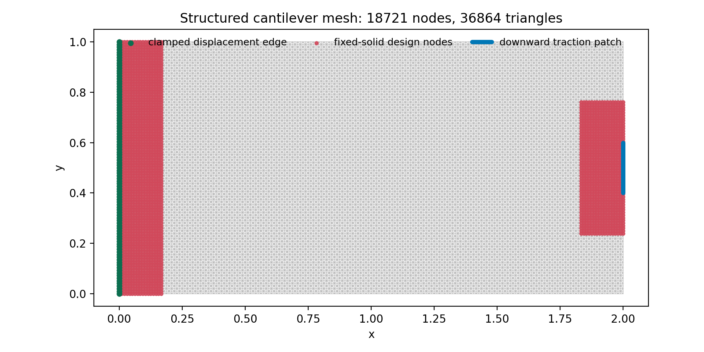
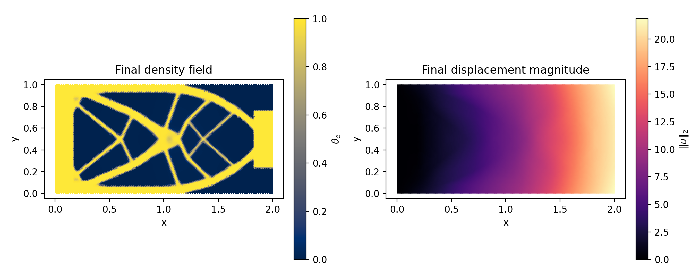
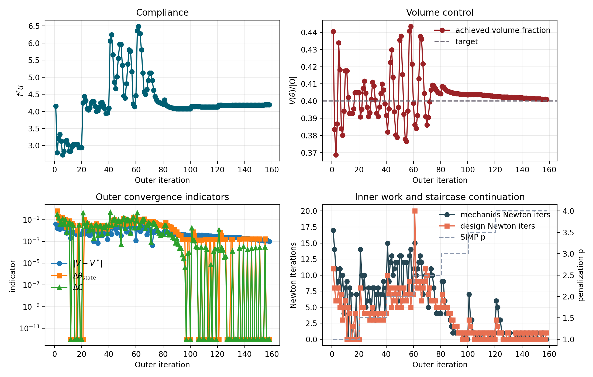
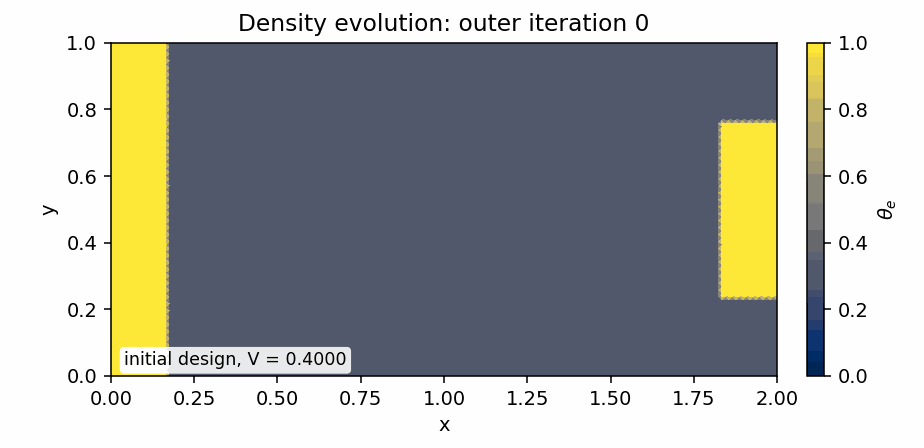

# JAX Topology Optimisation Benchmark

Date: 2026-03-11

This report fixes the JAX topology benchmark to a single clean reference
configuration: a fine `192 x 96` cantilever mesh, a staggered
displacement/design solve, and a fixed staircase SIMP continuation.
The intent is no longer to compare continuation heuristics; it is to
document one compact working implementation that demonstrates how the
repository can define energies in JAX, autodifferentiate them, assemble
sparse Hessians on fixed graphs, and solve a nontrivial benchmark.

## Benchmark Definition

The domain is the cantilever rectangle

$$
\Omega = [0, L] \times [0, H],
$$

with the left edge clamped and a downward traction patch on the right
edge. The design variable is a latent nodal field $z$, mapped to a
physical density by

$$
\theta(z) = \theta_{\min} + (1 - \theta_{\min})\,\sigma(z),
\qquad
\sigma(z) = \frac{1}{1 + e^{-z}}.
$$

The mechanics energy for fixed design is

$$
\Pi_h(u; z_k)
=
\sum_e A_e\,\frac{1}{2}\,\theta_e(z_k)^p\,\varepsilon_e(u)^T C\,\varepsilon_e(u)
- f^T u,
$$

and the frozen design energy is

$$
G_h(z; u_{k+1})
=
\sum_e A_e
\left[
e_{k,e}\,\theta_e(z)^{-p}
+ \lambda_k\,\theta_e(z)
+ \alpha\left(\frac{\ell}{2}|\nabla \theta_e(z)|^2 + \frac{W(\theta_e(z))}{\ell}\right)
+ \frac{\mu}{2}(\bar z_e - \bar z^{old}_e)^2
\right],
$$

with

$$
W(\theta) = \theta^2(1-\theta)^2.
$$

The SIMP exponent follows the fixed staircase schedule

$$
p_{k+1} =
\min\bigl(p_{\max},\, p_k + \Delta p\bigr)
\quad \text{every } m \text{ outer iterations},
$$

using `\Delta p = 0.5` and `m = 20`.

## Reference Configuration

| Knob | Value |
| --- | --- |
| Mesh | 192 x 96 |
| Elements | 36864 |
| Free displacement DOFs | 37248 |
| Free design DOFs | 16205 |
| Target volume fraction | 0.4000 |
| Staircase schedule | p = p + 0.5 every 20 outer iterations |
| Final p target | 4.00 |
| Volume control | beta_lambda = 12.0, volume_penalty = 10.0 |
| Regularisation | alpha = 0.005, ell = 0.08, mu_move = 0.01 |

## Minimal JAX Problem Definition

The problem-specific input to JAX is just the energy definition. The
following two functions are the parts that are actually autodifferentiated:

```python
def mechanics_energy(
    u_free, u_0, freedofs, elems, elem_B, elem_area, material_scale, constitutive, force
):
    u_full = expand_free_dofs(u_free, u_0, freedofs)
    u_elem = u_full[elems]
    strain = jnp.einsum("eij,ej->ei", elem_B, u_elem)
    elastic_density = 0.5 * jnp.einsum("ei,ij,ej->e", strain, constitutive, strain)
    return jnp.sum(elem_area * material_scale * elastic_density) - jnp.dot(force, u_full)


def design_energy(
    z_free, z_0, freedofs, elems, elem_grad_phi, elem_area, e_frozen,
    z_old_full, lambda_volume, alpha_reg, ell_pf, mu_move, theta_min, p_penal
):
    z_full = expand_free_dofs(z_free, z_0, freedofs)
    theta_full = theta_from_latent(z_full, theta_min)
    theta_elem = theta_full[elems]
    theta_centroid = jnp.mean(theta_elem, axis=1)
    grad_theta = jnp.einsum("eia,ei->ea", elem_grad_phi, theta_elem)
    z_delta_centroid = jnp.mean(z_full[elems] - z_old_full[elems], axis=1)

    double_well = theta_centroid**2 * (1.0 - theta_centroid) ** 2
    reg_density = 0.5 * ell_pf * jnp.sum(grad_theta * grad_theta, axis=1) + double_well / ell_pf
    proximal_density = 0.5 * mu_move * z_delta_centroid**2
    design_density = e_frozen * theta_centroid ** (-p_penal) + lambda_volume * theta_centroid
    return jnp.sum(elem_area * (design_density + alpha_reg * reg_density + proximal_density))
```

## Where JAX Is Used

The solver asks JAX for derivatives with respect to the free unknowns of
each subproblem only:

| Energy | Differentiated with respect to | What is generated |
| --- | --- | --- |
| $\Pi_h(u; z_k)$ | `u_free` | gradient and sparse Hessian of the mechanics subproblem |
| $G_h(z; u_{k+1})$ | `z_free` | gradient and sparse Hessian of the design subproblem |

The corresponding calls are:

```python
mechanics_drv = EnergyDerivator(
    mechanics_energy,
    mechanics_params,
    mesh.adjacency_u,
    jnp.asarray(u_free, dtype=jnp.float64),
)
mechanics_F, mechanics_dF, mechanics_ddF = mechanics_drv.get_derivatives()
mechanics_hess_solver = HessSolverGenerator(
    ddf=mechanics_ddF,
    solver_type="amg",
    elastic_kernel=mesh.elastic_kernel,
    tol=ksp_rtol,
    maxiter=ksp_max_it,
)

design_drv = EnergyDerivator(
    design_energy,
    design_params,
    mesh.adjacency_z,
    jnp.asarray(z_free, dtype=jnp.float64),
)
design_F, design_dF, design_ddF = design_drv.get_derivatives()
design_hess_solver = HessSolverGenerator(
    ddf=design_ddF,
    solver_type="direct",
    tol=ksp_rtol,
    maxiter=ksp_max_it,
)
```

`EnergyDerivator` provides the energy, gradient, and sparse Hessian-value
callbacks. `HessSolverGenerator` then builds the linear solve stage used
inside Newton: AMG for mechanics and a direct sparse solve for the design
subproblem.

The continuation itself is intentionally fixed and minimal:

```python
def staircase_p_step(p_penal, *, p_max, p_increment, continuation_interval, outer_it):
    if p_penal >= p_max or outer_it % continuation_interval != 0:
        return 0.0
    return min(p_increment, p_max - p_penal)
```

## Solver Structure

### Outer staggered loop

```text
build mesh, free-DOF masks, element operators
initialize z_0 from the target volume fraction and set u_0 = 0
define Π_h(u_free; z) and G_h(z_free; u, z_old, lambda, p)
use JAX to generate:
    grad_u Π_h, Hess_u Π_h on the displacement graph
    grad_z G_h, Hess_z G_h on the design graph
build sparse linear solvers for both Hessians

for outer iteration k = 1, 2, ...:
    theta_k <- theta_from_latent(z_k)
    material_scale <- theta(theta_k)^p_k

    solve mechanics subproblem in u_free:
        Newton steps use grad_u Π_h and Hess_u Π_h
        each Newton step solves a sparse linear system in the displacement unknowns

    freeze element strain-energy density e_k from u_{k+1}
    build lambda_effective from the sensitivity quantile, lambda_k, and volume penalty

    solve design subproblem in z_free:
        Newton steps use grad_z G_h and Hess_z G_h
        each Newton step solves a sparse linear system in the design unknowns

    update lambda_k from the achieved volume error
    record compliance, volume, design change, and Newton counts
    if p_k is already at p_max and all outer tolerances are satisfied:
        stop
    otherwise update p_k with the fixed staircase rule
```

### Inner Newton solve

```text
given x_n:
    evaluate F(x_n)
    evaluate g_n = grad F(x_n)        <- JAX autodiff
    evaluate H_n = Hess F(x_n)        <- JAX autodiff on fixed sparse graph
    solve H_n * delta = -g_n          <- sparse linear solver
    line-search / trust-region accept or reject the step
    x_{n+1} = x_n + alpha * delta
repeat until function and gradient tolerances are met
```

## Geometry And Final State





The density plot is elementwise constant: each triangle is coloured by
its average density $\theta_e$.

## Convergence History



## Density Evolution



## Run Summary

| Metric | Value |
| --- | --- |
| Result | completed |
| Outer iterations | 158 |
| Final p | 4.0000 |
| Wall time [s] | 405.968 |
| JAX setup [s] | 1.350 |
| Solve time [s] | 404.618 |
| Final compliance | 4.191350 |
| Final volume fraction | 0.400990 |
| Final volume error | 0.000990 |
| Final state change | 0.000000 |
| Final design change | 0.001745 |
| Final compliance change | 0.000000 |
| Total mechanics Newton iterations | 770 |
| Total design Newton iterations | 545 |

## Density Quality Indicators

| Indicator | Value |
| --- | --- |
| Gray fraction on 0.1 < theta < 0.9 | 0.0570 |
| Gray fraction on 0.05 < theta < 0.95 | 0.0756 |
| theta_min | 0.001289 |
| theta_max | 0.999955 |

## JAX Setup Timings

| Stage | Time [s] |
| --- | --- |
| mechanics: coloring | 0.202698 |
| mechanics: compilation | 0.189429 |
| design: coloring | 0.037845 |
| design: compilation | 0.233921 |

## Outer Iteration Table

| k | p | dp | lambda_eff | mech iters | design iters | compliance | volume | vol error | state change | comp change |
| --- | --- | --- | --- | --- | --- | --- | --- | --- | --- | --- |
| 1 | 1.000 | 0.000 | 4.07952 | 17 | 11 | 4.155670 | 0.440505 | 0.040505 | inf | inf |
| 2 | 1.000 | 0.000 | 5.82787 | 14 | 8 | 2.791863 | 0.383577 | -0.016423 | 0.634473 | 0.328180 |
| 3 | 1.000 | 0.000 | 6.13214 | 11 | 6 | 3.209663 | 0.368784 | -0.031216 | 0.189746 | 0.149649 |
| 4 | 1.000 | 0.000 | 4.71660 | 8 | 6 | 3.326708 | 0.386806 | -0.013194 | 0.085884 | 0.036466 |
| 5 | 1.000 | 0.000 | 3.21426 | 9 | 8 | 3.127203 | 0.433851 | 0.033851 | 0.084069 | 0.059971 |
| 6 | 1.000 | 0.000 | 4.20411 | 11 | 5 | 2.730789 | 0.418229 | 0.018229 | 0.174846 | 0.126763 |
| 7 | 1.000 | 0.000 | 5.21687 | 7 | 7 | 2.829888 | 0.383910 | -0.016090 | 0.047571 | 0.036290 |
| 8 | 1.000 | 0.000 | 5.46050 | 10 | 3 | 3.132373 | 0.380114 | -0.019886 | 0.112435 | 0.106890 |
| 9 | 1.000 | 0.000 | 4.27361 | 4 | 5 | 3.153742 | 0.394039 | -0.005961 | 0.019729 | 0.006822 |
| 10 | 1.000 | 0.000 | 3.40062 | 8 | 6 | 3.030763 | 0.417624 | 0.017624 | 0.048752 | 0.038995 |
| 11 | 1.000 | 0.000 | 3.78172 | 9 | 0 | 2.835313 | 0.417624 | 0.017624 | 0.077912 | 0.064489 |
| 12 | 1.000 | 0.000 | 4.57162 | 0 | 5 | 2.835313 | 0.402086 | 0.002086 | 0.000000 | 0.000000 |
| 13 | 1.000 | 0.000 | 5.06686 | 8 | 4 | 2.957387 | 0.392797 | -0.007203 | 0.047694 | 0.043055 |
| 14 | 1.000 | 0.000 | 4.96930 | 7 | 0 | 3.038601 | 0.392797 | -0.007203 | 0.030329 | 0.027461 |
| 15 | 1.000 | 0.000 | 4.56661 | 0 | 0 | 3.038601 | 0.392797 | -0.007203 | 0.000000 | 0.000000 |
| 16 | 1.000 | 0.000 | 4.16393 | 0 | 2 | 3.038601 | 0.395488 | -0.004512 | 0.000000 | 0.000000 |
| 17 | 1.000 | 0.000 | 3.93863 | 0 | 4 | 3.038601 | 0.404832 | 0.004832 | 0.009384 | 0.000000 |
| 18 | 1.000 | 0.000 | 3.82779 | 7 | 0 | 2.939522 | 0.404832 | 0.004832 | 0.030282 | 0.032607 |
| 19 | 1.000 | 0.000 | 4.07039 | 0 | 0 | 2.939522 | 0.404832 | 0.004832 | 0.000000 | 0.000000 |
| 20 | 1.000 | 0.500 | 4.31298 | 0 | 0 | 2.939522 | 0.404832 | 0.004832 | 0.000000 | 0.000000 |
| 21 | 1.500 | 0.000 | 11.18140 | 14 | 8 | 4.246332 | 0.390733 | -0.009267 | 0.000000 | 0.444565 |
| 22 | 1.500 | 0.000 | 9.87277 | 10 | 5 | 4.436756 | 0.395213 | -0.004787 | 0.102018 | 0.044845 |
| 23 | 1.500 | 0.000 | 8.34105 | 8 | 5 | 4.317419 | 0.407433 | 0.007433 | 0.047827 | 0.026898 |
| 24 | 1.500 | 0.000 | 8.02697 | 10 | 4 | 4.081891 | 0.411585 | 0.011585 | 0.047674 | 0.054553 |
| 25 | 1.500 | 0.000 | 9.10656 | 5 | 4 | 4.041939 | 0.404541 | 0.004541 | 0.024838 | 0.009787 |
| 26 | 1.500 | 0.000 | 9.79431 | 6 | 4 | 4.106087 | 0.396439 | -0.003561 | 0.026518 | 0.015871 |
| 27 | 1.500 | 0.000 | 10.15622 | 8 | 4 | 4.243138 | 0.390894 | -0.009106 | 0.028486 | 0.033377 |
| 28 | 1.500 | 0.000 | 9.26485 | 6 | 3 | 4.295040 | 0.393305 | -0.006695 | 0.027824 | 0.012232 |
| 29 | 1.500 | 0.000 | 8.46570 | 4 | 4 | 4.286255 | 0.400977 | 0.000977 | 0.018416 | 0.002045 |
| 30 | 1.500 | 0.000 | 7.79471 | 8 | 5 | 4.147460 | 0.410923 | 0.010923 | 0.030227 | 0.032381 |
| 31 | 1.500 | 0.000 | 8.38735 | 8 | 3 | 4.007043 | 0.408843 | 0.008843 | 0.041725 | 0.033856 |
| 32 | 1.500 | 0.000 | 9.33218 | 3 | 4 | 4.021824 | 0.400697 | 0.000697 | 0.014575 | 0.003689 |
| 33 | 1.500 | 0.000 | 9.96230 | 7 | 4 | 4.121231 | 0.393050 | -0.006950 | 0.027189 | 0.024717 |
| 34 | 1.500 | 0.000 | 9.85388 | 8 | 3 | 4.245374 | 0.390980 | -0.009020 | 0.027903 | 0.030123 |
| 35 | 1.500 | 0.000 | 8.84852 | 4 | 4 | 4.265386 | 0.396549 | -0.003451 | 0.015897 | 0.004714 |
| 36 | 1.500 | 0.000 | 7.90248 | 7 | 4 | 4.176266 | 0.404365 | 0.004365 | 0.027346 | 0.020894 |
| 37 | 1.500 | 0.000 | 7.90902 | 7 | 4 | 4.085757 | 0.409895 | 0.009895 | 0.028475 | 0.021672 |
| 38 | 1.500 | 0.000 | 8.31521 | 9 | 3 | 3.938546 | 0.406411 | 0.006411 | 0.025483 | 0.036030 |
| 39 | 1.500 | 0.000 | 8.97574 | 4 | 4 | 3.959283 | 0.398476 | -0.001524 | 0.014506 | 0.005265 |
| 40 | 1.500 | 0.500 | 9.67258 | 8 | 4 | 4.088048 | 0.391541 | -0.008459 | 0.026244 | 0.032522 |
| 41 | 2.000 | 0.000 | 21.84689 | 15 | 10 | 6.062530 | 0.382110 | -0.017890 | 0.026439 | 0.482989 |
| 42 | 2.000 | 0.000 | 16.47211 | 9 | 7 | 6.242651 | 0.395560 | -0.004440 | 0.094594 | 0.029710 |
| 43 | 2.000 | 0.000 | 10.78907 | 12 | 8 | 5.658102 | 0.422445 | 0.022445 | 0.074010 | 0.093638 |
| 44 | 2.000 | 0.000 | 10.35089 | 13 | 5 | 4.855685 | 0.429806 | 0.029806 | 0.102606 | 0.141817 |
| 45 | 2.000 | 0.000 | 13.54501 | 10 | 6 | 4.665799 | 0.413788 | 0.013788 | 0.038232 | 0.039106 |
| 46 | 2.000 | 0.000 | 17.53031 | 11 | 7 | 5.011984 | 0.393788 | -0.006212 | 0.054796 | 0.074196 |
| 47 | 2.000 | 0.000 | 20.09101 | 12 | 8 | 5.550987 | 0.380257 | -0.019743 | 0.072595 | 0.107543 |
| 48 | 2.000 | 0.000 | 18.78580 | 12 | 5 | 5.963344 | 0.378890 | -0.021110 | 0.062788 | 0.074285 |
| 49 | 2.000 | 0.000 | 13.09910 | 6 | 7 | 5.960040 | 0.396514 | -0.003486 | 0.042432 | 0.000554 |
| 50 | 2.000 | 0.000 | 7.64655 | 13 | 8 | 5.353870 | 0.435401 | 0.035401 | 0.073564 | 0.101706 |
| 51 | 2.000 | 0.000 | 8.52146 | 13 | 5 | 4.455542 | 0.437835 | 0.037835 | 0.142273 | 0.167790 |
| 52 | 2.000 | 0.000 | 12.49234 | 6 | 6 | 4.390140 | 0.415401 | 0.015401 | 0.039405 | 0.014679 |
| 53 | 2.000 | 0.000 | 16.90558 | 12 | 8 | 4.809140 | 0.392446 | -0.007554 | 0.067272 | 0.095441 |
| 54 | 2.000 | 0.000 | 19.80303 | 12 | 7 | 5.380391 | 0.377876 | -0.022124 | 0.083517 | 0.118784 |
| 55 | 2.000 | 0.000 | 18.58034 | 12 | 6 | 5.800863 | 0.376585 | -0.023415 | 0.064857 | 0.078149 |
| 56 | 2.000 | 0.000 | 12.41476 | 7 | 7 | 5.764969 | 0.394265 | -0.005735 | 0.048214 | 0.006188 |
| 57 | 2.000 | 0.000 | 5.91898 | 13 | 9 | 5.162804 | 0.440769 | 0.040769 | 0.084311 | 0.104453 |
| 58 | 2.000 | 0.000 | 6.64433 | 14 | 5 | 4.217307 | 0.443333 | 0.043333 | 0.179711 | 0.183136 |
| 59 | 2.000 | 0.000 | 10.19782 | 7 | 7 | 4.141314 | 0.421520 | 0.021520 | 0.043369 | 0.018019 |
| 60 | 2.000 | 0.500 | 14.25614 | 11 | 7 | 4.462070 | 0.398756 | -0.001244 | 0.073660 | 0.077453 |
| 61 | 2.500 | 0.000 | 28.61930 | 15 | 20 | 6.362167 | 0.386207 | -0.013793 | 0.073455 | 0.425833 |
| 62 | 2.500 | 0.000 | 23.41193 | 10 | 9 | 6.483621 | 0.384051 | -0.015949 | 0.107380 | 0.019090 |
| 63 | 2.500 | 0.000 | 16.68056 | 11 | 8 | 6.272514 | 0.391545 | -0.008455 | 0.075910 | 0.032560 |
| 64 | 2.500 | 0.000 | 9.49204 | 12 | 8 | 5.801420 | 0.413009 | 0.013009 | 0.076179 | 0.075104 |
| 65 | 2.500 | 0.000 | 5.84005 | 13 | 9 | 5.123229 | 0.437551 | 0.037551 | 0.112536 | 0.116901 |
| 66 | 2.500 | 0.000 | 7.12581 | 12 | 6 | 4.571096 | 0.435980 | 0.035980 | 0.120953 | 0.107771 |
| 67 | 2.500 | 0.000 | 10.41161 | 7 | 8 | 4.503667 | 0.421625 | 0.021625 | 0.055268 | 0.014751 |
| 68 | 2.500 | 0.000 | 14.08226 | 9 | 9 | 4.647012 | 0.404373 | 0.004373 | 0.062562 | 0.031829 |
| 69 | 2.500 | 0.000 | 16.55623 | 10 | 11 | 4.899933 | 0.390992 | -0.009008 | 0.064709 | 0.054427 |
| 70 | 2.500 | 0.000 | 15.79458 | 10 | 10 | 5.127683 | 0.386176 | -0.013824 | 0.061042 | 0.046480 |
| 71 | 2.500 | 0.000 | 12.36069 | 5 | 7 | 5.123529 | 0.390521 | -0.009479 | 0.047498 | 0.000810 |
| 72 | 2.500 | 0.000 | 8.90931 | 10 | 8 | 4.904669 | 0.399559 | -0.000441 | 0.051539 | 0.042717 |
| 73 | 2.500 | 0.000 | 7.11636 | 11 | 6 | 4.621144 | 0.406527 | 0.006527 | 0.067911 | 0.057807 |
| 74 | 2.500 | 0.000 | 6.64241 | 10 | 6 | 4.440437 | 0.409265 | 0.009265 | 0.059293 | 0.039105 |
| 75 | 2.500 | 0.000 | 6.78040 | 8 | 6 | 4.339989 | 0.408997 | 0.008997 | 0.046280 | 0.022621 |
| 76 | 2.500 | 0.000 | 6.99656 | 6 | 6 | 4.290484 | 0.407559 | 0.007559 | 0.038346 | 0.011407 |
| 77 | 2.500 | 0.000 | 7.06293 | 4 | 5 | 4.265176 | 0.406077 | 0.006077 | 0.034271 | 0.005899 |
| 78 | 2.500 | 0.000 | 6.97470 | 4 | 5 | 4.250013 | 0.405041 | 0.005041 | 0.028073 | 0.003555 |
| 79 | 2.500 | 0.000 | 6.69232 | 4 | 5 | 4.230741 | 0.404546 | 0.004546 | 0.027643 | 0.004535 |
| 80 | 2.500 | 0.500 | 6.46972 | 4 | 5 | 4.211237 | 0.404196 | 0.004196 | 0.026194 | 0.004610 |
| 81 | 3.000 | 0.000 | 6.13001 | 9 | 7 | 4.336309 | 0.408425 | 0.008425 | 0.024944 | 0.029699 |
| 82 | 3.000 | 0.000 | 5.89583 | 9 | 6 | 4.198639 | 0.408189 | 0.008189 | 0.051614 | 0.031748 |
| 83 | 3.000 | 0.000 | 5.89480 | 6 | 5 | 4.160358 | 0.407302 | 0.007302 | 0.029539 | 0.009117 |
| 84 | 3.000 | 0.000 | 5.90904 | 4 | 5 | 4.142173 | 0.406339 | 0.006339 | 0.024682 | 0.004371 |
| 85 | 3.000 | 0.000 | 5.71005 | 4 | 5 | 4.125195 | 0.405772 | 0.005772 | 0.024021 | 0.004099 |
| 86 | 3.000 | 0.000 | 5.59302 | 4 | 4 | 4.106737 | 0.405493 | 0.005493 | 0.021519 | 0.004474 |
| 87 | 3.000 | 0.000 | 5.57718 | 3 | 4 | 4.095921 | 0.405197 | 0.005197 | 0.013730 | 0.002634 |
| 88 | 3.000 | 0.000 | 5.59654 | 2 | 3 | 4.088590 | 0.405006 | 0.005006 | 0.012417 | 0.001790 |
| 89 | 3.000 | 0.000 | 5.64591 | 1 | 3 | 4.085606 | 0.404780 | 0.004780 | 0.007780 | 0.000730 |
| 90 | 3.000 | 0.000 | 5.68605 | 2 | 2 | 4.078613 | 0.404634 | 0.004634 | 0.007616 | 0.001712 |
| 91 | 3.000 | 0.000 | 5.72975 | 1 | 2 | 4.076296 | 0.404467 | 0.004467 | 0.004034 | 0.000568 |
| 92 | 3.000 | 0.000 | 5.77701 | 1 | 2 | 4.075286 | 0.404285 | 0.004285 | 0.003900 | 0.000248 |
| 93 | 3.000 | 0.000 | 5.82163 | 1 | 1 | 4.074292 | 0.404204 | 0.004204 | 0.003897 | 0.000244 |
| 94 | 3.000 | 0.000 | 5.86953 | 1 | 1 | 4.074052 | 0.404112 | 0.004112 | 0.001643 | 0.000059 |
| 95 | 3.000 | 0.000 | 5.91688 | 1 | 1 | 4.073930 | 0.404011 | 0.004011 | 0.001656 | 0.000030 |
| 96 | 3.000 | 0.000 | 5.95950 | 1 | 0 | 4.073946 | 0.404011 | 0.004011 | 0.001655 | 0.000004 |
| 97 | 3.000 | 0.000 | 6.00764 | 0 | 1 | 4.073946 | 0.403888 | 0.003888 | 0.000000 | 0.000000 |
| 98 | 3.000 | 0.000 | 6.04642 | 1 | 1 | 4.074245 | 0.403760 | 0.003760 | 0.001669 | 0.000073 |
| 99 | 3.000 | 0.000 | 6.08719 | 1 | 0 | 4.074628 | 0.403760 | 0.003760 | 0.001650 | 0.000094 |
| 100 | 3.000 | 0.500 | 6.13231 | 0 | 1 | 4.074628 | 0.403613 | 0.003613 | 0.000000 | 0.000000 |
| 101 | 3.500 | 0.000 | 6.11188 | 7 | 3 | 4.147886 | 0.403808 | 0.003808 | 0.001669 | 0.017979 |
| 102 | 3.500 | 0.000 | 6.15293 | 3 | 2 | 4.142320 | 0.403864 | 0.003864 | 0.007601 | 0.001342 |
| 103 | 3.500 | 0.000 | 6.19455 | 3 | 1 | 4.137571 | 0.403857 | 0.003857 | 0.003593 | 0.001146 |
| 104 | 3.500 | 0.000 | 6.23787 | 1 | 1 | 4.136234 | 0.403833 | 0.003833 | 0.001355 | 0.000323 |
| 105 | 3.500 | 0.000 | 6.28000 | 1 | 0 | 4.135041 | 0.403833 | 0.003833 | 0.001336 | 0.000288 |
| 106 | 3.500 | 0.000 | 6.32600 | 0 | 0 | 4.135041 | 0.403833 | 0.003833 | 0.000000 | 0.000000 |
| 107 | 3.500 | 0.000 | 6.37199 | 0 | 1 | 4.135041 | 0.403766 | 0.003766 | 0.000000 | 0.000000 |
| 108 | 3.500 | 0.000 | 6.41407 | 1 | 0 | 4.133722 | 0.403766 | 0.003766 | 0.001370 | 0.000319 |
| 109 | 3.500 | 0.000 | 6.45926 | 0 | 0 | 4.133722 | 0.403766 | 0.003766 | 0.000000 | 0.000000 |
| 110 | 3.500 | 0.000 | 6.50445 | 0 | 1 | 4.133722 | 0.403658 | 0.003658 | 0.000000 | 0.000000 |
| 111 | 3.500 | 0.000 | 6.54374 | 1 | 1 | 4.132526 | 0.403537 | 0.003537 | 0.001465 | 0.000289 |
| 112 | 3.500 | 0.000 | 6.58184 | 1 | 0 | 4.131757 | 0.403537 | 0.003537 | 0.001491 | 0.000186 |
| 113 | 3.500 | 0.000 | 6.62429 | 0 | 1 | 4.131757 | 0.403397 | 0.003397 | 0.000000 | 0.000000 |
| 114 | 3.500 | 0.000 | 6.66003 | 0 | 1 | 4.131757 | 0.403249 | 0.003249 | 0.001545 | 0.000000 |
| 115 | 3.500 | 0.000 | 6.69551 | 1 | 0 | 4.131789 | 0.403249 | 0.003249 | 0.001583 | 0.000008 |
| 116 | 3.500 | 0.000 | 6.73450 | 0 | 1 | 4.131789 | 0.403094 | 0.003094 | 0.000000 | 0.000000 |
| 117 | 3.500 | 0.000 | 6.76913 | 1 | 1 | 4.132301 | 0.402937 | 0.002937 | 0.001588 | 0.000124 |
| 118 | 3.500 | 0.000 | 6.80035 | 1 | 0 | 4.133142 | 0.402937 | 0.002937 | 0.001587 | 0.000203 |
| 119 | 3.500 | 0.000 | 6.83559 | 0 | 1 | 4.133142 | 0.402772 | 0.002772 | 0.000000 | 0.000000 |
| 120 | 3.500 | 0.500 | 6.86644 | 1 | 0 | 4.134126 | 0.402772 | 0.002772 | 0.001622 | 0.000238 |
| 121 | 4.000 | 0.000 | 6.86336 | 6 | 3 | 4.184437 | 0.402709 | 0.002709 | 0.000000 | 0.012170 |
| 122 | 4.000 | 0.000 | 6.89366 | 5 | 2 | 4.183812 | 0.402619 | 0.002619 | 0.006728 | 0.000149 |
| 123 | 4.000 | 0.000 | 6.92159 | 3 | 1 | 4.182678 | 0.402571 | 0.002571 | 0.003341 | 0.000271 |
| 124 | 4.000 | 0.000 | 6.95014 | 3 | 1 | 4.181974 | 0.402509 | 0.002509 | 0.001423 | 0.000168 |
| 125 | 4.000 | 0.000 | 6.97683 | 1 | 1 | 4.181828 | 0.402442 | 0.002442 | 0.001448 | 0.000035 |
| 126 | 4.000 | 0.000 | 7.00135 | 1 | 0 | 4.181639 | 0.402442 | 0.002442 | 0.001495 | 0.000045 |
| 127 | 4.000 | 0.000 | 7.03065 | 0 | 0 | 4.181639 | 0.402442 | 0.002442 | 0.000000 | 0.000000 |
| 128 | 4.000 | 0.000 | 7.05995 | 0 | 0 | 4.181639 | 0.402442 | 0.002442 | 0.000000 | 0.000000 |
| 129 | 4.000 | 0.000 | 7.08925 | 0 | 1 | 4.181639 | 0.402344 | 0.002344 | 0.000000 | 0.000000 |
| 130 | 4.000 | 0.000 | 7.11184 | 0 | 1 | 4.181639 | 0.402243 | 0.002243 | 0.001538 | 0.000000 |
| 131 | 4.000 | 0.000 | 7.13772 | 1 | 0 | 4.182183 | 0.402243 | 0.002243 | 0.001603 | 0.000130 |
| 132 | 4.000 | 0.000 | 7.16464 | 0 | 0 | 4.182183 | 0.402243 | 0.002243 | 0.000000 | 0.000000 |
| 133 | 4.000 | 0.000 | 7.19156 | 0 | 0 | 4.182183 | 0.402243 | 0.002243 | 0.000000 | 0.000000 |
| 134 | 4.000 | 0.000 | 7.21848 | 0 | 0 | 4.182183 | 0.402243 | 0.002243 | 0.000000 | 0.000000 |
| 135 | 4.000 | 0.000 | 7.24540 | 0 | 1 | 4.182183 | 0.402115 | 0.002115 | 0.000000 | 0.000000 |
| 136 | 4.000 | 0.000 | 7.26716 | 1 | 0 | 4.183225 | 0.402115 | 0.002115 | 0.001649 | 0.000249 |
| 137 | 4.000 | 0.000 | 7.29254 | 0 | 0 | 4.183225 | 0.402115 | 0.002115 | 0.000000 | 0.000000 |
| 138 | 4.000 | 0.000 | 7.31792 | 0 | 1 | 4.183225 | 0.401975 | 0.001975 | 0.000000 | 0.000000 |
| 139 | 4.000 | 0.000 | 7.33778 | 1 | 0 | 4.184710 | 0.401975 | 0.001975 | 0.001682 | 0.000355 |
| 140 | 4.000 | 0.000 | 7.36148 | 0 | 0 | 4.184710 | 0.401975 | 0.001975 | 0.000000 | 0.000000 |
| 141 | 4.000 | 0.000 | 7.38519 | 0 | 1 | 4.184710 | 0.401828 | 0.001828 | 0.000000 | 0.000000 |
| 142 | 4.000 | 0.000 | 7.40213 | 1 | 0 | 4.185476 | 0.401828 | 0.001828 | 0.001700 | 0.000183 |
| 143 | 4.000 | 0.000 | 7.42406 | 0 | 0 | 4.185476 | 0.401828 | 0.001828 | 0.000000 | 0.000000 |
| 144 | 4.000 | 0.000 | 7.44600 | 0 | 1 | 4.185476 | 0.401672 | 0.001672 | 0.000000 | 0.000000 |
| 145 | 4.000 | 0.000 | 7.46403 | 1 | 0 | 4.186443 | 0.401672 | 0.001672 | 0.001713 | 0.000231 |
| 146 | 4.000 | 0.000 | 7.48409 | 0 | 0 | 4.186443 | 0.401672 | 0.001672 | 0.000000 | 0.000000 |
| 147 | 4.000 | 0.000 | 7.50415 | 0 | 1 | 4.186443 | 0.401509 | 0.001509 | 0.000000 | 0.000000 |
| 148 | 4.000 | 0.000 | 7.51813 | 1 | 0 | 4.187514 | 0.401509 | 0.001509 | 0.001721 | 0.000256 |
| 149 | 4.000 | 0.000 | 7.53624 | 0 | 0 | 4.187514 | 0.401509 | 0.001509 | 0.000000 | 0.000000 |
| 150 | 4.000 | 0.000 | 7.55435 | 0 | 1 | 4.187514 | 0.401342 | 0.001342 | 0.000000 | 0.000000 |
| 151 | 4.000 | 0.000 | 7.56637 | 1 | 0 | 4.188688 | 0.401342 | 0.001342 | 0.001722 | 0.000280 |
| 152 | 4.000 | 0.000 | 7.58247 | 0 | 0 | 4.188688 | 0.401342 | 0.001342 | 0.000000 | 0.000000 |
| 153 | 4.000 | 0.000 | 7.59857 | 0 | 0 | 4.188688 | 0.401342 | 0.001342 | 0.000000 | 0.000000 |
| 154 | 4.000 | 0.000 | 7.61467 | 0 | 1 | 4.188688 | 0.401168 | 0.001168 | 0.000000 | 0.000000 |
| 155 | 4.000 | 0.000 | 7.62400 | 1 | 0 | 4.189968 | 0.401168 | 0.001168 | 0.001737 | 0.000305 |
| 156 | 4.000 | 0.000 | 7.63801 | 0 | 0 | 4.189968 | 0.401168 | 0.001168 | 0.000000 | 0.000000 |
| 157 | 4.000 | 0.000 | 7.65203 | 0 | 0 | 4.189968 | 0.401168 | 0.001168 | 0.000000 | 0.000000 |
| 158 | 4.000 | 0.000 | 7.66605 | 0 | 1 | 4.189968 | 0.400990 | 0.000990 | 0.000000 | 0.000000 |

## Artifacts

- JSON result: `topological_optimisation_jax/report_assets/report_run.json`
- Final state: `topological_optimisation_jax/report_assets/report_state.npz`
- Outer-history CSV: `topological_optimisation_jax/report_assets/report_outer_history.csv`
- Mesh figure: `topological_optimisation_jax/report_assets/mesh_preview.png`
- Final-state figure: `topological_optimisation_jax/report_assets/final_state.png`
- Convergence figure: `topological_optimisation_jax/report_assets/convergence_history.png`
- Density-evolution GIF: `topological_optimisation_jax/report_assets/density_evolution.gif`

## Reproduction

Regenerate the benchmark report and assets with:

```bash
        ./.venv/bin/python topological_optimisation_jax/generate_report_assets.py
        ```

        Run the solver directly with the same fine-grid staircase setup:

        ```bash
        ./.venv/bin/python topological_optimisation_jax/solve_topopt_jax.py \
    --nx 192 --ny 96 --length 2.0 --height 1.0 \
    --traction 1.0 --load_fraction 0.2 \
    --fixed_pad_cells 16 --load_pad_cells 16 \
    --volume_fraction_target 0.4 --theta_min 0.001 \
    --solid_latent 10.0 --young 1.0 --poisson 0.3 \
    --alpha_reg 0.005 --ell_pf 0.08 --mu_move 0.01 \
    --beta_lambda 12.0 --volume_penalty 10.0 \
    --p_start 1.0 --p_max 4.0 --p_increment 0.5 \
    --continuation_interval 20 --outer_maxit 180 \
    --outer_tol 0.02 --volume_tol 0.001 \
    --mechanics_maxit 200 --design_maxit 400 \
    --tolf 1e-06 --tolg 0.001 \
    --ksp_rtol 0.01 --ksp_max_it 80 --save_outer_state_history --quiet
        ```
