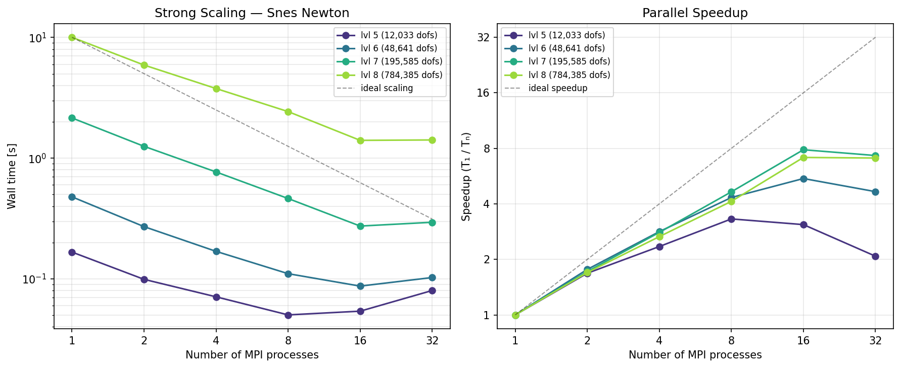

# p-Laplace 2D — Benchmark Results

Benchmark results for the 2D p-Laplacian problem ($p = 3$, $f = -10$, homogeneous Dirichlet BCs on the unit square).

Raw data is stored as JSON files in [results/](results/). See [instructions.md](instructions.md) for how to run new experiments and store results.

---

## Experiment `experiment_001`

- **Date**: 2026-02-21
- **CPU**: AMD Ryzen 9 9950X3D 16-Core Processor (32 threads)
- **DOLFINx**: 0.10.0.post2
- **Git commit**: `7dce8760`
- **Repetitions**: 3 (median time reported)
- **Data**: [results/experiment_001/](results/experiment_001/)

### FEniCS SNES Newton (serial vs parallel)

| lvl | dofs   | time (serial) | iters | J(u)    | time (4 proc) | iters | J(u)    | time (8 proc) | iters | J(u)    | time (16 proc) | iters | J(u)    |
| --- | ------ | ------------- | ----- | ------- | ------------- | ----- | ------- | ------------- | ----- | ------- | -------------- | ----- | ------- |
| 4   | 2945   | 0.043         | 10    | -7.9430 | 0.029         | 11    | -7.9430 | 0.026         | 10    | -7.9430 | 0.033          | 11    | -7.9430 |
| 5   | 12033  | 0.167         | 10    | -7.9546 | 0.071         | 10    | -7.9546 | 0.050         | 10    | -7.9546 | 0.054          | 10    | -7.9546 |
| 6   | 48641  | 0.478         | 7     | -7.9583 | 0.169         | 7     | -7.9583 | 0.110         | 7     | -7.9583 | 0.087          | 8     | -7.9583 |
| 7   | 195585 | 2.152         | 8     | -7.9596 | 0.768         | 8     | -7.9596 | 0.463         | 8     | -7.9596 | 0.274          | 8     | -7.9596 |
| 8   | 784385 | 10.026        | 9     | -7.9600 | 3.772         | 9     | -7.9600 | 2.430         | 9     | -7.9600 | 1.404          | 9     | -7.9600 |

### All Solver Configurations (SNES vs Custom Newton)

| lvl | dofs   | SNES serial | iters | Custom serial | iters | SNES 4-proc | iters | Custom 4-proc | iters | SNES 8-proc | iters | Custom 8-proc | iters | SNES 16-proc | iters | Custom 16-proc | iters | J(u)    |
| --- | ------ | ----------- | ----- | ------------- | ----- | ----------- | ----- | ------------- | ----- | ----------- | ----- | ------------- | ----- | ------------ | ----- | -------------- | ----- | ------- |
| 4   | 2945   | 0.043       | 10    | 0.039         | 5     | 0.029       | 11    | 0.021         | 5     | 0.026       | 10    | 0.016         | 5     | 0.033        | 11    | 0.021          | 5     | -7.9430 |
| 5   | 12033  | 0.167       | 10    | 0.157         | 5     | 0.071       | 10    | 0.055         | 5     | 0.050       | 10    | 0.039         | 5     | 0.054        | 10    | 0.039          | 5     | -7.9546 |
| 6   | 48641  | 0.478       | 7     | 0.731         | 6     | 0.169       | 7     | 0.239         | 6     | 0.110       | 7     | 0.143         | 6     | 0.087        | 8     | 0.098          | 6     | -7.9583 |
| 7   | 195585 | 2.152       | 8     | 3.434         | 7     | 0.768       | 8     | 0.931         | 6     | 0.463       | 8     | 0.556         | 6     | 0.274        | 8     | 0.318          | 6     | -7.9596 |
| 8   | 784385 | 10.026      | 9     | 12.488        | 6     | 3.772       | 9     | 4.091         | 6     | 2.430       | 9     | 2.873         | 6     | 1.404        | 9     | 1.482          | 6     | -7.9600 |

The Custom Newton uses the JAX-version algorithm (golden-section line search on $[-0.5, 2]$, CG + HYPRE AMG). It converges in fewer iterations (5–7 vs 7–10 for SNES) with comparable wall times. At small mesh levels the Custom solver is faster due to fewer iterations; at larger levels the per-iteration cost of the golden-section line search (~20 energy evaluations) adds overhead that offsets the iteration savings.

### Strong Scaling (SNES Newton, 1–32 processes)



Left: wall time vs number of MPI processes (log-log). Right: parallel speedup relative to serial. The dashed line shows ideal linear scaling. Larger problems (lvl 7, 8) scale well up to 16 processes; at 32 processes communication overhead starts to dominate for the smaller mesh levels.

To regenerate this plot:
```bash
python3 results/generate_scaling_plot.py results/experiment_001/
```

### JAX Newton (serial only, no MPI)

The same p-Laplace problem solved using a pure-JAX pipeline (automatic differentiation for gradients, sparse finite differences with graph coloring for Hessian assembly, PyAMG smoothed-aggregation CG solver). This implementation lives in [`pLaplace2D_jax/`](pLaplace2D_jax/), [`tools/`](tools/) and is wrapped by [`pLaplace2D_jax/solve_pLaplace_jax_newton.py`](pLaplace2D_jax/solve_pLaplace_jax_newton.py).

| lvl | dofs   | setup (s) | solve (s) | total (s) | iters | J(u)    |
| --- | ------ | --------- | --------- | --------- | ----- | ------- |
| 4   | 2945   | 0.184     | 0.076     | 0.260     | 6     | -7.9430 |
| 5   | 12033  | 0.182     | 0.147     | 0.329     | 6     | -7.9546 |
| 6   | 48641  | 0.263     | 0.435     | 0.698     | 6     | -7.9583 |
| 7   | 195585 | 0.582     | 2.173     | 2.755     | 8     | -7.9596 |
| 8   | 784385 | 1.903     | 10.918    | 12.821    | 9     | -7.9600 |

**Setup** includes JIT compilation, Hessian sparsity detection (graph coloring), and AMG preconditioner construction. **Solve** is the Newton iteration time only.

**Comparison with FEniCS (serial)**:
- **Solve time**: JAX is comparable to FEniCS SNES for small problems but slightly slower at larger levels (10.9 s vs 10.0 s at lvl 8), likely due to differences in AMG implementations (PyAMG vs HYPRE).
- **Iterations**: JAX converges in 6–9 iterations (similar to the Custom Newton's 5–7). Both use a golden-section line search on $[-0.5, 2]$ with `tol=1e-3`. SNES converges in 7–10 iterations with a full-step (basic) line search.
- **No parallelism**: The JAX solver runs on a single CPU core. There is no MPI parallelism yet.
- **Setup overhead**: The ~0.2–1.9 s setup cost (JIT + graph coloring) is amortized over the solve but significant for small problems.

### Custom Newton — JAX-version algorithm (FEniCS + PETSc)

Re-implementation of the JAX minimiser (`tools/minimizers.py`) on top of PETSc via `tools_petsc4py/minimizers.py`. Uses the same golden-section line search on $[-0.5, 2]$ with `tol=1e-3`, CG + HYPRE AMG with `rtol=1e-3`, `tolf=1e-5`, `tolg=1e-3`. Supports MPI parallelism.

Script: [`pLaplace2D_fenics/solve_pLaplace_custom_jaxversion.py`](pLaplace2D_fenics/solve_pLaplace_custom_jaxversion.py)

| lvl | dofs   | time (serial) | iters | time (4-proc) | iters | time (8-proc) | iters | time (16-proc) | iters | J(u)    |
| --- | ------ | ------------- | ----- | ------------- | ----- | ------------- | ----- | -------------- | ----- | ------- |
| 4   | 3201   | 0.039         | 5     | 0.021         | 5     | 0.016         | 5     | 0.021          | 5     | -7.9430 |
| 5   | 12545  | 0.157         | 5     | 0.055         | 5     | 0.039         | 5     | 0.039          | 5     | -7.9546 |
| 6   | 49665  | 0.731         | 6     | 0.239         | 6     | 0.143         | 6     | 0.098          | 6     | -7.9583 |
| 7   | 197633 | 3.434         | 7     | 0.931         | 6     | 0.556         | 6     | 0.318          | 6     | -7.9596 |
| 8   | 788481 | 12.488        | 6     | 4.091         | 6     | 2.873         | 6     | 1.482          | 6     | -7.9600 |

**Key observations**:
- **5–7 iterations** — matches or beats the JAX solver (6–9) and significantly fewer than SNES (7–10).
- **Line search allows α > 1**: The wider interval $[-0.5, 2]$ and tighter tolerance (`1e-3`) enable full or overshooting steps.
- **MPI-parallel**: Unlike pure JAX, this solver scales across MPI processes.
- **Comparable serial times** to SNES Newton — slightly slower due to golden-section energy evaluations per iteration, but fewer iterations compensate.

### JAX + PETSc DOF-Partitioned Newton (MPI-parallel)

A hybrid solver that uses **JAX** for automatic differentiation (energy, gradient, Hessian-vector products) combined with **PETSc** for distributed sparse linear algebra. Unlike a replicated-data approach where every rank evaluates the full problem, this solver uses **DOF-based overlapping domain decomposition** — each rank computes only on its local mesh partition.

**Key design:**

- **RCM reordering** of free DOFs via Reverse Cuthill–McKee ensures PETSc's block distribution maps to spatially compact regions (mimicking FEniCS's ParMETIS/SCOTCH).
- **Point-to-point ghost exchange** for energy, gradient, and HVP: each rank sends/receives only the ghost DOF values from its neighbours (~8–32 KB at 16 ranks), instead of `Allgatherv` of the full vector (~6 MB). No `Allreduce` on dense vectors.
- **Local SFD Hessian assembly**: each rank computes _all_ $n_c$ colour HVPs on its local domain (owned + overlap elements), producing exact owned-row Hessian entries. The PETSc COO fast-path inserts owned entries directly — no global `Allreduce` of NNZ arrays.
- **Broadcast-free local graph coloring**: each rank builds the DOF adjacency $A|_J$ directly from its local element connectivity — no MPI broadcast of the full adjacency matrix (5.5 M nonzeros at level 9). A² is computed locally, then colored with igraph. Batched HVP via `vmap`.
- **PETSc MPIAIJ** KSP: CG + HYPRE BoomerAMG or GAMG, with `rtol = 1e-3`.
- **Same Newton algorithm** as the other custom solvers: golden-section line search on $[-0.5, 2]$, `tolf = 1e-5`, `tolg = 1e-3`, via `tools_petsc4py/minimizers.py`.
- `OMP_NUM_THREADS=1` and `xla_cpu_multi_thread_eigen=false` enforced (workload is memory-bandwidth limited; critical for Hypre AMG to avoid thread oversubscription).

**Note on mesh levels**: The JAX+PETSc solver uses its own mesh numbering from HDF5 files. JAX level $\ell$ corresponds to FEniCS level $\ell - 1$ (e.g. JAX level 9 = FEniCS level 8 = 784 385 DOFs).

Script: [`pLaplace2D_jax_petsc/solve_pLaplace_dof.py`](pLaplace2D_jax_petsc/solve_pLaplace_dof.py) with `--local-coloring`

For a detailed technical description of the DOF decomposition, P2P ghost exchange, and individual operation benchmarks, see [`jax_parallel_partitioning.md`](jax_parallel_partitioning.md).

#### Full Newton Solve — Hypre BoomerAMG

Level 9 (784 385 free DOFs, 1 572 864 elements, 7–8 graph colors). All configurations converge in **7 Newton iterations** to **$J(u) = -7.960006$**. Median of 3 repeats.

| np  | Setup (s) | Solve (s) | Total (s) | Newton its | KSP its | Solve speedup |
| --- | --------- | --------- | --------- | ---------- | ------- | ------------- |
| 1   | 4.01      | 9.51      | 13.52     | 7          | 27      | 1.00×         |
| 2   | 2.32      | 6.07      | 8.30      | 7          | 27      | 1.57×         |
| 4   | 1.57      | **4.50**  | 6.02      | 7          | 27      | **2.12×**     |
| 8   | 1.25      | **3.35**  | 4.59      | 7          | 26      | **2.84×**     |
| 16  | 1.28      | **2.63**  | 3.90      | 7          | 28      | **3.62×**     |
| 32  | 1.82      | **3.51**  | 5.45      | 7          | 27      | **2.71×**     |

#### Full Newton Solve — GAMG

| np  | Setup (s) | Solve (s) | Total (s) | Newton its | KSP its | Solve speedup |
| --- | --------- | --------- | --------- | ---------- | ------- | ------------- |
| 1   | 4.01      | 5.61      | 9.61      | 7          | 53      | 1.00×         |
| 2   | 2.30      | 3.86      | 6.16      | 7          | 53      | 1.45×         |
| 4   | 1.53      | **3.03**  | 4.56      | 7          | 57      | **1.85×**     |
| 8   | 1.25      | **2.60**  | 3.82      | 7          | 54      | **2.16×**     |
| 16  | 1.30      | **2.18**  | 3.47      | 7          | 54      | **2.58×**     |
| 32  | 1.81      | **3.24**  | 5.10      | 7          | 52      | **1.73×**     |

#### Key Observations

- **Monotonic scaling up to 16 ranks.** More MPI ranks help up to 16 — unlike the earlier replicated-data approach which _degraded_ beyond 4 ranks due to `Allgatherv` + memory-bandwidth contention. At 32 ranks, KSP and line-search costs on this problem size begin to dominate.
- **GAMG is faster in absolute time** (2.18 s vs 2.63 s at 16 ranks) but **Hypre scales better** (3.62× vs 2.58× at 16 ranks). Hypre is recommended for larger rank counts.
- **KSP dominates at high rank counts**, shifting the bottleneck from JAX assembly (which scales well) to PETSc linear algebra — a healthy sign for scalability.
- **Setup scales well** — from 4.01 s (serial, full graph coloring) to 1.28 s (16 ranks, local coloring on smaller subgraphs). No adjacency broadcast needed.
- **Numerically exact** — energy, gradient, and HVP match serial reference to machine epsilon at all rank counts (see [`jax_parallel_partitioning.md`](jax_parallel_partitioning.md) §5.1).

#### Effect of Looser Tolerances (ksp\_rtol = 1e-1, linesearch\_tol = 1e-1)

All previous tables use the baseline tolerances (`ksp_rtol = 1e-3`, `linesearch_tol = 1e-3`). Loosening both to `1e-1` retains the same solution accuracy ($J(u) = -7.960006$, same Newton iterations) while significantly reducing KSP iterations and line-search evaluations. Level 9, np = 16, median of 3 repeats.

| PC    | Tolerances      | Setup (s) | Solve (s) | Total (s) | Newton its | KSP its | LS evals | $J(u)$    |
| ----- | --------------- | --------- | --------- | --------- | ---------- | ------- | -------- | --------- |
| GAMG  | 1e-3 / 1e-3     | 1.37      | 2.33      | 3.70      | 7          | 54      | 119      | -7.960006 |
| GAMG  | **1e-1 / 1e-1** | 1.39      | **1.72**  | **3.11**  | 7          | **22**  | **49**   | -7.960006 |
| Hypre | 1e-3 / 1e-3     | 1.34      | 2.84      | 4.18      | 7          | 28      | 119      | -7.960006 |
| Hypre | **1e-1 / 1e-1** | 1.35      | **2.16**  | **3.52**  | 7          | **13**  | **49**   | -7.960006 |

**Observations:**
- **GAMG**: 26% faster solve (2.33 → 1.72 s), KSP iterations drop 59% (54 → 22), LS evaluations drop 59% (119 → 49).
- **Hypre**: 24% faster solve (2.84 → 2.16 s), KSP iterations drop 54% (28 → 13), LS evaluations drop 59%.
- **Convergence unchanged**: Same Newton iterations (7) and final energy — the p-Laplacian is sufficiently smooth that inexact Newton directions still point toward the minimiser.
- **Recommended for production**: `ksp_rtol = 1e-1`, `linesearch_tol = 1e-1` gives a free 24–26% speedup with no accuracy loss on this problem.

#### Comparison with FEniCS Custom Newton (16 ranks, ~785 K DOFs)

Both solvers use the same Newton algorithm (golden-section line search, CG + HYPRE BoomerAMG).

| Metric               | FEniCS Custom (5 its) | JAX+PETSc DOF (7 its) | Ratio |
| :------------------- | --------------------: | --------------------: | ----: |
| Solve time (np = 1)  |               11.10 s |                9.51 s | 0.86× |
| Solve time (np = 16) |                1.53 s |                2.63 s | 1.72× |
| Scaling (16 / 1)     |                  7.3× |                 3.62× |       |
| KSP time (np = 16)   |                1.00 s |                ~1.1 s | 1.10× |

The KSP linear solve is nearly identical (~1.1× ratio), confirming that RCM reordering produces equivalent partition quality to FEniCS's ParMETIS. The remaining gap comes from: (1) more Newton iterations (7 vs 5), (2) SFD Hessian assembly vs compiled UFL forms, (3) line search overhead (17 energy evaluations per step). **At serial, JAX+PETSc is faster** (9.51 s vs 11.10 s).

#### Reproducing the Results

```bash
# Serial (local coloring, recommended)
mpirun -n 1 python3 -m pLaplace2D_jax_petsc.solve_pLaplace_dof --local-coloring --level 9

# Parallel (4 / 8 / 16 ranks), with Hypre (default)
mpirun -n 4  python3 -m pLaplace2D_jax_petsc.solve_pLaplace_dof --local-coloring --level 9
mpirun -n 16 python3 -m pLaplace2D_jax_petsc.solve_pLaplace_dof --local-coloring --level 9

# Use GAMG instead
mpirun -n 16 python3 -m pLaplace2D_jax_petsc.solve_pLaplace_dof --local-coloring --level 9 --pc-type gamg

# Save JSON output
mpirun -n 16 python3 -m pLaplace2D_jax_petsc.solve_pLaplace_dof --local-coloring --level 9 --json results/dof_np16.json
```

**Environment**: Docker (`fenics_test:latest`) with DOLFINx 0.10.0, JAX 0.9.0.1, PETSc 3.24.0, HYPRE, mpi4py (MPICH), h5py, scipy. See Makefile for Docker build targets.

---

## Experiment `experiment_002` — Native Build (no Docker)

- **Date**: 2026-03-03
- **CPU**: AMD Ryzen Threadripper PRO 7975WX 32-Core Processor (64 threads)
- **OS**: Arch Linux x86_64 (kernel 6.18.13-arch1-1, bare metal — no Docker)
- **MPI**: OpenMPI 5.0.10
- **DOLFINx**: 0.10.0.post5
- **PETSc**: 3.24.2 (with Hypre, METIS, ParMETIS, MUMPS, SuperLU_dist, SuiteSparse)
- **JAX**: 0.9.0.1
- **Python**: 3.12.10 (built from source)
- **Git commit**: `main`
- **Repetitions**: 3 (median time reported)

> **Note**: These results use a native (non-Docker) build with OpenMPI instead of MPICH.
> The previous `experiment_001` used Docker with MPICH, where shared-memory overhead
> caused scaling degradation beyond 16 ranks. The native build eliminates this bottleneck.

### JAX + PETSc DOF-Partitioned Newton — Native Build

Same solver as `experiment_001` (DOF-based overlapping decomposition, local graph coloring, SFD Hessian, PETSc COO assembly). Level 9 (784 385 free DOFs). All configurations converge in **7 Newton iterations** to **$J(u) = -7.960006$**. Median of 3 repeats.

#### Full Newton Solve — Hypre BoomerAMG

| np  | Setup (s) | Solve (s) | Total (s) | Newton its | KSP its | Solve speedup |
| --- | --------- | --------- | --------- | ---------- | ------- | ------------- |
| 1   | 5.46      | 12.58     | 18.04     | 7          | 27      | 1.00×         |
| 2   | 3.09      | 7.18      | 10.27     | 7          | 27      | 1.75×         |
| 4   | 2.07      | **4.59**  | 6.65      | 7          | 27      | **2.74×**     |
| 8   | 1.73      | **3.45**  | 5.18      | 7          | 26      | **3.65×**     |
| 16  | 1.25      | **1.61**  | 2.86      | 7          | 28      | **7.81×**     |
| 32  | 1.08      | **1.00**  | 2.09      | 7          | 27      | **12.58×**    |

#### Full Newton Solve — GAMG

| np  | Setup (s) | Solve (s) | Total (s) | Newton its | KSP its | Solve speedup |
| --- | --------- | --------- | --------- | ---------- | ------- | ------------- |
| 1   | 5.56      | 8.29      | 13.85     | 7          | 53      | 1.00×         |
| 2   | 3.11      | 4.74      | 7.85      | 7          | 53      | 1.75×         |
| 4   | 2.08      | **3.17**  | 5.25      | 7          | 57      | **2.62×**     |
| 8   | 1.72      | **2.74**  | 4.47      | 7          | 54      | **3.02×**     |
| 16  | 1.25      | **1.17**  | 2.41      | 7          | 54      | **7.09×**     |
| 32  | 1.06      | **0.62**  | 1.68      | 7          | 52      | **13.37×**    |

#### Key Observations (Native vs Docker)

| Metric               | Docker (exp. 001) | Native (exp. 002) |
| :------------------- | ----------------: | ----------------: |
| Hypre solve, np=1    |            9.51 s |           12.58 s |
| Hypre solve, np=16   |            2.63 s |            1.61 s |
| Hypre solve, np=32   |            3.51 s |            1.00 s |
| Hypre speedup, np=16 |             3.62× |             7.81× |
| Hypre speedup, np=32 |             2.71× |            12.58× |
| GAMG solve, np=16    |            2.18 s |            1.17 s |
| GAMG solve, np=32    |            3.24 s |            0.62 s |
| GAMG speedup, np=32  |             1.73× |            13.37× |

- **Serial is slower** on the native build (~12.6 s vs 9.5 s for Hypre) — likely due to different Hypre/PETSc compilation flags in the DOLFINx Docker image.
- **Parallel scaling is dramatically better**: Hypre reaches 12.6× at 32 ranks (vs 2.7× in Docker); GAMG reaches 13.4× (vs 1.7× in Docker). The Docker MPICH shared-memory transport was the primary bottleneck.
- **No degradation at 32 ranks**: Both preconditioners show monotonic improvement through 32 ranks, unlike Docker where performance degraded beyond 16 ranks.
- **GAMG is again faster** in absolute time at high rank counts (0.62 s vs 1.00 s at np=32), and also scales better on the native build (13.4× vs 12.6×).

---

## Annex 0 — Problem Description, Solvers, and Implementation

This annex collects all information about the benchmark problem, the solver variants, and key implementation details needed to reproduce the results or adapt the approach to other problems.

### 0.1  The p-Laplacian Problem

**PDE (strong form)**:
$$-\nabla \cdot \bigl(|\nabla u|^{p-2}\,\nabla u\bigr) = f \quad\text{in } \Omega = (0,1)^2,\qquad u = 0 \;\text{on } \partial\Omega$$

with $p = 3$ and $f = -10$.

**Energy functional** (minimisation form):
$$J(u) = \int_\Omega \frac{1}{p}\,|\nabla u|^p\,\mathrm{d}x - \int_\Omega f\,u\,\mathrm{d}x$$

The solution is the unique minimiser of $J$ over $H_0^1(\Omega)$. The Hessian (second Fréchet derivative) is SPD at any point away from $\nabla u = 0$, enabling CG-based Newton methods.

**Discretisation**: P1 (piecewise-linear) Lagrange finite elements on a triangular mesh of the unit square. Meshes are generated by DOLFINx at increasing refinement levels and stored as HDF5 files in `mesh_data/pLaplace/`. The mesh data includes: node coordinates embedded in element connectivity (`elems`), derivative maps (`dvx`, `dvy`), element volumes (`vol`), free-DOF indices (`freedofs`), boundary values (`u_0`), and a right-hand-side load vector (`f`).

| JAX level | FEniCS level |    DOFs |  Elements | nnz (Hessian) |
| --------: | -----------: | ------: | --------: | ------------: |
|         5 |            4 |   2 945 |     5 632 |        20 097 |
|         6 |            5 |  12 033 |    23 296 |        83 361 |
|         7 |            6 |  48 641 |    95 744 |       340 481 |
|         8 |            7 | 195 585 |   388 096 |     1 365 009 |
|         9 |            8 | 784 385 | 1 564 672 |     5 482 513 |

Note: JAX level numbering is offset by +1 from FEniCS because the HDF5 mesh files include an extra coarse level.

### 0.2  Solver Variants

Four solver implementations are benchmarked:

**1. FEniCS SNES Newton** (`pLaplace2D_fenics/solve_pLaplace_snes_newton.py`):
DOLFINx + PETSc SNES with default Newton line search. Hessian assembled from UFL symbolic forms using `dolfinx.fem.petsc.assemble_matrix`. Linear solver: CG + HYPRE BoomerAMG, `rtol = 1e-5`. MPI-parallel via DOLFINx's native mesh partitioning (ParMETIS/SCOTCH).

**2. FEniCS Custom Newton** (`pLaplace2D_fenics/solve_pLaplace_custom_jaxversion.py`):
Same DOLFINx assembly as above, but uses a custom Newton loop (`tools_petsc4py/minimizers.py`) with golden-section line search on $[-0.5, 2]$, `tol = 1e-3`. KSP: CG + HYPRE, `rtol = 1e-3`. Convergence: `tolf = 1e-5` (energy change), `tolg = 1e-3` (gradient norm).

**3. JAX Newton — serial** (`pLaplace2D_jax/solve_pLaplace_jax_newton.py`):
Pure JAX implementation. Energy function JIT-compiled. Gradient via `jax.grad`. Hessian assembled by sparse finite differences (SFD) with graph coloring: directional derivatives approximate Hessian-vector products for each color group, then scattered into a CSR matrix. Preconditioner: PyAMG smoothed aggregation. Same Newton algorithm and tolerances as variant 2.

**4. JAX + PETSc DOF-Partitioned Newton — MPI-parallel** (`pLaplace2D_jax_petsc/solve_pLaplace_dof.py --local-coloring`):
The main solver studied in this document. Uses DOF-based overlapping domain decomposition with P2P ghost exchange for energy/gradient/HVP, local SFD Hessian assembly via PETSc COO fast-path, and RCM reordering for locality-aware PETSc block distribution. Uses `LocalColoringAssembler` — each rank builds the DOF adjacency directly from local elements (no broadcast), colors locally with igraph, and uses `vmap`-batched HVP. KSP: CG + HYPRE BoomerAMG or GAMG. Same Newton algorithm and tolerances as variant 2. See [`jax_parallel_partitioning.md`](jax_parallel_partitioning.md) for full technical details.

### 0.3  Newton Algorithm (`tools_petsc4py/minimizers.py`)

All "custom" solvers (variants 2, 3, 4) share the same Newton algorithm:

1. **Gradient**: $g_k = \nabla J(u_k)$ (JAX `jax.grad` or DOLFINx `assemble_vector`).
2. **Hessian solve**: $d_k = -H_k^{-1}\,g_k$ via CG + AMG preconditioner.
3. **Line search**: golden-section minimisation of $\varphi(\alpha) = J(u_k + \alpha\,d_k)$ on $[-0.5, 2.0]$ with tolerance $10^{-3}$. This allows overshooting ($\alpha > 1$) and even negative steps, which is necessary for the p-Laplacian's non-quadratic energy.
4. **Update**: $u_{k+1} = u_k + \alpha_k\,d_k$.
5. **Convergence**: stop if $|J(u_{k+1}) - J(u_k)| < 10^{-5}$ or $\|g_{k+1}\|_2 < 10^{-3}$.

The golden-section line search evaluates $\varphi$ approximately 17 times per Newton step ($\lceil\log_{1/\varphi}(2.5/10^{-3})\rceil$ where $\varphi = (\sqrt{5}-1)/2$).

### 0.4  Sparse Finite Difference (SFD) Hessian Assembly

The SFD approach approximates the Hessian without requiring its symbolic form:

1. **Graph coloring**: Compute a distance-1 coloring of the Hessian sparsity graph (= DOF adjacency). This produces $n_c$ color groups such that no two DOFs in the same group share a nonzero Hessian entry.
2. **Compressed columns**: For each color $c$ with DOF set $S_c$, form the direction vector $e_c = \sum_{i \in S_c} e_i$ (indicator of the group).
3. **HVP**: Compute $w_c = \nabla^2 J(u) \cdot e_c$ using finite differences: $w_c \approx [\nabla J(u + h\,e_c) - \nabla J(u)] / h$ with $h = \varepsilon \cdot \max(1, \|u\|_\infty)$, $\varepsilon = 10^{-7}$.
4. **Scatter**: Each entry $w_c[i]$ for $i \in S_c$ gives one row of the Hessian: $H_{ij} = w_c[i]$ for each $j$ adjacent to $i$ in color $c$. Since the coloring ensures no two $j$-neighbours of any $i \in S_c$ share color $c$, the scatter is unambiguous.
5. **Symmetrise**: $H \leftarrow (H + H^T) / 2$ (enforces exact symmetry despite floating-point asymmetry).

The number of HVPs per Newton step equals $n_c$ (typically 8–10 for 2D P1 elements). The SFD approach requires **only the energy function** — no hand-derived Hessian forms.

In the DOF-partitioned solver, each rank computes all $n_c$ HVPs on its local domain (owned + overlap elements). Since the local domain includes all elements touching owned DOFs, the HVP at each owned row is exact — no global `Allreduce` of Hessian values is needed. Each rank fills its owned rows of the PETSc MPIAIJ matrix via the COO fast-path (`setPreallocationCOO` / `setValuesCOO`).

### 0.5  Graph Coloring

The graph coloring is computed by `graph_coloring/multistart_coloring.py`.  This uses a greedy distance-1 coloring with multiple random starting orderings (multi-start heuristic).  In MPI mode, each rank runs `coloring_trials_per_rank` independent trials and the global minimum is broadcast.

Typical results for the p-Laplace 2D meshes: **8–10 colors** (the maximum vertex degree in a 2D P1 triangulation is typically ≤9, giving a theoretical minimum of ≤10 colors for distance-1 coloring).

### 0.6  DOF-Based Overlapping Domain Decomposition

The DOF-partitioned solver replaces the replicated-data model with a true distributed approach:

1. **RCM reordering**: Rank 0 computes the Reverse Cuthill–McKee permutation on the DOF adjacency graph (`scipy.sparse.csgraph.reverse_cuthill_mckee`), then broadcasts. This ensures consecutive DOF indices are spatially near.

2. **PETSc block distribution**: After RCM, the $n$ free DOFs are split into contiguous blocks — rank $r$ owns DOFs $[\text{lo}_r, \text{hi}_r)$. This matches `MPIAIJ` row ownership exactly.

3. **Overlapping local domains**: Each rank takes all elements with $\geq 1$ vertex mapping to an owned DOF. This creates small overlap at partition boundaries (~0.9% at 16 ranks). Shared elements get weight $w_e = 1/k$ (where $k$ = number of owning ranks) for energy summation.

4. **P2P ghost exchange**: Instead of `Allgatherv` of the full vector, each rank sends/receives only the ghost DOF values needed by its neighbours via `MPI_Isend`/`MPI_Irecv`. Data volume: ~32 KB at 16 ranks (vs 6 MB for `Allgatherv`).

**Why gradients are exact without Allreduce**: For any owned DOF $i$, _all_ elements contributing to $\nabla J_i$ are in the local domain (by construction). The same argument applies to HVP: if DOF $i$ is owned and $A_{ij} \neq 0$, then the element connecting $i$ and $j$ is local. Therefore, local computation at owned DOFs is numerically exact.

### 0.7  PETSc COO Matrix Assembly

Instead of per-entry `setValues` calls, the solver uses PETSc's COO fast-path:

1. **Setup** (once): `Mat.setPreallocationCOO(row_indices, col_indices)` — registers each rank's owned (row, col) pairs.
2. **Assembly** (each Newton step): `Mat.setValuesCOO(values, addv=INSERT_VALUES)` — streams just the nonzero values in the same order. No index lookups or global reductions at assembly time.

### 0.8  Reproducing the Results

All benchmarks were run in a Docker container (`fenics_test:latest`) based on the DOLFINx 0.10.0 image with JAX, PETSc 3.24.0, and HYPRE added. The Makefile provides convenience targets:

```bash
# Build Docker image
make docker-build

# Run serial JAX+PETSc benchmark
docker run --rm --entrypoint mpirun -v "$PWD":/workspace -w /workspace \
  fenics_test:latest -n 1 python3 pLaplace2D_jax_petsc/solve_pLaplace_dof.py --level 9

# Run parallel (16 processes) — note --shm-size=8g for MPICH shared memory
docker run --rm --shm-size=8g --entrypoint mpirun -v "$PWD":/workspace -w /workspace \
  fenics_test:latest -n 16 python3 pLaplace2D_jax_petsc/solve_pLaplace_dof.py --level 9

# Run FEniCS comparison benchmark (unit square, bypasses h5py parallel issue)
docker run --rm --shm-size=8g --entrypoint mpirun -v "$PWD":/workspace -w /workspace \
  fenics_test:latest -n 16 python3 experiment_scripts/bench_fenics_compare.py --N 885
```

> **⚠ Docker shared-memory**: The image uses MPICH, which requires shared memory
> for inter-process communication. Docker defaults to 64 MB, which causes
> **SIGBUS (exit 135)** or OOM kills with ≥8 MPI processes. Always pass
> `--shm-size=8g` (or larger) for multi-process MPI runs.

**Known issue**: The Docker container has a DOLFINx/h5py conflict that prevents the FEniCS custom solver from loading external meshes in MPI-parallel mode (`malloc()` corruption in `create_mesh`). The standalone `experiment_scripts/bench_fenics_compare.py` script uses `create_unit_square` to bypass this. The JAX+PETSc solver is unaffected (each rank reads mesh data independently with serial h5py).

### 0.9  Code Organisation (`pLaplace2D_jax_petsc/`)

| File                      | Purpose                                                                              |
| ------------------------- | ------------------------------------------------------------------------------------ |
| `dof_partition.py`        | `DOFPartition` class: RCM, PETSc block dist, P2P ghost exchange                      |
| `mpi_dof_partitioned.py`  | `MPIDOFPartitionedEnergy`: energy / gradient / HVP                                   |
| `parallel_hessian_dof.py` | `ParallelDOFHessianAssembler` + `LocalColoringAssembler`: sparse Hessian + KSP solve |
| `solve_pLaplace_dof.py`   | Complete Newton solver with CLI, timing breakdown, JSON output                       |
| `jax_energy.py`           | JAX energy function (full-mesh, used by serial solver)                               |
| `jax_energy_local.py`     | JAX energy function (local domain, weighted for partitioning)                        |
| `mesh.py`                 | HDF5 mesh loader                                                                     |

---

## Generating LaTeX Tables and Plots

The script `results/generate_latex_tables.py` reads JSON result files, aggregates repeated runs (median time), and produces publication-ready tables.

```bash
# Print LaTeX tables to stdout
python3 results/generate_latex_tables.py results/experiment_001/

# Save to .tex file (can be \input{}-ed in a LaTeX document)
python3 results/generate_latex_tables.py results/experiment_001/ --output results/experiment_001/tables.tex

# Print Markdown tables instead
python3 results/generate_latex_tables.py results/experiment_001/ --markdown
```

The generated LaTeX file is also committed at [results/experiment_001/tables.tex](results/experiment_001/tables.tex).
